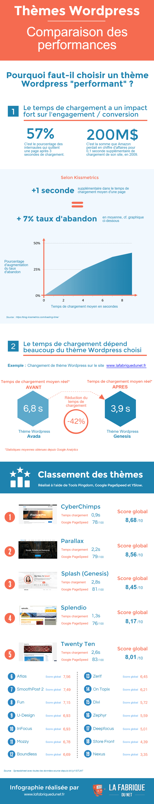

Bien que WordPress soit la solution [CMS](https://fr.wikipedia.org/wiki/Système_de_gestion_de_contenu) la plus utilisée à travers le monde, il n’en reste pas moins difficile à maîtriser de par tous ses aspects et subilités, et demande une perpétuelle remise à niveau de ses utilisateurs.

Quel thème WordPress choisir pour son site ? Quelles sont les performances que l’on peut attendre de tel ou tel thème ? Quentin de [La Fabrique Du Net](http://www.lafabriquedunet.fr/blog) a réalisé une belle infographie qui fait état des performances d’un site en fonction du thème WordPress choisi, et comparant notamment 20 templates Wordpress très répandus.<!--more-->

Petite piqûre de rappel : Les professionnels sont unanimes, la recherche de performance d’un site est inscrite dans le processus stratégique de tous les gros acteurs du web.

Le temps de chargement d’une page, notion à laquelle on ne pense pas forcément, est une caractéristique extrêmement importante lorsque l’on pense à l’optimisation d’un site. Or, **un temps de chargement plus long sera perçu négativement par les robots indexeurs de Google et impactera donc négativement le référencement du site**.

Pour preuve, en 2015, **Amazon déclarait qu’une baisse de son temps de chargement de 0.1 seconde engendrait une hausse de son chiffre d’affaires de plus de 200 millions d'euros !**. On entrevoit tout de suite les gains potentiellement réalisables, quand on sait que certains sites affichent des temps de chargement de plusieurs secondes.

Bien sûr, tout le monde n'est pas Amazon, et vous n'allez probablement pas gagner des millions d'euros juste en améliorant votre temps de chargement d'une demi-seconde. Mais ce n'est pas une raison pour négliger ce paramètre: cela vous permettra de gagner (ou plutôt de ne pas perdre) de très nombreux visiteurs ! Dans certains cas cela peut faire augmenter sensiblement vos statistiques. _Petite astuce en passant: pour savoir si vous perdez beaucoup d'utilisateurs à cause du temps de chargement de vos pages, pensez à utiliser [Google Analytics](https://www.google.fr/analytics/) ou ([Piwik](https://fr.piwik.org) si vous préferéz une application Open Source)._

Alors, la prochaine fois que vous partirez en chasse d'un nouveau thème, au-delà du seul aspect esthétique, pensez aussi aux performances.

 Source: [La Fabrique Du Net](http://www.lafabriquedunet.fr/blog/theme-wordpress-comparaison-performance-temps-chargement/)
