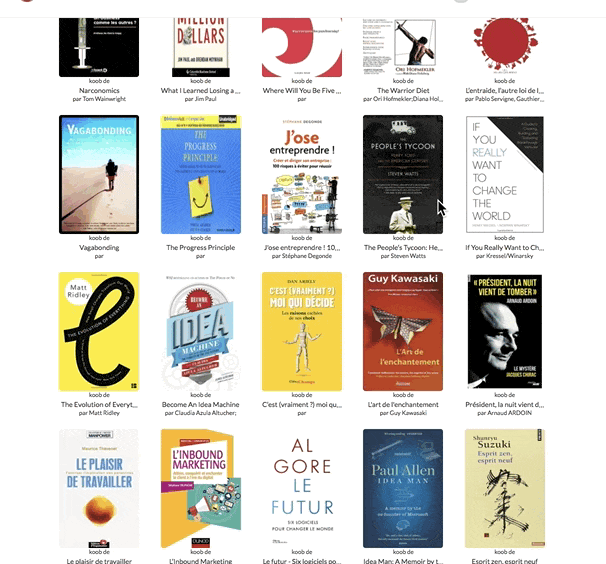
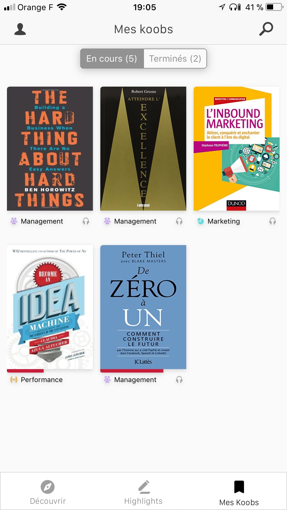
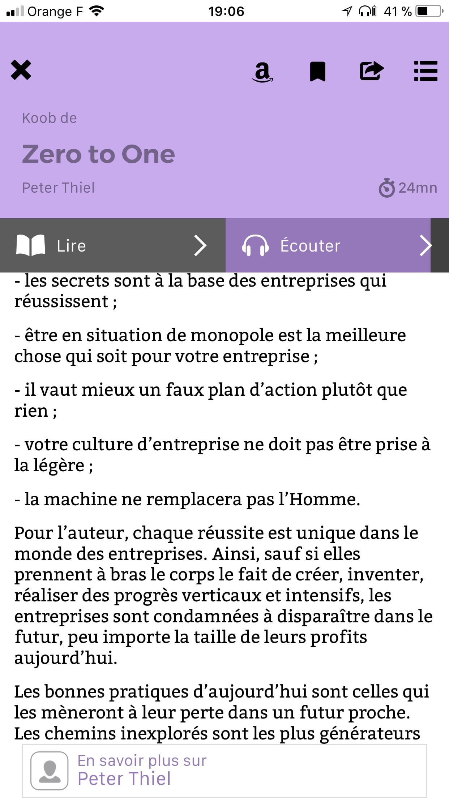
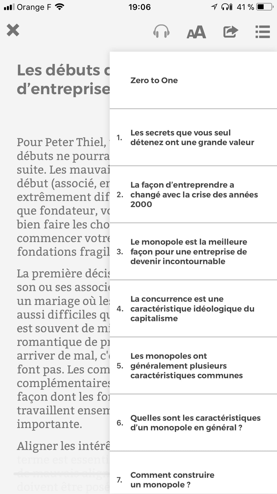
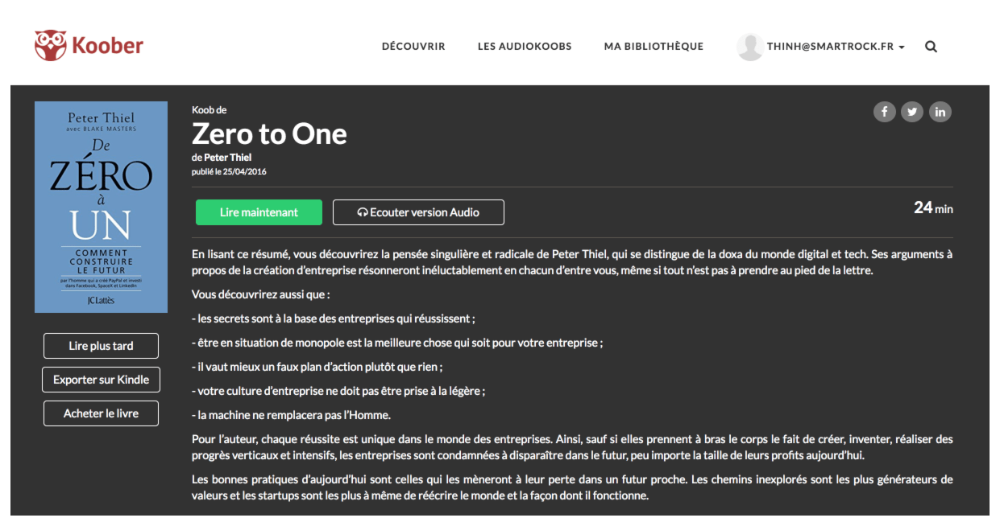

Bon ok, mon titre est un peu putaclic. Mais c'est la vérité, ou presque.

Tout le monde sait que lire des livres, c'est un truc super, ça rend plus intelligent, qu'il faut le faire. Mais bon soyons honnêtes, y'a pas le temps. Entre le boulot, le sport, le ménage, les enfants pour ceux qui en ont, la dernière saison de Game of Thrones… Qui a le temps de se poser pour lire des livres de 200 ou 300 pages ?

Pourtant, en ne lisant pas, **vous passez à côté d'un trésor inestimable**. Pour moi, lire des livres est si important que j'en ai fait une priorité dans ma vie. Mais je comprends, tout le monde n'a pas les mêmes priorités ou le temps libre pour lire plusieurs heures par jour.

C'est là qu'intervient [Koober](https://koober.com/).<!--more-->

Koober est une startup qui veut vous apporter tout le côté pratique des livres, sans les aspects contraignants.

En d'autres termes, **Koober propose de vous livrer l'essentiel du contenu d'un livre, et d'en enlever le superflu**.

Concrètement, pour chaque livre disponible au catalogue, les gens de chez Koober ont écrit un résumé concis, regroupant **toutes les notions essentielles abordées à travers le livre**, mais d'une longueur similaire à un gros article de blog. Chaque résumé prend environ entre 10 et 30 minutes à lire, selon les livres.

## Un catalogue déjà bien fourni

Le catalogue de livres disponibles est exclusivement de la non-fiction, et souvent orienté entrepreneuriat: livres de développement personnel, biographies, marketing, business, psychologie, productivité... N'espérez pas trouver le dernier Harry Potter ou un bon Stephen King.

A part cela, leur offre compte à ce jour **plus de 300 livres**, et chaque mois plusieurs dizaines de livres sont ajoutés.

\[caption id="" align="aligncenter" width="606"\] Là je ne suis même pas descendu à la moitié.\[/caption\]

Cerise sur le gâteau, **certains résumés sont disponibles au format audio**. Top, si vous voulez consommer le contenu dans la voiture ou dans les transports avec votre casque sur les oreilles.

Koober est parfait pour les gens qui n'aiment pas lire ou n'ont pas le temps, mais qui veulent quand même bénéficier des enseignements que l'on peut en tirer.

## Des applis pour lire partout

Côté pratique, aucun souci: l'appli mobile Koober est disponible pour Android et iPhone. J'ai testé l'appli iPhone et elle est très bien faite. Simple et droit au but, vous lancez l'appli et vous devez commencer par choisir 5 livres parmi les choix proposés. Ensuite, vous accédez à votre bibliothèque, et il vous suffit de cliquer sur une couverture pour commencer à lire le résumé.

 

Les textes sont clairs, bien écrits et bien présentés. Chaque livre est composé de petits chapitres et la navigation entre les chapitres est simple et rapide.

Quand à qualité de l'audio (tant en termes d'enregistrement que de voix/diction), elle est aussi excellente, et le contenu est agréable à écouter.

Une appli web très simple et pratique est aussi disponible, ce qui fait que vous pouvez lire ou écouter les résumés de livres vraiment n'importe où.

\[caption id="" align="aligncenter" width="802"\] L'appli web de Koober. Simple et efficace.\[/caption\]

## "Ok, ça à l'air cool ton truc, mais combien ça coûte ?"

Koober dispose d'une offre gratuite, qui vous permet de lire 1 "koob" (c'est comme ça qu'ils appellent leur résumés) par semaine. Si vous êtes vraiment à la dèche c'est déjà sympa, toutes les semaines vous découvrez le résumé d'un nouveau livre.

Mais si vous voulez être un peu plus sérieux dans votre quête de connaissance, Koober propose un offre unique mensuelle à 7,99€/mois. En prenant à l'année cela vous reviendra un peu moins cher (80€ à l'année, soit 6,67€ / mois). Ça c'est le prix normal. Si vous lisez un peu mes autres articles, vous devriez savoir que 6,67€ par mois c'est vraiment RIEN comparé à ce que le fait de lire ces résumés de livres peut vous apporter, aussi bien en connaissances utiles qu'en temps gagné.

Dites vous aussi que le prix de l'abonnement vous donne **un accès illimité à l'ensemble du catalogue**. Je vous laisse imaginer combien ça coûterait d'acheter tous ces livres.

**Mais comme vous êtes des privilégiés (oui, ceux qui lisent mon blog sont des privilégiés), Koober offre aux lecteurs de Smartrock une réduction exclusive: l'année à 48€ au lieu de 80€ (soit 4€ / mois, quasi moitié prix)**.

Eh ouais, bibi vous a déniché une super réduc'. Pour en profiter, vous devez impérativement utiliser ce lien: [découvrir Koober](https://www.smartrock.fr/koober) et lors de votre inscription, indiquer le code promo **SMARTROCK**.

## Le mot de la fin

Sachez que je ne propose jamais de produits ou services que je ne supporte pas. C'est à dire que **je ne propose que des trucs qui déchirent et dont j'estime qu'ils vous apporteront énormément.** Koober en fait partie.

Personellement, j'adore lire, donc ça ne me dérange pas de prendre le temps de lire des livres en entier. D'ailleurs, au départ, j'étais sceptique sur l'offre. Mais j'ai essayé, et le concept m'a convaincu.

Convaincu, pas _converti_, car je n'arrêterai pas de lire des livres. Pour moi, il est important d'avoir tout le contexte. Et c'est simplement un plaisir de lire. **Cela dit, si vous voulez absolument lire des livres pour apprendre et vous améliorer**, mais que:

- vous avez un emploi du temps trop chargé,
- vous ne voulez pas perdre de temps à lire des livres en entier​,
- ​vous avez la flemme,
- vous voulez avoir accès à l'essentiel de centaines de livres sans avoir à les acheter et les éplucher,

alors Koober est une excellente solution.

Dorénavant, vous n'avez plus d'excuses pour ne pas lire
