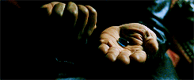

Tu connais la loi d'attraction ?

**La loi d'attraction**, c'est un concept très connu dans le milieu du développement personnel, qui dit, en gros:

> Si tu veux obtenir quelque chose, penses-y très fort et tu l'auras.

Bon, ça c'est la version ultra résumée. Mais grosso modo, c'est ça.<!--more-->

Si tu as un objectif, peu importe lequel, visualise-le.

Imagine-le.

Ressens ce que ça fait de l'avoir atteint.

Regarde-toi dans le miroir tous les matin.répète-toi que tu vas l'avoir.

Bla bla...

Le positivisme, c'est un peu pareil. On nous dit qu'il faut se mettre à voir le positif partout, sourire, voir les choses du bon côté et le monde deviendra meilleur comme par magie.

Quel gros ramassis de belles conneries, n'est-ce pas ?

Pas du tout. Enfin, pas exactement.

## R.A.S

Rien À Signaler ? Non, exactement le contraire

Il y a concept qui a été popularisé ces dernières années, appelé le **Système d'Activation Réticulaire** (appelé R.A.S pour Reticular Activating System en anglais). On va l'appeler **SAR** pour aller plus vite.

Il s'agit d'un groupe de nerfs situé sur notre tronc cérébral qui filtre les informations parvenant à notre cerveau, supprimant celles inutiles afin de nous permettre d'isoler et nous concentrer sur _ce qui est important_.

Si je te parle du SAR, **c'est parce qu'il est la raison principale derrière le phénomène de la Loi d'attraction**.

Le SAR, c'est ce qui fait que quand tu apprends un nouveau mot, tu l'entends partout. Ou quand tu achètes une voiture, d'un coup on dirait que tout le monde a la même.

De base, le SAR est très utile : c'est grâce à lui que ton attention est instantanément captée quand tu entends ton prénom, même dans un endroit bruyant avec plein de monde.

## Le rôle du Système d'Activation Réticulaire

Revenons en a la Loi d'attraction. L'idée n'est pas tellement de faire de la réaffirmation tous les matins devant sa glace. Le vrai "truc", **c'est simplement de savoir exactement ce qu'on veut, et ensuite ouvrir son esprit pour remarquer tout ce qui peut nous permettre d'accomplir nos objectifs.** Ça nous permet de filtrer le torrent d'information quotidien qui nous est déversé sur la tronche, pour ne retenir et utiliser que ce qui est va nous servir.

Pour le positivisme, c'est pareil. **Positiver, en soi, ne change pas la réalité autour de toi, et c'est complètement débile d'espérer que ça soit le cas**. Par contre, **ça te fait te concentrer sur les choses positives qu'il y a autour de toi**.

Parce que c'est ça la vie. C'est pas tout rose ni tout noir. Il y a des choses cool et d'atures moins. Seulement, **ce sur quoi tu choisis de te concentrer et la manière dont tu choisis d'interpréter les choses qui t'arrivent vont façonner ta réalité**.

Le fait de se concentrer sur les choses positives, plutôt que les négatives, va avoir un effet sur ton humeur, ton état d'esprit et ta vision du monde. Ce qui, par effet boule de neige, va changer ton quotidien.

## Voilà pourquoi on a toujours le choix

Les gens qui sont paranos finissent par se mettre tout le monde à dos. Les gens qui s'estiment malchanceux ont toujours la poisse. Et ceux qui choisissent de sourire à la vie, la vie leur sourit.

Et je dis bien _choisir_, car oui c'est un choix.

> "Ah ouais ? Et le gars qui s'est pris la foudre, et qui est paralysé, c'était son choix peut-être ?"

Ahah, pas si vite petit malin.

Je n'ai pas dit _choisir ce qui t'arrive_, j'ai dit _choisir comment interpréter ce qui t'arrive_, nuance.

Ce mec qui se retrouve paralysé après s'être fait frappé par la foudre, il peut choisir. Choisir de maudire la vie. De se dire qu'il est malchanceux. De maudire le destin, et vivre dans la haine et la rancoeur jusqu'à la fin de ses jours.

Et puis t'as l'autre gars à qui il arrive la même chose. Sauf que lui, il se dit qu'en fait, il est grave chanceux d'être encore en vie, parce qu'après tout il aurait pu mourir. Et il vit sa vie avec le sourire, en se disant que c'est un survivor.

Même accident, deux perceptions et deux vies complètement différentes

## Il n'y a pas de chance

C'est comme la chance. Les gens se considérant chanceux sont généralement chanceux. Et les malchanceux, ben, ils ont la poisse quoi. Quel est le mystère ? Il n'y en a pas. D'ailleurs, il n'y a pas de chance ou de malchance. Juste des événements.

Dans une vie, il arrive plein de trucs. Des bons et des mauvais. La personne chanceuse, c'est juste celle qui a choisi de se concentrer sur les événements positifs.

De base, si tu es né dans en France, ou un autre pays occidental avec des écoles, une protection sociale, et une famille qui a pu te donner à manger tous les jours, tu es déjà plus chanceux que 75% de la population mondiale.

**La réalité n'est rien d'autre qu'une [question de perception](https://tobal.fr/change-le-monde-en-changeant-une-seule-chose/)**.

On a la faculté extraordinaire de pouvoir filtrer naturellement le monde qui nous entoure, pour ne garder qu'une partie. C'est cette partie qui sera l'essentiel de notre expérience de la vie. Quelle partie vas-tu choisir aujourd'hui ?
