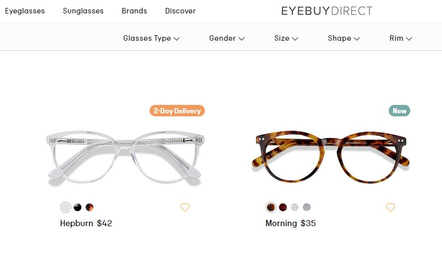
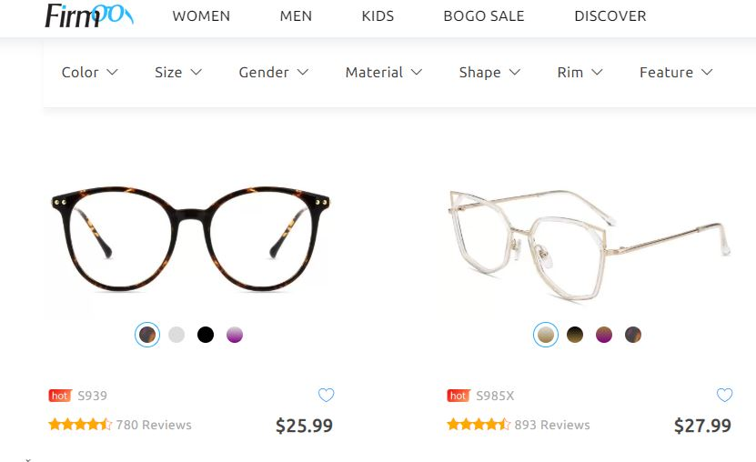
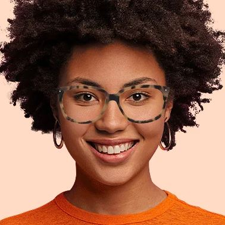
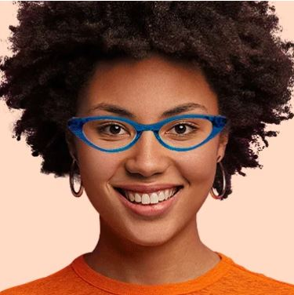
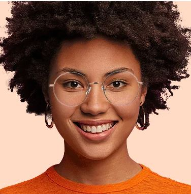
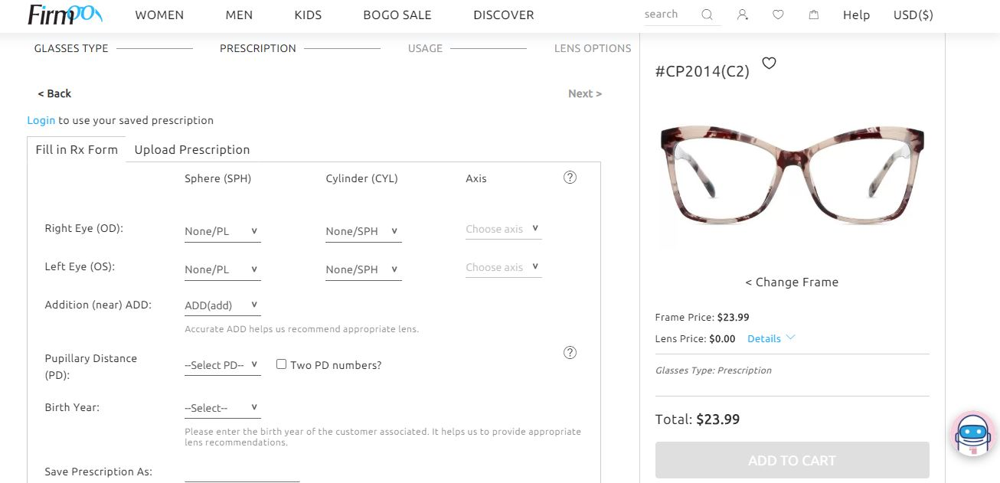
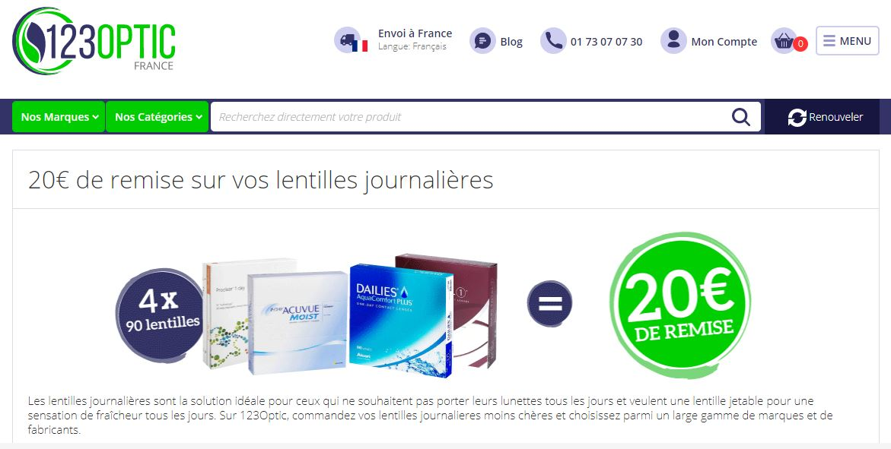
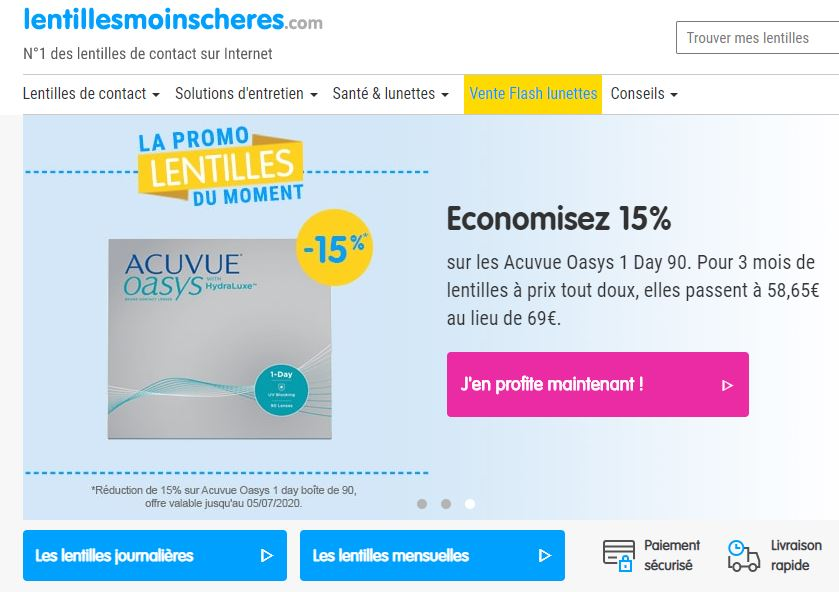

**Dame nature t'a offert deux pupilles légèrement défaillantes nécessitant le port de lunettes correctrices ? Alors tu as sûrement connu ce parcours du combattant lorsqu’il s’agit d’obtenir de nouvelles montures ou de renouveler tes lentilles :**

<!--more-->

Après un rendez-vous chez l’ophtalmologiste – souvent obtenu après de longs mois d’attente – vient le passage obligatoire chez l’opticien pour qu’il fasse fabriquer, et ceci peut s'avérer très onéreux, tes précieuses lunettes ou lentilles. Et, je te passe les tracas administratifs liés au remboursement de la mutuelle. 

Mais ça c’était avant. Avant qu’une poignée de sites internet viennent révolutionner le marché, offrant aux acheteurs rapidité, simplicité, choix et économies.

Suis le guide et pars à l’exploration du monde merveilleux de l’optique en ligne.

## **Un avantage de taille : le prix**

Myopes et autres presbytes le savent : l’achat d’une monture représente traditionnellement un coût très important dans un budget. En effet, d’après [une étude menée par l’UFC Que Choisir](https://www.quechoisir.org/dossier-de-presse-distribution-de-l-optique-examen-a-la-loupe-d-un-marche-juteux-n13321/), le prix moyen d’une paire de lunettes correctrice est de 470 euros. 

Une somme sur laquelle l’opticien récupère 275 euros, qui lui servira essentiellement à payer ses frais de structure – salaires, loyer…

Nul besoin d’être un génie en mathématiques pour comprendre **l’économie ainsi réalisée si on se passait de l’opticien.** 

Effectivement, sur les simulations réalisées par la même enquête, l’économie entre la boutique d’optique traditionnelle et l'opticien en ligne peut aller jusqu'à 50 % sur une paire avec des unifocaux (simple foyer), et 40 % avec des verres progressifs.

Une différence de prix importante qui donne envie de choisir plusieurs montures colorées pour varier les styles et assortir ses lunettes de vue à sa tenue du jour… D'ailleurs, les montures ringardes c'est terminé. 

## **Se passer d’un opticien, mais pas d’un ophtalmo**

Avant d’être des produits de consommation, **les lunettes et les lentilles sont des produits de santé**. Leur achat s’effectue alors, normalement, dans le cadre d’une prescription médicale. 

Il est en effet déconseillé de commander des lentilles en suivant les mesures des lunettes par exemple, car les lentilles se trouvant plus près des yeux, leur correction peut légèrement évoluer.

D’autres paramètres sont également à prendre en compte comme le rayon de courbure de l’œil ou l’analyse du film lacrymal pour déterminer quel type de lentilles sont les plus adaptées (lentilles souples, rigides…). Un ophtalmologiste pourra également te prescrire des lentilles d’essai, afin de voir comment ton œil réagit lors du port prolongé de ce produit.

Les sites d’optique en ligne sont donc **à réserver aux personnes habituées** au port des lentilles et qui souhaitent simplement recommander les produits habituels.

Si l’achat des lentilles semble évident  puisqu’il s’agit de renouveler ses produits préférés, la commande de lunettes en revanche, interroge. Puisque, le choix et l’élaboration d’une paire de lunette sur mesure est soumis à de minuscules variables qui ne sont pas forcément visibles sur une photo. 

En effet, seul un ophtalmologiste est en mesure de déterminer avec précision ta correction mais également l’écart pupillaire, la distance horizontale en millimètres entre la racine du nez et le centre de la pupille. Ces mesures sont des préalables indispensables pour confectionner une paire de monture correctrice.

Mais une fois le sésame obtenu (l’ordonnance) le monde de l’optique en ligne s’offre à toi.

## **Commande de lunettes en ligne**

Envie de changer de lunettes à ta guise sans débourser l’équivalent d’un loyer chez ton opticien ? Avec l’optique en ligne, c’est tout à fait possible. Ces nouveaux sites tels que [firmoo.com](https://www.firmoo.com/) ou [eyebuydirect.com](https://fr.eyebuydirect.com/) proposent des montures à très bas prix sans lésiner sur le style ou la qualité. Et si nous allions voir ce qu’il en est côté pratique ?

### **1****er** **étape : le choix de la monture :**

Parmi les milliers de modèles proposés, on choisit une paire qui nous plait. Au départ, effectivement les modèles sont très peu chers, (aux alentours de 25 dollars pour les premiers prix) et il existe un choix presque infini de formes, de matières et de couleurs. Ces produits viennent d’Asie mais d’après de nombreux internautes conquis les montures reçues étaient de très bonne qualité et conformes aux modèles présentés sur le site.

Sur certains sites tu peux également essayer virtuellement différentes montures grâce à une photo prise avec ta webcam. L’occasion d’essayer différents looks surprenants, et de t’offrir cette paire colorée sur laquelle tu n'aurais jamais osé craquer chez un opticien !

### **2****ème** **étape : les mesures**

Après avoir sélectionné le type de correction dont tu as besoin (myopie, hypermétropie, presbytie… ou verres sans correction juste pour le look),  il va falloir rentrer les mesures mentionnées sur ton ordonnance. Les myopes ont des puissances de correction négatives tandis que les hypermétropes doivent corriger leur vision en augmentant la puissance des verres. Pour de précieux conseils concernant la lecture de ton ordonnance, ce site, est très bien fait : [https://www.choisir-ses-lunettes.com/savoir-lire-son-ordonnance-ophtalmo.html](https://www.choisir-ses-lunettes.com/savoir-lire-son-ordonnance-ophtalmo.html)

### **3****ème** **étape : les verres**

Pour les verres, tu peux sélectionner plusieurs options : antireflets, antibuée, verres amincis. Chacune des options a une incidence différente sur le prix final. Si le type de verre dont tu as besoin ne correspond pas à ta monture, le site t'en informe.

En revanche certains clients estiment que si les lunettes pour corriger une myopie sont parfaites, les verres pour astigmate le sont un peu moins. En effet ces verres nécessitent une correction visuelle mais également une certaine courbure du verre qui rend la vision confortable quel que soit l'angle. Ce détail n’aurait pas pu être réalisé sur les montures livrées par Firmoo par exemple.

### **4****ème** **étape : Règlement et envoi**  

Après le paiement, le site te tient informé de toutes les étapes de la conception de ta monture : élaboration des verres, montage des lunettes, mise en colis, envoi, transit… 

Chez firmoo.com tu reçois tes lunettes dans un colis très sécurisé. [Le temps](https://tobal.fr/le-temps-passe-quoi-quil-arrive-autant-en-faire-un-allie/) d’attente peut en revanche varier. Le site promet une livraison en 2 semaines mais les avis clients varient entre 10 jours et 1 mois.

Le service client semble disponible et clair. En revanche ces deux sites sont en anglais. 

## **Commande de lentilles de contact en ligne**

La plupart des sites d’achat de lentilles se présentent comme des sites de renouvellement de lentilles. Mais, il ne te sera pas demandé la vérification de votre ordonnance. 

Ainsi, si tu connais ta correction, tu peux commander tes lentilles en ligne.

### **Mes sites préférés pour commander ses lentilles en ligne :**

- **[123optic.fr](https://www.123optic.com/fr-fr/) (anciennement toutesmeslentilles.fr)**

Ce site basé en Belgique promet des produits jusqu’à 70% moins chers que chez les opticiens. Leur service client est très professionnel.  A quelques exceptions près, les utilisateurs mettent en avant la conformité et la rapidité de la livraison. Il est noté également que tu peux trouver de nombreux codes promos sur internet permettant de cumuler des réductions sur ta commande.

- **[lentillesmoinscheres.com](https://www.lentillesmoinscheres.com/)**

Ce site se présente comme le numéro 1 du renouvellement en ligne de lentilles de contact en France. On y dénombre 70 000 références dont les grandes marques : Bausch & Lomb, Johnson & Johnson ou CooperVision. Le site propose régulièrement des réductions très intéressantes ce qui explique la différence de prix. La livraison est claire, fiable et rapide.

A titre d’exemple voici un comparatif de prix entre trois opticiens en ligne. Sur les trois produits testés, deux d’entre eux étaient en promotion chez lentillesmoinscheres.com, ce qui explique la différence de prix. 

<table><tbody><tr><td></td><td><strong>Opticien Krys</strong></td><td><strong>123optic.fr</strong></td><td><strong>Lentillesmoinscheres.com</strong></td></tr><tr><td>Acuvue Oasys 1 Day boite de 90</td><td>69.85 €</td><td>69.90 €</td><td>58.65 €</td></tr><tr><td>Lentilles de couleurs Freshlook One day boite de 10</td><td>11.50 €</td><td>13.90 €</td><td>9.80 €</td></tr><tr><td>Solution d’entretien BioTrue 3x300mL</td><td>22.45 €</td><td>29.99 €</td><td>20.99 €</td></tr></tbody></table>

Pour aller plus loin, si tu sens une fatigue oculaire due à ton temps passé devant l'écran de ton ordinateur, il est peut-être temps d'agir. Alors, avant de passer aux lunettes ou même en complément de celles-ci, utilise ce hack santé : [tu peux faire du bien à tes yeux quand tu lis sur écran](https://tobal.fr/faites-du-bien-a-vos-yeux-quand-vous-lisez-sur-ecran/).
