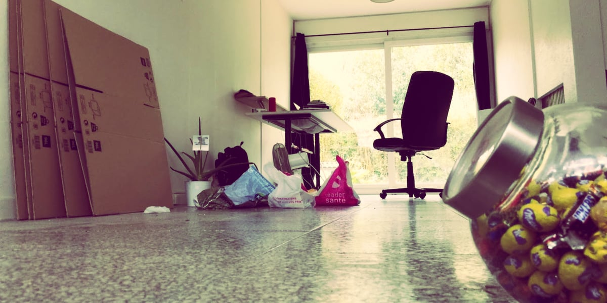
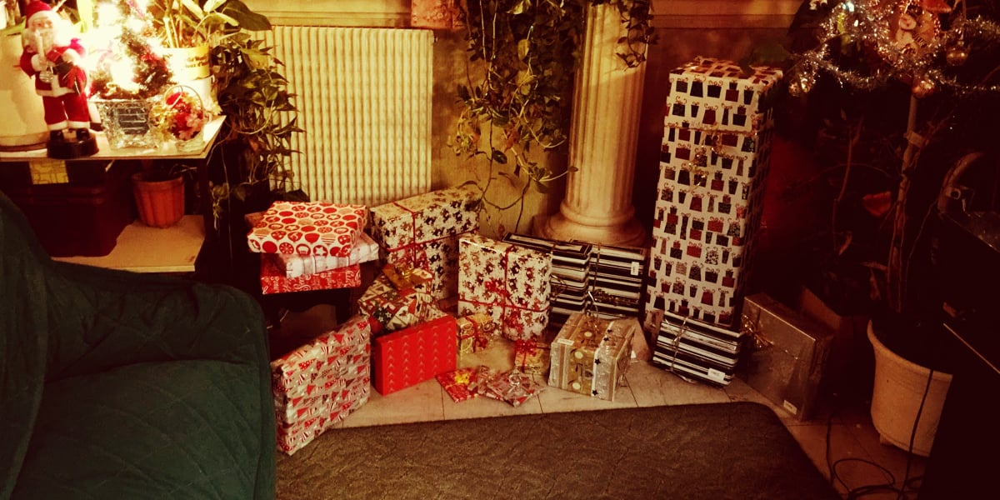

Il y a quelques jours j'ai publié un article te mettant [au défi de jeter au moins une chose par jour](https://tobal.fr/une-chose-en-moins-par-jour-es-tu-capable-de-relever-le-defi/).

Je l'ai fait car je veux partager cette découverte : **moins j'ai de choses, plus je me sens heureux**.

Ok, je ne suis pas un ermite, reclus de la société, vivant d'amour et d'eau fraîche à poil dans une grotte. Mais plus je me débarrasse de choses, et mieux je me sens.<!--more-->

C'est comme si les objets qu'on possède étaient un fardeau, non seulement physique, mais aussi _mental_.

Il n'y a pas si longtemps, j'avais une télé 65 pouces, un canapé dont le prix fait 4 chiffres, 8 ordinateurs à la maison, 2 voitures et un scooter. Le bonheur ce n'est pas d'avoir plein de choses, surtout si on ne fait rien de ces choses. **Non, le bonheur, c'est plutôt d'avoir peu de choses, mais d'en profiter à fond**.

L'année qui vient de passer, je me suis débarrassé de plusieurs dizaines de possessions, allant des petites bricoles à de grosses choses comme des véhicules. Pas une seule fois je n'ai regretté m'en être débarrassé. Pas une seule fois je me suis dit "Ah, zut, si seulement je les avais gardées !".

**Comment faire le ménage dans sa vie ? Comment être sûr de savoir ce dont il faut se débarrasser et ce qu'il faut garder ?**

Voici deux méthodes que j'ai utilisées.

## Les 3 questions

La 1ère c'est simplement de te demander, pour chaque chose que tu as :

- Est-ce que _j'adore_ ce truc ? Pas juste, "j'aime bien", mais "j'adore".
- Est-ce vraiment impossible pour moi de m'en passer ?
- Est-ce que je m'en sers tous les jours ?

Si tu ne réponds pas un OUI clair à au moins 2 de ces 3 questions, débarrasse-en toi.

Le pire du pire, c'est de se dire : "Ca va peut-être me servir un jour".

C'est LE PIRE DU PIRE.

C'est la raison n˚1 pour laquelle 99% de la population mondiale s'encombre de choses inutiles.

C'est pour ça que tu n'es pas heureux. Tu vis dans la peur : "Un jour je risque d'en avoir besoin". À réfléchir comme ça, autant marcher constamment avec un déambulateur. On ne sait jamais, un jour tu risques de trébucher et te casser quelque chose.

Je me suis débarrassé:

- d'affaires que je ne mets plus ou quasiment plus.
- d'une voiture et d'un scooter dont je me servais à peu près une ou deux fois par mois.
- d'électronique de tout poil, allant de simples cables à des ancien téléphones portables, en passant par un GPS (qui a besoin de ça avec les smartphones ?). Les câbles, c'est toujours difficile. On se dit toujours "on sait jamais, ce câble jack-RCA pourrait me servir un jour". Oui, mais non. Si ça fait deux ans qu'il ne t'a pas servi, il ne te servira pas plus tard.
- des instruments de musique avec lesquels je ne joue plus.
- d'un ordinateur haut de gamme/gamer et d'un iPad dont je ne me servais pas. Enfin, si je m'en servais... une à deux fois par mois.
- Des tables et des chaises qui trainaient dans mon garage que je gardais "au cas où".

Sais-tu combien de fois j'ai regretté m'être débarrassé de toutes ces choses ? Zéro.

La seule chose que j'ai regretté, c'est de ne pas m'être débarrassé de tout ça plus tôt.

Et si jamais tu t'aperçois avoir besoin de quelque chose dont tu t'es débarrassé (ce qui arrive très rarement), tu peux toujours le racheter. Au moins tu auras un truc neuf et qui sert, pas un vieux truc qui traine depuis des plombes dans la maison.

## Dans les cartons

Si tu n'arrives vraiment pas à te décider, la deuxième méthode est moins radicale mais tout aussi efficace: mets toutes tes affaire dans des cartons. Comme si tu allais déménager.

Déjà, ça va te faire une place monstre.

Ensuite, au fur et a mesure que tu en as besoin, sors tes affaires des cartons, une par une.

**Tu vas t'apercevoir très vite qu'il y a plein de choses qui vont rester dans les cartons**. La règle est simple : si quelque chose reste dans les cartons plus d'un mois, débarrasse-en toi !

Se débarrasser ne veut pas forcément dire jeter à la poubelle. Tu peux donner à ton entourage ou à ceux dans le besoin. Tu peux même revendre et gagner un peu d'argent.

## C'est pas une question de moyens ou de situation, mais d'état d'esprit

Encore une fois, s'il te plaît, je t'en conjure: arrête de te dire "on ne sait jamais". C'est le mal absolu. "On ne sait jamais", c'est avoir peu du futur et admettre que l'on va se retrouver en totale impuissance plus tard.

Je ne recommande pas d'aller à l'excès et tout balancer sans réfléchir en mode "fuck la vie". Mais garder des dizaines et des dizaines de possessions parce que "on ne sait jamais", c'est l'extrême opposé.

C'est pas une question d'être riche ou pauvre. Peu importe tes moyens. D'ailleurs, j'ai remarqué que plus les gens sont pauvres et plus ils accumulent de choses inutiles. C'est une question d'état d'esprit, pas de moyens.

## Tu profites plus quand tu possèdes moins

C'est mathématique. Ta capacité d'attention, mais aussi d'appréciation, n'est pas infinie. Plus tu as de choses et plus tu divises cette capacité entre les choses que tu as. Donc moins tu en profites.

Regarde ce qui se passe avec les enfants de nos jours. Ayant grandi dans un foyer épanoui mais peu dépensier, à Noël j'avais deux-trois cadeaux maximum (ce qui est déjà énorme). Mais je chérissais chaque cadeau que je recevais.

De nos jours, même dans les foyers modestes, les enfants sont inondés de cadeaux. À tel point qu'ils ne prêtent même plus vraiment attention à leurs cadeaux, comme on le faisait à l'époque. Ils chérissent moins chaque cadeau et sont plus préoccupés par la quantité..

Pour nous les adultes, c'est pareil. On se fait nos propres cadeaux, mais plus on a de choses et moins on profite de chaque.

Quand je me suis acheté ma super télé 65 pouces, je me suis dit qu'avoir une super grande télé toute neuve allait me rendre un peu plus heureux. Ça n'a rien changé à ma vie. Oui, c'est confortable, mais je ne me suis pas senti plus épanoui pour autant.

**En termes de bonheur, [plus c'est moins, et moins c'est plus](https://tobal.fr/reussir-dans-la-vie-ne-rend-pas-heureux-cest-linverse/).**

Je me sens plus heureux quand:

- je crée des choses (quand j'écris, je fais de la musique, je fais des nouvelles choses, des nouveaux projets, des nouveaux défis).
- Quand j'agis en accord avec mes principes.
- Quand je voyage et découvre de nouvelles choses
- Quand je donne (que ce soit du temps, du matériel, de l'argent, des services) aux autres
- Quand je passe du temps avec les gens que j'aime.

Pas quand j'accumule des possessions.

Pour finir, si tu veux pousser plus loin le sujet, je t'invite à lire [La Magie du Rangement](https://amzn.to/2zlv7hW) par Marie Kondo.
