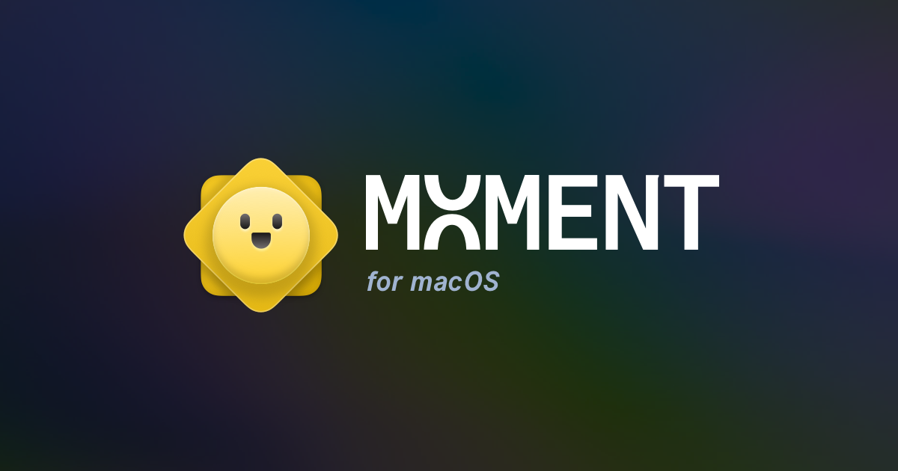
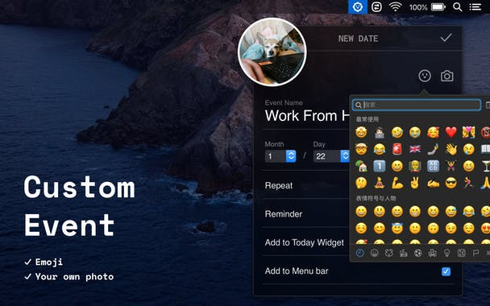
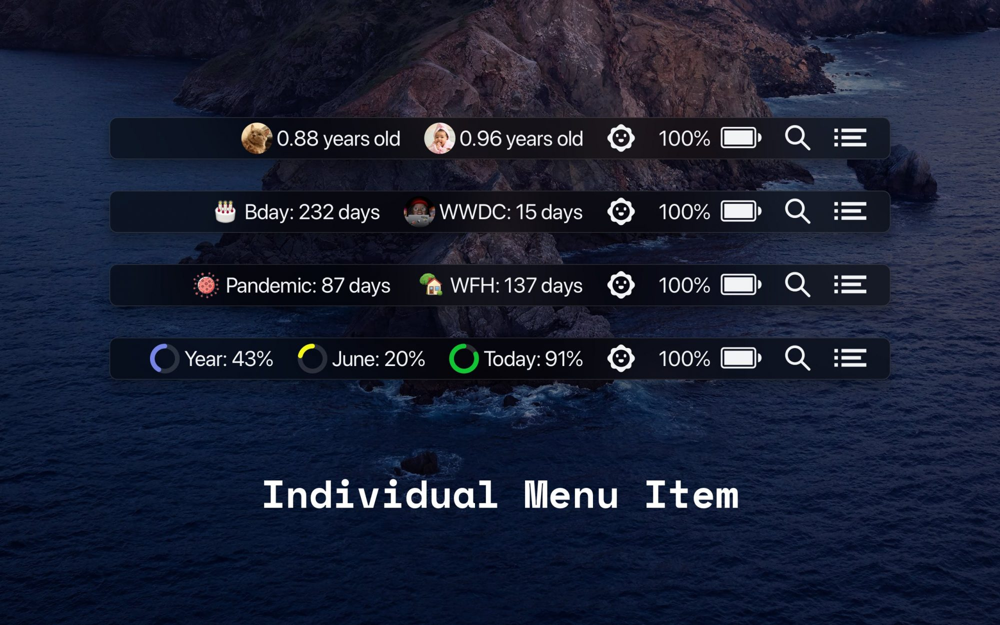
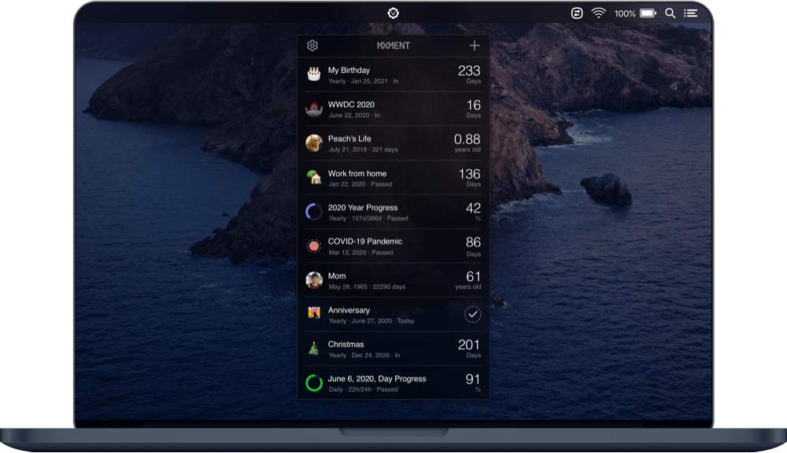
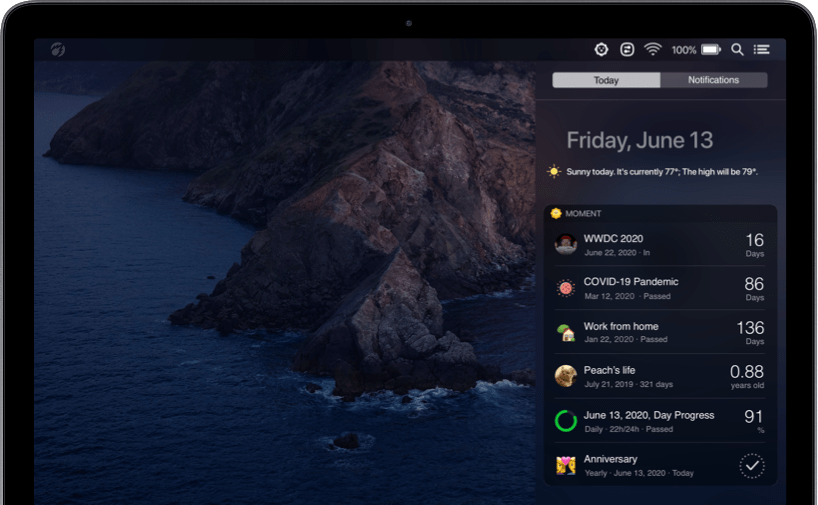

Un anniversaire manqué, un moment important de raté ou encore un rendez-vous oublié. Tu as peut-être déjà vécu tout ça car tu t’es mal organisé. Ou tout simplement car tu n’as pas noté correctement sur ton bloc note. Une solution très efficace que tu ne connais peut-être pas : Moment.

<!--more-->

**[Moment](https://fireball.studio/moment) est une application de compte à rebours qui apparait dans la barre de menu et dans le centre de notifications pour t'aider à te souvenir des jours les plus importants de ta vie.**

Crée des comptes à rebours pour tout ce qui t’attends. Tu peux aussi configurer l'application pour qu'elle fasse un compte à rebours à partir d'une date passée ; rien de plus simple et de plus pratique pour ne rater aucun moment important.

## **Crée des événements de compte à rebours**

De l'anniversaire de ton animal de compagnie aux vacances à venir, Moment génère des comptes à rebours pour tout ce qui compte pour toi. Et ce n'est pas seulement pour les événements à venir. L'application te permet de revenir sur le point de départ de quelque chose, comme ton premier jour de travail, ou le jour où tu as décidé d'arrêter le café.

## **Suis tes progrès**

Sache exactement combien de temps s'est écoulé dans l'année, dans le mois, dans la semaine et dans la journée. Planifie et [gère ton temps](https://tobal.fr/devenez-un-pro-de-la-gestion-du-temps-gerer-son-energie/) dans la barre de menu Progress Bar Timer. Crée des jalons personnels et ajoutes-y des chronomètres de barre de progression. Tu peux même suivre ton âge ou l'âge de tes proches. L'application te tient parfaitement au courant de chaque moment de ta vie et t’aide à planifier ton temps de manière plus réfléchie.

## **Donne une touche personnelle aux événements**

Ce sont tes moments privilégiés, ils doivent donc avoir un aspect spécial.

- **Personnalise les événements** avec des emojis ou même tes propres photos.
- **Nomme chaque événement** de manière à ce qu'il soit facile de s'en souvenir et d'en garder une trace.
- **Change les couleurs** et **définis des rappels personnalisés** pour chaque moment important de ta vie.

## **Ajoute des moments à la barre de menu**

Certains événements sont tout simplement trop importants pour n'être qu'un parmi d'autres. L'application Moment résout ce problème en te permettant de transformer des événements cruciaux en éléments individuels de la barre de menu. Cela signifie que tu peux garder le compte à rebours de l'anniversaire d'un enfant ou un minuteur _[Work From Home](https://tobal.fr/le-vrai-probleme-du-teletravail/)_ toujours visible sur Mac. Les moments de la barre de menu peuvent être personnalisés avec des photos ou des emojis.

## **Tous les événements dans Today Widget**

Le widget **Aujourd'hui** est l'endroit idéal pour planifier ta journée. Naturellement, c'est aussi un endroit parfait pour Moment. L'application intègre tous tes événements et tes barres de progression dans le Widget Aujourd'hui, afin que tu puisses jeter un coup d'œil à ce qui devrait être accompli, sans même ouvrir l'application.

## **Points faibles de l'application Moment**

Moment ne prends pas en charge la synchronisation iCloud, mais ce sera fait plus tard. Pour l'instant, tes données sont stockées localement. Si tu supprimes et réinstalles l’application Moment, les données seront automatiquement récupérées.

De plus, l'application Moment ne fonctionne pas encore comme Widget dans [Big Sur](https://www.apple.com/fr/macos/big-sur-preview/features/), la nouvelle version de MacOS. Mais ce sera très probablement le cas bientôt.

Enfin, la synchronisation avec iOS et la version iOS14 n'est pas encore possible, mais c'est aussi en cours de développement.

## **Conclusion**

Moment est une application qui permet de suivre tous les moments importants vie. Ajoute des étapes et des comptes à rebours, regarde les progrès annuels, hebdomadaires et quotidiens que ça soit à venir ou dans le passé. Des petits coups de pouce qui te font faire attention aux choses qui comptent vraiment.

Moment offre un essai gratuit de 7 jours, et il n’y a aucune facturation à la fin de l'essai, il suffit de télécharger l'application et de l'essayer.

**Sources**

[Site officiel Moment](https://fireball.studio/moment)
[Page de l'application sur ProductHunt](https://www.producthunt.com/posts/moment-for-macos)
