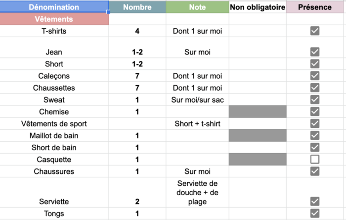
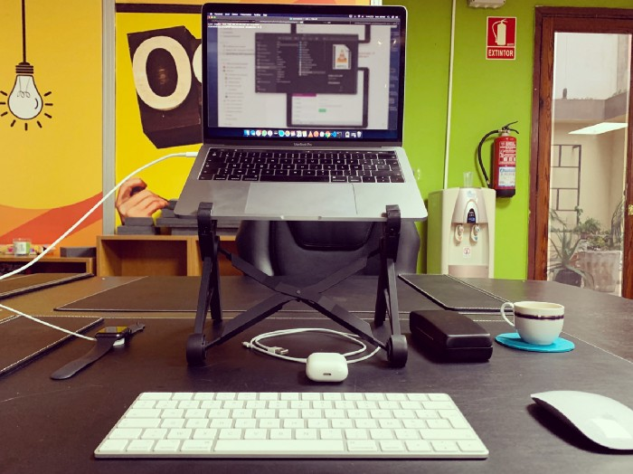

_Cet article a été écrit par Alexandre Grisey, web entrepreneur et digital nomad. Passionné par le développement personnel et le minimalisme, vous pouvez retrouver ses écrits sur [son blog Medium](https://medium.com/@grisey.alexandre)._

Je suis développeur et [digital nomad](https://lesnouveauxtravailleurs.fr/definition-digital-nomad/). Pour faire simple, je suis un télétravailleur boosté à l’adrénaline. Non seulement je ne travaille qu’à distance, mais en plus, je ne suis pas limité — ou peu — par la situation géographique. En clair, je peux travailler de n’importe où, et changer de lieu quand je le veux.

Mon métier, comme de plus en plus de jobs, permet de devenir digital nomad ; de passer son temps à l’étranger, de travailler d’où l’on veut.

**Et c’est exactement ce que je fais.**

<!--more-->

Pour preuve, j’écris ces lignes depuis Javéa, en Espagne. D’ici quelques semaines, j’irai ailleurs, et je ne sais même pas encore où.

Mais si ce lifestyle peut sembler idyllique de l’extérieur, il n’est pas exempt de problèmes et de difficultés.

Une des difficultés quand on est nomade, c’est de savoir avec quoi on va voyager. Techniquement, j’aurais juste besoin de mon ordi, de mon chargeur et basta.

**Mais tu te doutes bien que c’est un poil plus compliqué que ça.**

Pour simplifier tout ça, j’ai décidé de me la jouer [minimaliste](https://tobal.fr/je-suis-minimaliste/). Aujourd’hui, je voyage pour une durée illimitée avec seulement deux sacs cabine : un gros, dans lequel je mets la majorité de mes affaires, et un plus petit, que je peux glisser sous mon siège. Le petit, c’est un Eastpak, tu sais, ce sac qu’a la moitié des lycéens (du moins à l’époque où j’étais moi-même lycéen…).

Et je dois mettre toute ma vie dans ces deux sacs.

Pour savoir quoi prendre, j’ai fait pas mal de recherches, vu pas mal de vidéos et lu pas mal d’articles de blog (d’ailleurs, tu lis peut-être celui-là car tu veux devenir digital nomad #inception).

Au final, je suis arrivé à une liste, qui évolue bien sûr au fil du temps. Avant de te décrire plus en profondeur cette liste, laisse-moi t’expliquer comment je la gère.

## Pour ne rien oublier…

Il existe plusieurs outils possibles pour lister les choses qu’on doit emmener dans son sac.

On peut utiliser [Notion](https://tobal.fr/notion-outil-de-productivite-ultime/), par exemple, ou [Mystvff](https://mystvff.com/), une application qui devrait bientôt sortir et qui permet de lister ses possessions.

Pour ma part, j’ai choisi d’utiliser une simple Google Spreadsheet. Pourquoi ? Pour plusieurs raisons :

- C’est stocké sur le cloud, et donc mis à jour en temps réel sur tous les autres appareils que j’utilise (car oui, je check la liste via mon iPhone, même si l’application n’est pas super simple à utiliser depuis un smartphone).
- On peut tout personnaliser rapidement. Couleurs, taille du texte, etc. C’est très facile et accessible à tout le monde.
- Et j’ai commencé avec ça, et comme je suis flemmard, je reste dessus.

Tiens, je suis tellement sympa que je te partage [ma liste](https://docs.google.com/spreadsheets/d/1IeJ2pr65d0AVkTmkI0oY8FmWjkiE9SjV9KygCqKappI/edit?usp=sharing). Mais je vais la détailler tout de suite.

## Mon matos

Comme tu peux le voir, j’ai décidé de séparer la liste en plusieurs éléments : Vêtements, Numérique, Soins et Autres.

C’est pas forcément parfait, mais je trouve ça plutôt pas mal.

J’ai décidé d’avoir cinq colonnes pour l’ensemble de la liste :

- Dénomination
- Nombre (de cet élément à prendre)
- Note, pour m’aider à choisir
- Obligatoire à prendre ou non
- Présence, la checkbox à cocher lorsque c’est bien dans mon sac

Bien. Maintenant je vais faire un rapide tour de tout ce que je prends.

### **Vêtements**

Ce sont les vêtements qui prennent le plus de place, il faut donc les choisir avec soin.

Comme tu peux le voir, je prends juste assez de sous-vêtements pour une semaine. Je ne prends que 4 t-shirts que je change tous les deux jours (l’avantage d’être quelqu’un qui ne transpire pas 😎).

Quatre paires de chaussures : de marche, de ville, de sport et des tongs.

Ensuite, les classiques chemise, sweats, jeans, shorts, etc. Je ne vise que des pays chauds, ça m’évite de m’encombrer de doudounes et autres pyjamas.

Si tu veux partir en Finlande en Janvier, il va évidemment falloir que tu adaptes ta liste 😉

### **Numérique**

Ah, le numérique ! Le plus important ! Sans quoi je ne pourrais pas travailler.

Évidemment, on retrouve mon ordi, un Macbook Pro 13" de 2018 (boosté). Les différents chargeur, et mes deux trépieds (un horizontal, pour prendre des photos, un vertical, que je pose sur mon bureau à côté de mon ordi).

À noter également, j’ai un clavier et une souris externe, que j’utilise avec un support pour mon Mac. En gros, mon setup ressemble à ça :

Et ça me sauve le dos 😉

(Si tu veux le même support d’ordi que moi, vas faire un tour [ici](https://amzn.to/3ml308G), il est très bien et ne prend pas de place).

### **Soins**

Ce que j’ai appelé soins, c’est tout ce qui concerne l’hygiène et ce genre de choses.

Alors on retrouve classiquement une brosse à dents, peigne, parfum, crème solaire, etc.

Ce qui est moins courant, c’est ma petite paire de ciseaux pour ma moustache et de l’huile pour ma barbe (on a le droit d’être nomade et élégant, non ? 🙄).

J’ai aussi de la lessive solide (sous forme de petites feuilles), très pratique. Niveau médicament, j’emmène le nécessaire, Doliprane, Spasfon, etc.

### **Autres**

Au niveau de l’inclassable, il y a du classique : ma gourde, lunettes de soleil, passeport (évidemment), masques pour le COVID, portefeuille, etc. Sans oublier les préservatifs : aller à l’étranger, ça ouvre des possibilités 😏

Je voyage aussi avec 2 élastiques de musculation Décathlon pour continuer à faire des séances de sport sans avoir à trouver de salle de sport. C’est hyper pratique.

Il y a quelques autres trucs dont je vais parler juste là :

### **Ce que tu dois ABSOLUMENT prendre**

Il y a pour moi une liste des choses que tu dois absolument prendre, alors que tu n’y penses pas forcément. En voici la liste :

- Deux serviettes, si tu voyages dans des endroits où on ne t’en fournis pas (style auberge de jeunesse). Une pour la plage (fine, type microfibres), et une de douche — et si tu voyages dans des endroits où il y a des plages, évidemment.
- Un adaptateur de prise électrique, si tu vas dans des pays dont le courant/les prises sont différentes de la France.
- Une bouteille réutilisable. En plus d’être écolo, c’est super pratique (pour passer la douane à l’aéroport il suffit qu’elle soit vide).
- Un sac de jour, que tu prendras pour mettre tes affaires de plage ou pour aller faire une rando.
- Un masque de nuit et des bouchons d’oreille. Ça va te sauver la vie si tu passes quelques nuits en auberge de jeunesse.
- Une multiprise. Je ne sais pas pourquoi, mais dans beaucoup d’Airbnb, il n’y a pas de multiprise à côté de ton lit. Si tu veux brancher deux trucs en même temps, c’est mort. Alors prends-en une !

C’est tout pour ma liste. Ce qui est sur cette spreadsheet, c’est exactement ce que je prends (je ne prends pas tout, d’où l’importance de la case “Non obligatoire”), mais tout ce qu’il y a dans mon sac est sur cette liste.

Mais, comme je le disais, cette liste évolue avec le temps…

## L’expérience fait le reste

Je me suis rendu compte, à force d’aller et venir, que j’avais des choses parfaitement inutiles. Par exemple, la première fois, j’ai pris un cadenas, qui ne m’a jamais servi. De même, j’ai pris une espèce de petit sac banane qui se glisse sous le t-shirt, pour mettre des papiers importants ; pareil, jamais utilisé. Les poches, c’est aussi bien.

J’ai aussi réalisé qu’il me manquait des choses. Au tout début, je ne suis parti qu’avec mon sac principal, maintenant je dois avoir le petit avec car j’ai plus de matos avec moi. Par exemple, avant je n’avais qu’un jean et qu’un sweat. Maintenant j’en ai deux de chaque. je n’avais aussi pas de multiprise et 2–3 autres trucs.

C’est avec le temps et l’expérience qu’on se rend compte de ce qu’on doit prendre ou pas, et il en sera de même pour toi.

N’hésite pas à me dire ce que tu penses de tout ça en commentaire, et de me partager ton matos de digital nomad, ça me donnera peut-être des idées !
