Il existe application de productivité qui fait beaucoup parler d'elle ces derniers temps : [Notion](http://notion.so/).

Depuis que j'ai découvert cet outil il y a quelques mois, je ne jure plus que par lui. Intuitif, ergonomique, complet et agile... L'espace de travail dont je rêvais depuis des années. C'est ma nouvelle obsession.

Plus besoin de multiplier les applications, les logiciels, les renvois et les automatisations via des applications tierces. **Notion permet de retrouver tout ce dont vous pourriez avoir besoin dans un seul et même endroit**.

<!--more-->

## Notion, une feuille blanche, personnalisable quasiment à l'infini

Dès la première utilisation, j'ai été séduit par l'aspect épuré et le design minimaliste de l'outil. Pas de tableau de bord compliqué, pas de menus compliqués qui rendent les fonctions que l'on recherche difficile à trouver.

Notion se présente comme une feuille blanche sur laquelle vous pouvez créer les outils, templates, et supports dont vous avez besoin en temps réel au gré de vos envies.

Les différentes fonctionnalités se dévoilent au fur et à mesure d'un simple clic de la souris, ou en utilisant les raccourcis claviers qui sont très simples à prendre en main. Par exemple. il suffit de taper simplement "/" pour ouvrir un menu déroulant qui centralise toutes les fonctionnalités).

<figure>

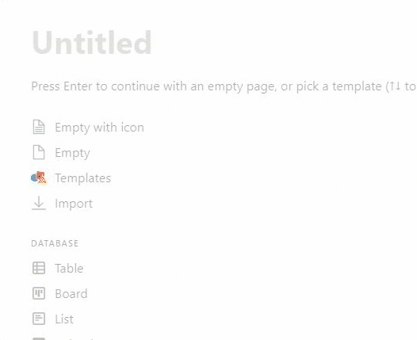

<figcaption>

On peut tout faire depuis le menu invoqué avec "/"

</figcaption>

</figure>

Je m'attarde un peu sur ce point, car je suis convaincu que le design et l'expérience utilisateur de Notion ont joué un très grand rôle dans la vitesse avec laquelle j'ai adopté l'outil, **qui est aujourd'hui devenu une composante essentielle de mon workflow**.

J'ai utilisé de nombreuses solutions par le passé pour essayer de créer un espace de travail digital aussi complet et simple d'utilisation que possible, et j'ai toujours été frustré par deux choses : la difficulté de prise en main de certains outils, et la rigidité de certaines plateformes.

Si un outil dont je souhaite me servir chaque jour nécessite plusieurs heures d'apprentissage avant de pouvoir m'être utile, je me décourage. Je n'ai aucun problème à admettre que l'ergonomie est un point primordial dans le choix des solutions que je privilégie.

## Notion rassemble plusieurs outils en un

Par ailleurs je n'aime pas perdre du temps à changer d'outil plusieurs fois par jour, par exemple pour passer de ma [To Do List](https://tobal.fr/la-meilleure-facon-de-gerer-sa-todo-list/), à un document de traitement de texte, avant de devoir ouvrir un tableau pour mon suivi client... Le temps perdu lié à des process non-optimisés a le don de m'énerver.

Avec Notion j'ai trouvé un outil qui me permet de contourner aisément ces deux points, particulièrement rédhibitoires en ce qui me concerne. Grâce à Notion, j'ai crée au sein d'un espace **unique** plusieurs outils dont je me sers chaque jour :

- Un tableau de bord qui centralise ma To Do List, mon calendrier éditorial et les KPI sur lesquels je souhaite garder un oeil au quotidien.
- Mon CRM.
- Les ressources pour mon process d'onboarding client
- Mes notes & documents relatifs aux projets en cours :

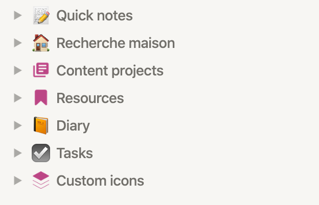

Mais je prévois également de digitaliser et centraliser, dans un avenir proche, les ressources dont je me sers au quotidien dans ma vie personnelle :

- Mon journal dans lequel j'écris chaque jour, ainsi que mon journal d'entraînement.
- Ma liste de lecture.
- Les notes sur mes projets personnels (investissements immobiliers, projets de vacances...)

L'organisation en arborescence permet de faire communiquer et hiérarchiser de manière claire les différents documents dont je pourrais avoir besoin.

Tous les outils que j'utilise chaque jour dans ma vie professionnelle et personnelle ne sont jamais à plus de 3 clics. Ce qui constitue un gain de temps et de clarté considérable.

## Les points forts de Notion

### La structure

L'organisation en dossier et en arborescence permet de retrouver en un clin d'oeil ce que l'on cherche. Je disais un peu plus haut que, sur Notion, ce que je cherche n'est jamais à plus de 3 clics. Et c'est vrai !

La navigation entre les différentes pages est très facile. Le menu s'efface d'un clic en cas de besoin. Le fait de pouvoir intégrer des pages au sein des pages (vous avez dit Inception?) rend la hiérarchisation des différents contenus très simple.

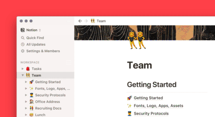

### La variété des contenus que l'on peut héberger sur une page

Du texte simple au calendrier, en passant par les tableaux, les documents PDF, des vidéos ou encore ses fichiers audio... Il est possible d'intégrer et agencer une très grande variété de contenus au sein d'une même page.

Et c'est sans compter les intégrations, de plus en plus nombreuses, qui permettent de faire communiquer différentes applications entre elles sans quitter Notion : Google Drive, Loom ou encore Typeform, par exemple.

<figure>

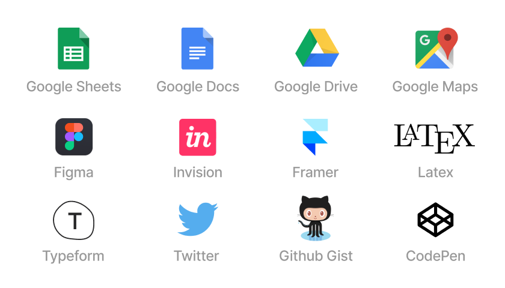

<figcaption>

Une liste non exhaustive de ce qu'on peut intégrer à une page Notion

</figcaption>

</figure>

### La création de bases de données

Ce point à lui seul mérite que je lui consacre une partie entière, dans la mesure où j'ai été très agréablement surpris de voir à quel point il était simple de construire des bases de données évolutives, en partant de rien ou via des modèles existants.

Quelques exemples d'applications intéressantes que l'on peut faire très aisément avec Notion :

- Création d'un CRM simple et flexible (notamment pour les freelances et les indépendants).
- Calendriers éditoriaux pour la gestion de campagnes marketing.
- Tableaux Kanban (coucou Trello 👋)
- Et bien plus encore.

_Petite astuce à connaître_ : Notion vous offre la possibilité de transformer quasiment n'importe quel tableau classique en [tableau Kanban](https://fr.wikipedia.org/wiki/Tableau_kanban) grâce à un système ingénieux qui s'appuie sur l'utilisation des étiquettes renseignées dans votre tableau. Un gain de temps considérable !

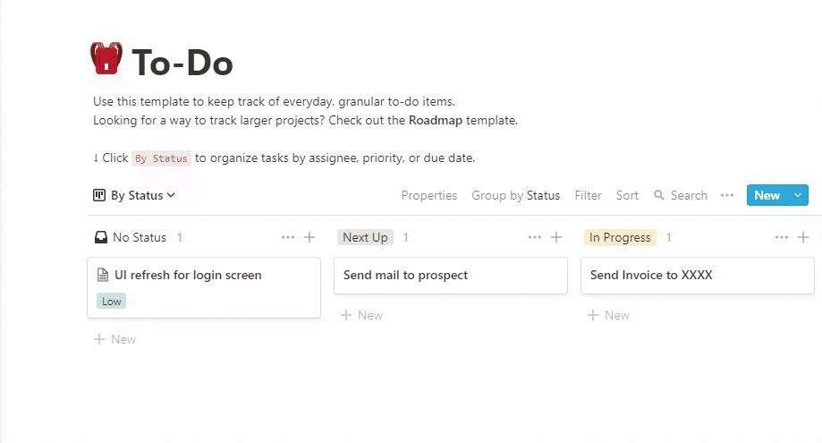

### Le coût

Précision qui a son importance : [Notion ne coûte pas cher](https://www.notion.so/pricing)... En fait, [il vient récemment de passer entièrement gratuit](https://www.numerama.com/tech/625412-notion-devient-gratuit-pour-les-particuliers-qui-veulent-organiser-leur-vie-minutieusement.html) et, si vous voulez utiliser les fonctions vraiment avancées, cela coûte moins de 50 € par an.

Étant donné les possibilités offertes par l'outil, le prix de Notion est très compétitif.

<figure>

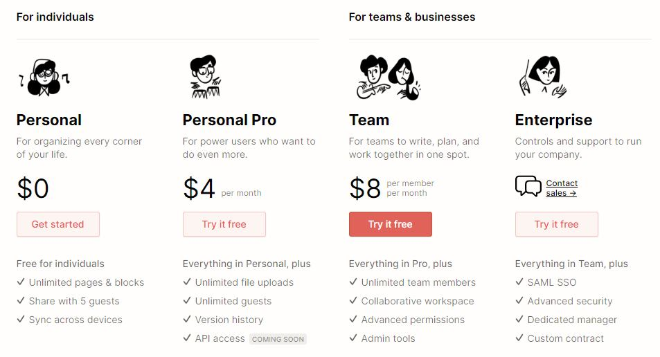

<figcaption>

Les plans proposés permettent de créer des solutions évolutives et adaptées aux besoins et usages de chaque utilisateur

</figcaption>

</figure>

### Un partage de pages très simple

Le partage est un must pour le travail en équipe. Notion vous permet de partager aisément, avec gestion des droits en lecture seule ou modification, vos pages avec n'importe qui.

Par exemple, vous pouvez facilement envoyer une page dédiée à vos clients, votre famille ou vos amis. Un moyen simple et rapide de créer des propositions commerciales, des rapports ou n'importe quel type de page ayant vocation à être hébergée en ligne sans avoir à coder.

<figure>

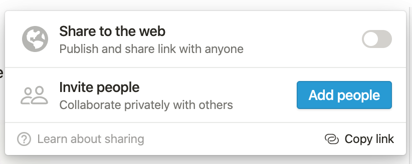

<figcaption>

Partage public, pour tout le monde, ou pour certaines personnes seulement

</figcaption>

</figure>

Je l'ai évoqué plus haut, mais la grande diversité de contenus que l'on peut héberger au sein d'une même page en fait un outil parfait pour héberger vos présentations, portfolio ou tout autre support de communication digitale.

### Une application mobile très bien conçue

Un défi de taille est de réussir à retranscrire l'expérience utilisateur, très confortable, sur mobile. Je dois avouer que j'ai eu quelques appréhensions à ce sujet. Non pas que ce soit très gênant en soi, puisque je travaille quasi-exclusivement sur mon ordinateur mais quand même.

Or, il s'avère que l'entreprise a su relever le défi haut la main. Encore une fois, le design épuré et minimaliste joue un rôle très important dans la facilité d'adoption et le confort d'utilisation.

Comme sur ordinateur, la navigation est simple et la lecture très confortable. L'édition de page se fait simplement, comme sur n'importe quelle application de prise de note. Encore une jolie victoire.

## Les (rares) points faibles de Notion

Cette section sera assez brève mais doit être abordée afin d'être aussi objectif que possible. Même si, vous l'aurez bien compris, je ne le suis plus depuis longtemps.

L'un des chantiers les plus important auquel Notion devra faire face selon moi : augmenter le nombre d'intégrations possibles.

Si Notion arrive à se connecter à une offre plus importante d'applications, alors elle aura définitivement gagné le trophée de la meilleur application de productivité... Selon votre serviteur du moins.

Je m'interroge également sur la sécurité des données hébergées sur la plateforme, bien qu'aucun indice ne me laisse présager le pire.

Plus les utilisateurs hébergeront de données personnelles sur le site, plus le risque de voir Notion être la cible de hackers mal intentionnés sera important. La sécurité des données hébergées sur la plateforme doit devenir selon moi l'une de préoccupations principales de l'entreprise.

Un dernier souci est la réactivité de l'interface. Loin d'être laborieuse, elle pourrait cependant être un chouilla plus fluide. Il arrive parfois que certaines pages, qui contiennent beaucoup d'information, mettent une seconde à apparaitre. Ce n'est pas rédhibitoire, mais quand on à l'habitude d'aller vite, ça peut être un peu frustrant.

## Une communauté d'utilisateurs active et pleine de ressources

Autre point important avec Notion : la communauté d'utilisateurs, qui est incroyablement active. Si vous êtes à l'aise en anglais, le [Reddit officiel](https://www.reddit.com/r/NotionSo/) est une mine d'or.

Lorsque l'on commence à s'intéresser à tout ce qui a pu être créé grâce à l'écosystème Notion, on se rend compte qu'il existe de nombreux templates tout fait qui aident grandement à prendre l'outil en main.

Si vous souhaitez en découvrir simplement, une galerie dédiée est [disponible ici](https://www.notion.so/Notion-Template-Gallery-181e961aeb5c4ee6915307c0dfd5156d).

## Des templates Notion à gogo

Le nombre de templates disponibles est particulièrement impressionnant. Un certain nombre d'entre eux ont été créés par l'équipe de Notion elle-même, mais il existe des dizaines de modèles créés par des utilisateurs pour des usages bien spécifiques.

Il y a de tout : des tableaux de bord personnels ou professionnels, des pages d'accueil, des bases de données, listes de lecture ou de de séries, gestion d'emploi du temps, de tâches ménagères, suivi des habitudes, objectifs et todo lists, calendrier, organisation de vacances...

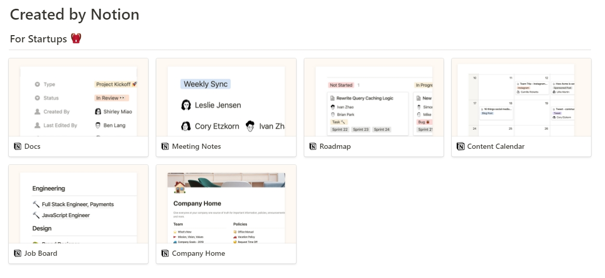

Des graphistes freelances partagent leurs modèles de propositions commerciales créées sur Notion.

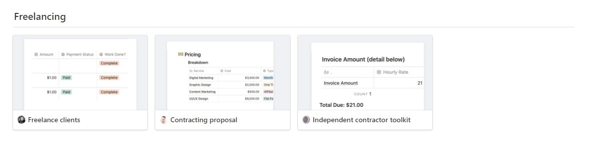

Ou encore product managers au sein de startups proposent également leurs outils de pilotage. Certains responsables de ressources humaines mettent à disposition leurs ressources pour l'onboarding des collaborateurs :

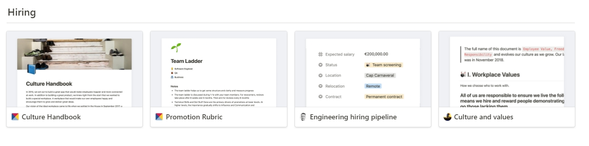

La souplesse de l'outil permet d'imaginer des applications presque sans limites.

Je n'ai pas été très étonné de voir se multiplier les événements, les ateliers et même les formations en ligne afin d'aider une communauté, toujours plus importante, à s'approprier et faire connaître Notion.

## Et même des extensions

De nombreux projets ont vu le jour sur [Product Hunt](https://www.producthunt.com/search?q=notion) afin d'enrichir encore un peu plus les possibilités offertes par l'application et pallier aux très rares limites que peut encore rencontrer l'outil.

<figure>

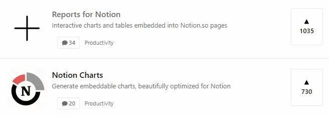

<figcaption>

Des outils qui permettent d'en faire encore plus avec Notion.

</figcaption>

</figure>

Je suis très curieux de voir les évolutions à venir de la plateforme. Étant donné l'engouement qui entoure le projet, on est loin d'avoir tout vu.

Je sais que de nombreux freelances utiliseront Notion en lieu et place de leurs sites personnels. Vous pouvez d'ailleurs déjà [trouver quelques exemples ici](https://www.notion.so/ec819bccd09b49148b3acf251a069cba?v=c4ef8493e0c04ca79d97081978e46453).

Cet outil a le potentiel de pouvoir permettre à de nombreux indépendants de construire des espaces de travail évolutifs et appropriés à leurs besoins, à peu de frais. Certaines entreprises, notamment les startups, peuvent construire des écosystèmes et des environnements de travail complets en se basant exclusivement sur cette plateforme.

## Conclusion

Je vous avais prévenu en préambule : je suis conquis.

> Les utilisateurs frustrés d'Evernote, Trello et autres applications dédiées à la productivité trouveront chez Notion une solution unique, centralisée et complètement personnalisable.

Si vous êtes dans ce cas, sachez que vous pouvez [importer aisément vos carnets depuis Evernote dans Notion](https://www.notion.so/evernote) directement.

<figure>

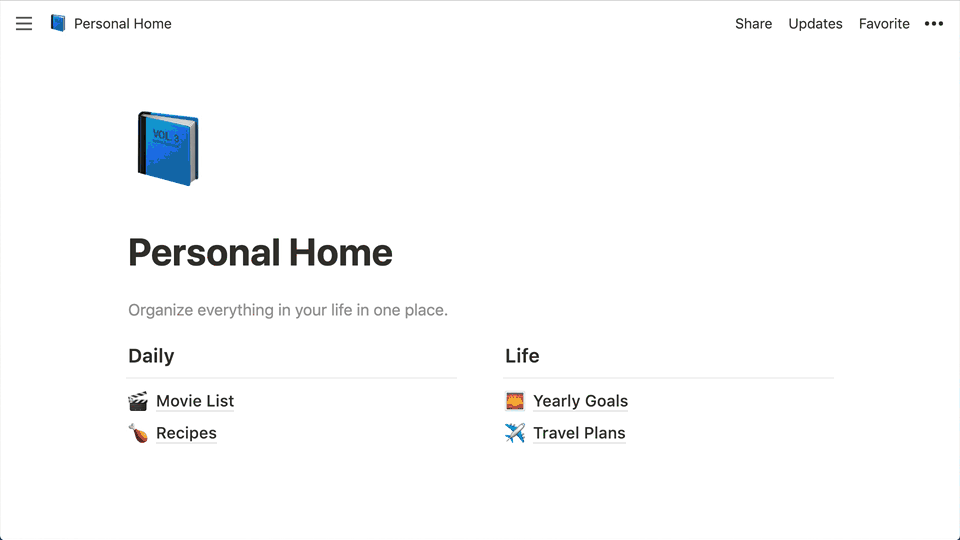

<figcaption>

L'import dans Notion depuis Evernote est simple.

</figcaption>

</figure>

L'outil est-il parfait ? Non mais, à ce jour, je n'en ai trouvé aucun qui rivalise avec Notion.

étant donné la vitesse à laquelle le nombre d'utilisateurs augmente, j'ai bon espoir que Notion continue de s'améliorer jusqu'à devenir (presque) parfait.

Pour finir, voici une liste de ressources qui vous seront utile si vous décidez d'utiliser Notion.

[NotionVIP](https://www.notion.vip/) : un site rassemblant de nombreuses astuces, vidéos et exemples d'espaces de travail Notion.
[NotionPages](https://notionpages.com/) : ce site regorge de modèles de pages tous aussi pratiques (et beaux) les un que les autres.
[10 Public Notion Templates You Can Magically Copy](https://medium.com/@benln/10-public-notion-templates-you-can-magically-copy-25d04c1e5da2) : un article en anglais sur Medium qui présente 10 excellents templates Notion.

_Cet article a été rédigé par Thomas Tissot, rédacteur freelance, qui utilise Notion au quotidien pour travailler_.
