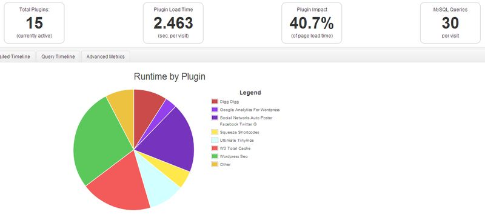

Dans un [article récent de l'ami Korben](http://korben.info/p3-plugin-profiler.html), j'ai découvert un plugin WordPress très pratique: [P3 (Plugin Performance Profile)](http://wordpress.org/plugins/p3-profiler/).<!--more-->

Il s'agit d'un plugin que vous installez en deux clics depuis l'admin de Wordpress et qui ira se loger dans la section "Outils". Il vous suffit ensuite de le lancer (en cliquant sur **Start Scan Now**), de choisir un nom (ou laisser celui par défaut) et de cliquer sur **Auto Scan**.

Le plugin va alors lancer une série de test afin de déterminer le temps de chargement de chaque plugin, pour vous donner une liste détaillée des performances de ceux-ci, ainsi qu'un joli graphique pour visualiser en un coup d’œil l'impact qu'ont vos plugins sur le temps de chargement de votre page:

Après l'avoir testé, je trouve ce plugin vraiment pratique et intéressant pour deux raisons:

- premièrement il est très simple à installer et utiliser. Il ne sert à faire qu'une chose mais il la fait bien.
- Deuxièmement, il vous permet de trouver quels plugins font ramer votre page au chargement, ce qui va vous permettre d'agir en conséquence (optimiser ou virer un plugin qui prendrait trop de temps). Ce qui vous donne donc la possibilité d'améliorer fortement le temps de chargement de vos pages, et ça, c'est vraiment top pour le coup.
