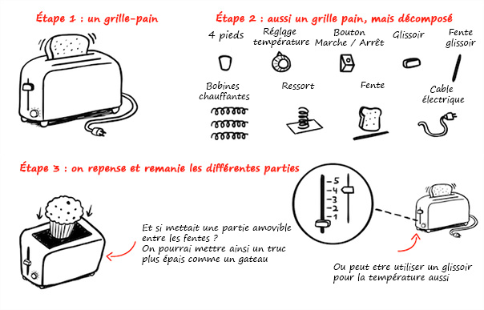
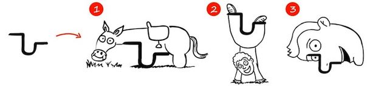

_Est ce que la créativité est un talent inné ? Pour beaucoup d'entre nous, le processus de création n'est pas automatique: il nécessite travail et efforts. Comme l'explique l'écrivain Iris Shoor, etre créatif et trouver de nouvelles idées n'est pas toujours un don de la nature - c'est une compétence qui peut s'apprendre._

Il y a quelque jours, je parlais à quelqu'un de ma startup. "Comment t'es venu l'idée ?" m'a-t-il demandé, avant d'ajouter "Tu es quelqu'un de créatif". Cette remaarque me fait toujours sourire, car je pense qu'etre créatif n'est pas un talent inné. Tous les jours, je n'essaye pas de penser différement, mais j'essaye plutot ardemment de vivre en concevant les choses différement. Je pense que la créativité peut être enseignée, et je sais assurément que je suis devenue plus créative au fil du temps. Il ne s'agit pas forcément de trouver l'idée du siècle ou LE concept, mais plutot d'utiliser la créativité afin de réussir à surmonter les obstacles de la vie de tous les jours et atteindre ses objectifs personnels et/ou professionnels. J'utilise ma creativité afin de vendre mes idées et produits au gens, mais aussi afin de surmonter mes obstacles personnels, en sortant hors de ma zone de confort.

Voici quelques principes que j'utilise pour trouver de nouvelles idées.

## Changer seulement une peite partie d'une idée à la fois

La plus grande diffculté à laquelle nous faisons face lorsque nous tentons d'innover vient du fait que notre cerveau préfère naturellement ce qui lui est familier. Que ce soit pour brouillon ou un concept vieux de plusieurs années, une fois la première idée implantée, il devient très difficile de s'en débarasser. Une fois que nous avons une idée d'agencement pour un bureau, un croquis, une présentation ou un design de site web, il est presque impossible de complètement changer d'idée. Par exemple, essayez de trouver un nouveau design à la page d'accueil Google. Difficile, n'est-ce pas ?

Une technique très efficace pour contrer ce problème est de prendre son idée ou projet et le diviser en plusieurs petits éléments. Une fois que vous aurez cessé de considérer le projet dans sa globalité, les choses paraissent moins figées qu'auparavent. Établissez une liste de tous les éléments de votre concept (cela peut être des sujets de présentation, des paragraphes d'article, des élements d'un site web, les différentes pièces qui composent un meuble, etc...). Puis concentrez-vous sur une seule partie à la fois et ne changez que celle-ci. Le phénomène le plus intéressant est que le fait de diviser ainsi un projet en plusieurs petites parties tend à faire naitre de nombreuses idées par la suite. Une fois la liste détaillée des composantes d'un projet ou d'une idée, vous pouvez faire des merveilles avec. Exemple:

## Ne commencez pas forcément au début

L'un des moments les plus critiques d'un projet n'est pas la fin mais le début. Très souvent il arrive qu'on se retrouve à repousser un projet, jour après jour, semaine après semaine, pour la seule raison que l'on n'arrive pas vraiment à le démarrer depuis le début. Cela arrive car généralement, jeter la première pierre s'avère difficile car on ne sait pas forcément pas où commencer ou comment commencer. Et lorsqu'on rencontre des difficultés, on a tendance à abandonner.

Une solution consiste alors à commencer par une partie qui vous semble plus abordable, meme si ce n'est pas le début "logique". Commencez par une partie plus technique, standard, qui demande moins de réflexion. Par exemple, pour créer un site web, je peux tout à fait commencer par le pied de page, ou un paragraphe "A propos", ou encore un bloc de contact. Puis je passe à la suite. Meme pas besoin que la partie suivante soit liée à ce que je viens de faire, l'important est d'avancer sur des éléments "faciles" à implémenter. Après avoir répété ce processus quelques fois, on arrive la plupart du temps à un squelette de base duquel on peut ensuite facilement dessiner le reste et l'ensemble du projet.

## Explorer les alternatives, du simple à l'extrême

Un peu à la manière des tests de QI, vous pouvez vous soumettre à des tests de créativité. Dans un des tests les plus courants, il est demandé de créer le plus possible de formes ou figures en se basant sur une forme simple (par exemple un cercle, ou trois lignes reliées). Voici mon essai:

Lorsque votre créativité entre en jeu, il ne s'agit plus de trouver LA bonne réponse, mais plutot de trouver plusieurs réponses possibles à une même question. Lorsque vous rencontrez un problème, essayez de trouver de multiples réponses. Cela vous aidera à le résoudre plus facilement, d'une manière plus créative. Avant de démarrer un projet (ou une partie de ce projet), essayez de concevoir 5 ou 6 versions différentes. Cela peut être 5 ou 6 manières d'exprimer un discours, 5 ou 6 thèmes de site web. Je m'assure de préparer une liste d'alternatives avant de commencer un projet pour être sur de ne pas être bloquée sur une idée. Dans un deuxième temps, rendons les choses encore plus intéressantes: essayez de classer vos alternatives par ordre de variation, la première étant la plus proche du concept de base et la dernière étant la plus extrêmement éloignée.

Même si vous finissez par choisir les idées "standard" plutot que les extrêmes, en testant les idées les plus excentriques, votre version "standard" changera probablement aussi. Pour citer un exemple personnel, le logo de ma société a été crée en utilisant cette méthode. J'ai commencé par un logo simple, sobre, typique des logos "corporate", puis j'ai essayé de créer différentes versions de plus en plus "excentriques". A la 5ème version, le logo comportait des personnages types monstres de cartoon, représentant le problème que nous tentons de résoudre. Il s'est avéré que le logo avec les monstres marche du tonerre. Je n'aurai jamais trouvé cette idée sans me forcer à chercher de multiples alternatives.

## Pensez différement, pensez comme si vous étiez quelqu'un d'autre

Citez-moi 10 noms de villes.

A présent, citez-moi 10 noms de villes proches de la ville où vous résidez.

C'est plus facile, non? Lorsque nous utilisons des contraintes, il est souvent plus aisé de trouver des idées. Notre manière de penser repose sur les connexions: un certain parfum ravive un souvenir, un nom rappelle un visage. En utilisant des contraintes, nous déclenchons naturellement des idées, et donc des solutions. Même lorsqu'il n'y a pas de contraintes, nous avons tendance à en fabriquer. Lorsqu'on demande à une personne de citer 10 noms de ville, elle va naturellement chercher des liaisons: noms de capitales, noms de villes déjà visitées, etc...

Donc, en quelque sorte, on ne pense jamais complètement différement, on se place plutot dans différents contextes. Une de mes techniques favorites pour être créative, c'est de me mettre dans l'état d'esprit d'une autre personne. Par exemple, j'essaye de voir un projet en cours d'élaboration en m'imaginant à la place de quelqu'un d'autre. Si il s'agit de design, je me demande comment Google ou bien Coca-cola ferait le design ? Si c'est un article, comment tel journaliste ou même collègue l'écrirait-il ? Vous vous rendrez compte que même si votre idée est loin de ressembler à ce que vous pensiez initialement, s'apposer des contraintes de cette manière fera bouillir votre sens créatif.

_par Iris Shoor. Traduit et adapté de l'anglais. Illustration par [renjith krishnan](http://www.freedigitalphotos.net)_.
