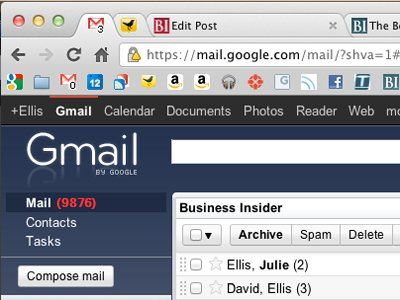

Tous les jours nous sommes exposés à un flot, que dis-je, un torrent d'informations, et il est facile de se retrouver à jongler entre des dizaines d'onglets, rater des e-mails, ouvrir trop de fenêtre et laisser de côté un travail inachevé sur un logiciel pendant des jours sans s'en apercevoir. Les ordinateurs sont multitâches, mais pas vous. Voici quelques conseils pour vous entraîner à vous focaliser sur l'essentiel dans un environnement rempli de distractions.

## Adoptez la règle "Pas de fenêtres réduites" afin de vous forcer à agir

Réduire une fenêtre est le meilleur moyen pour créer une pagaille "invisible". C'est un peu comme si vous laissiez traîner des miettes de nourriture où du liquide renversé au sol en vous disant que vous nettoierez plus tard. Sur le moment vous n'y faites pas attention, mais plus tard vous vous rendrez compte que vous avez marché dessus. Certes, votre ordinateur ne vas pas se transformer en poils d'animaux, de grains de riz ou de coupure d'ongles, mais virtuellement, réduire une fenêtre revient au même par rapport à votre productivité.

Réduire une fenêtre, ça revient à dire "Je ne peux pas m'occuper de ça maintenant", et ce n'est pas une bonne chose. Vous _pouvez_ vous en occuper immédiatement. La différence c'est que vous allez devoir prendre une décision quand à l'importance de la chose. Par exemple, cela peut être un article sur un blog que vous vouliez lire mais vous n'avez jamais vraiment eu le temps. Laissez tomber et fermez la page. Si il s'agit d'un document Word que vous deviez terminer depuis plusieurs jours, fermez-le. Cessez de réduire vos fenêtres et priorisez vos tâches à la place. Un groupe de fenêtre réduites n'est pas une liste de tâche à faire, au contraire, c'est une liste de choses que vous allez oublier de faire.

Au début, vous aurez du mal, mais faites l'effort de vous interdire de réduire toutes vos fenêtres. Vous vous sentirez vite débordés par le nombre d'éléments à votre écran, mais c'est l'effet recherché. Cela vous forcera à trier et ranger les choses pour garder les idées claires. Vous devrez prendre des décisions difficiles: quelle fenêtre fermer ou garder, mais au fur et à mesure vous prendre l'habitude et vous serez mieux organisés.

## Triez votre bureau

La pire des choses que vous puissiez faire (et beaucoup le font !), c'est d'utiliser votre bureau (celui de l'ordinateur, pas le meuble hein) comme "fourre-tout". Si vous avez ce problème, vous devez vous y attaquer le plus tôt possible. Rechercher un fichier qu'on ne trouve pas à cause du souk sur son bureau, ça vous fait perdre du temps. En réalité, vous créez une représentation visuelle de la manière dont vous êtes débordé. Cela peut vous sembler idiot, mais un bureau propre peut vous aider à mieux vous concentrer. D'une part parce que vous n'êtes pas constamment confronté à votre problème de désordre toute la journée, et d'une autre parce qu'encore une fois, vous gagnerez du temps en étant organisé.

## Stop à la boite de réception "vortex"

Combien y-a-t-il de mail dans votre boite de réception ? Si vous répondez plus de 10, le discours est à peu près semblable à celui sur votre bureau: une boite de réception qui sert de fourre-tout. Là aussi il est très facile de laisser tous les mails atterrir dans sa boite de réception, en se disant qu'on les traitera plus tard. Et puis au bout d'un moment on se retrouve avec des dizaines (voir des centaines) d'e-mails dans sa boite.

Si c'est votre cas, prenez le taureau par les cornes et lancez-vous dans le rangement de votre boite. L'objectif est d'avoir une boite de réception vide ! Tout courrier lu et traité doit être classé dans un dossier ou libellé adéquat. Si vous n'avez pas lu le mail, lisez-le (faites vous des sessions "gestion et tri des e-mails"). Au besoin, n'ayez aucun remord à le supprimer. Trier vos mails aura deux effets bénéfiques pour votre productivité:

- Vous aurez une meilleure visibilité. L'aspect propre et ordonné de votre boite de réception n'aura pas l'impact négatif et démotivant d'une boite remplie et en désordre.
- Vous gagnerez du temps. Garder une boite de réception vide ou presque vous forcera à ranger systématiquement les nouveaux e-mails dans le bon dossier, ou à leur appliquer le bon libellé. Vous retrouverez donc beaucoup plus facilement vos e-mails. De plus, votre boite de réception sera claire et vous identifierez donc plus rapidement les nouveaux courriers importants à traiter du reste.

Voilà, en suivant ces quelques conseils, vous vous rendrez vite compte que retrouver un information, ou s'organiser pour une tâche en particulier devient beaucoup moins contraignant. Vous n'en serez que plus efficace et productif.
