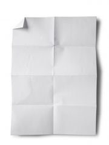
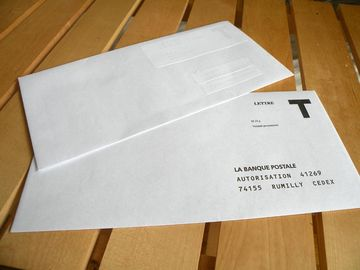

## 1\. Votre CV doit tenir sur une seule page

Il fut une époque où votre CV devait tenir coûte que coûte sur une seule page. Cette époque est révolue. Les temps ont changé et les CV en plusieurs pages deviennent de plus en plus courant de nos jours. L'important, c'est la clarté et la pertinance des informations que contient votre CV. Si c'est nécessaire utilisez deux pages, voire trois si vous avez vraiment beaucoup d'expérience. Pas plus par contre, il ne s'agit pas non plus d'écrire un roman. Bien entendu, si vous n'avez pas beaucoup d'expérience il est tout à fait normal et appropriée d'avoir un CV qui tient sur une seule page.

## 2\. L'intégralité de votre expérience doit figurer sur votre CV

Vous n'êtes en rien obligé(e) de faire figurer la totalité de vos précédents emplois su votre CV. Rappelez-vous de ceci: votre CV, **c'est votre publicité, c'est un élément de marketing.**. Le but est de présenter votre candidature de manière efficace et avantageuse, mais il n'est pas obligatoire de devoir indiquer chaque emploi occupé précédemment. N'hésitez donc pas à "dégrossir" votre CV pour le rendre plus pertinent (et éventuellement gagner de la place).

## 3\. Indiquer des références joignables sur son CV

Cette pratique est d'une autre époque. De nos jours, on vous demandera directement par téléphone ou par e-mail de communiquer des références si besoin. Vous n'avez pas besoin d'en citer explicitement sur votre CV. En plus vous gagnerez quelques lignes sur votre CV.

## 4\. Indiquer ses objectifs en haut de votre de CV

Alors là il faut vraiment la jeter aux oubliettes, fermer à clé et jeter la clé dans les laves du Mordor. Les recruteurs n'ont que faire de vos objectifs: ce qui les intéresse, c'est ce que vous pouvez leur apporter; ce sont vos compétences et surtout ce que vous pouvez en faire qu'ils retiendront. La tendance actuelle consiste à mettre en valeur, à la place de l'objectif, une caractéristique particulière ou une compétence phare.

## 5\. Déposer un CV papier / envoyer son CV par courrier

On entend encore dire qu'il est bon de déposer son CV sur papier ou l'envoyer par courrier. La seule chose que cela vous apportera, c'est de paraitre "vieux-jeu", dépassé. Vous risquez même de déranger un peu, car de nos jours presque tout passe par l'informatique, votre CV papier risque de se retrouver "en dehors du système" et d'être oublié. Envoyez un e-mail, c'est plus simple et plus rapide.

## 6\. Donner un faux point faible

C'est un grand classique: le recruteur vous demande votre point faible, et vous lui dites quelque chose du genre "Je suis trop perfectionniste", ou encore "J'ai tendance à trop travailler". Premièrement, on vous demande un point faible, hors des choses comme "travailler trop" sont tout sauf des points faibles. Deuxièmement, cela fait horriblement cliché, c'est la réponse donnée par 99% des candidats. Ce genre de réponse ne fera qu'indiquer au recruteur un manque d'originalité. Essayez de sortir du lot en évitant la technique du "défaut positif".

## 7\. Utiliser un langage très soutenu, formel dans votre CV et lettre de motivation

C'est également un stéréotype, qui fait que tous les CV ou lettres de motivation se ressemblent. Après tout, les meilleurs CV et lettres de motivation sont ceux qui vous ressemble. Bien entendu, pas question d'être familier, mais un langage courant, franch et naturel sera plus parlant et vous fera sortir du lot.
