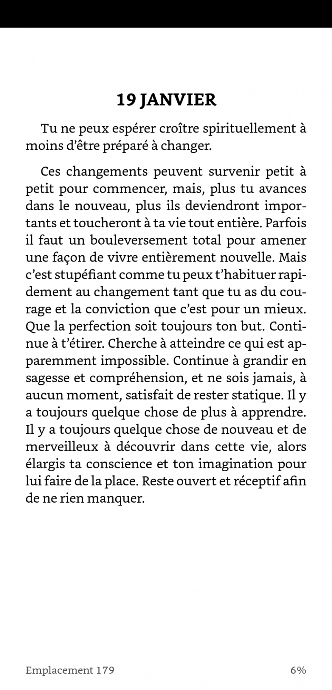

Il y a quelques mois, en dormant chez mon frangin je suis tombé sur un livre de la bibliothèque de ma belle-soeur qui a attiré mon attention : **La petite voix**.

<!--more-->

Après l'avoir feuilleté, je l'ai acheté aussi sec sur Amazon. J'ai trouvé les textes très sympas et le format original.

**La petite voix** est un livre dont le sous-titre est "Méditations quotidienne".

Et c'et exactement ça. Le format de ce livre est super sympa car **tu n'as pas à lire plein de pages et prévoir du temps pour lire**. Le livre est divisé en 365 petits chapitres qui prennent moins de 5 minutes à lire. Chaque chapitre correspondant à un jour de l'année, tout simplement.

C'est donc très facile à lire. Chaque jour son chapitre, à peine 5 minutes. Et chaque texte est une invitation à la réflexion spirituelle. Un exemple :

<figure>

<figcaption>

Extrait du texte du 19 janvier.

</figcaption>

</figure>

## Un ton très spirituel

Le ton du livre est très spirituel, dans le sens _développement de l'esprit_.

**Le message communiqué est celui d'une [amélioration de soi, de courage, d'abondance, d'acceptation et de foi](https://tobal.fr/change-le-monde-en-changeant-une-seule-chose/)**.

Alors quand je dis "foi", je te préviens : les textes peuvent parfois sonner très religieux, avec des références au divin et parfois même au Christ. Mais **tu es libre de les interpréter à ta façon**.

Personnellement, je suis pas du tout religieux, et ça ne me dérange pas le moindre du monde. Je pense que les messages transmis à travers ces méditation quotidiennes sont avant tout une forme de développement personnel. Le but est de **faire la paix à l'intérieur pour bien vivre à l'extérieur**.

Après, qu'on interprète que les textes font référence à Dieu, au Christ, à l'Univers, le destin, la matrice... Chacun fait comme il veut.

Je recommande de lire ce livre 2 minuts tous les matins au lever. Si tu cherches un livre très facile à lire, et qui te redonne du peps, t'aide à avoir [confiance en toi](https://tobal.fr/petite-confidence-sur-la-confiance-en-soi/) et en la vie, et surtout à devenir une meilleure personne, c'est le livre qu'il te faut.

[La petite voix sur Amazon](https://amzn.to/2CxC5RJ).
