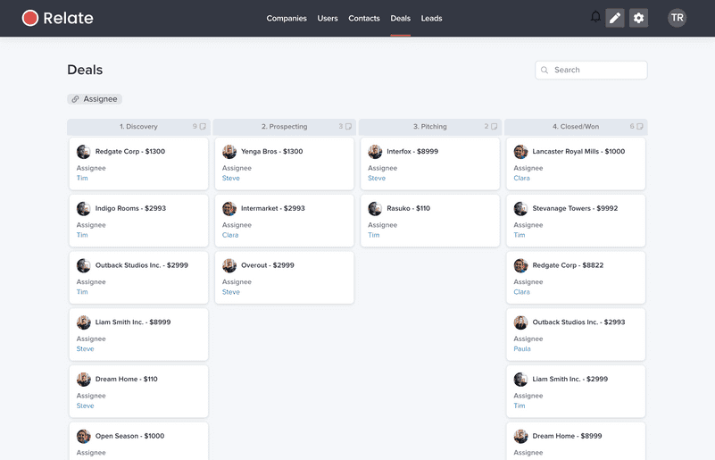
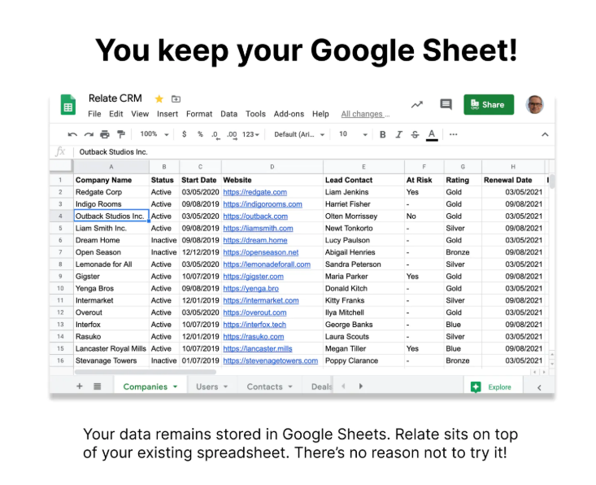
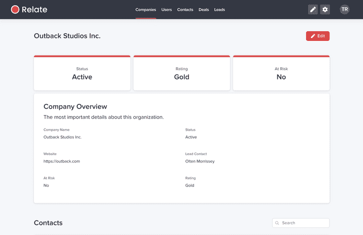
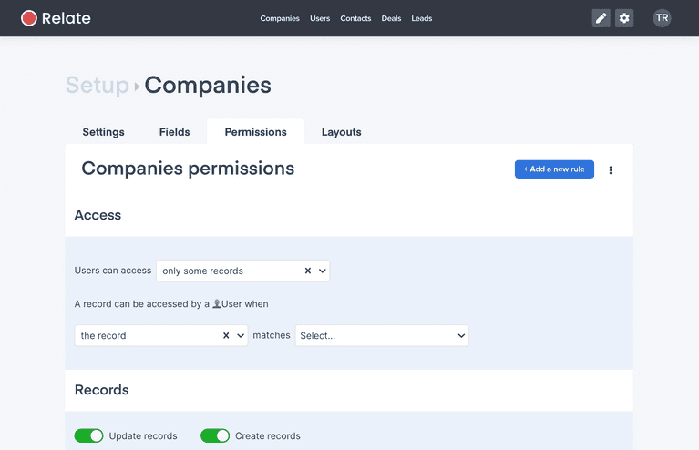
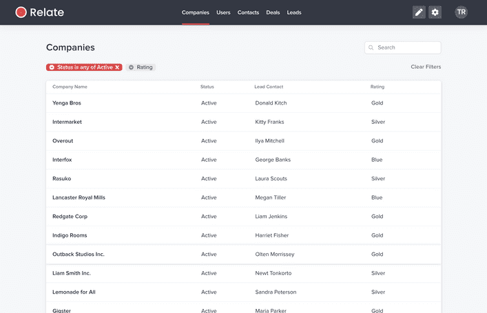

Tu as peut-être déjà eu un problème d’organisation avec [un CRM](https://blog.hubspot.fr/customer-relationship-management) où les données sont mal organisées et ça devient difficile à suivre. Ou alors le prix qui revient trop cher, ou encore l’application trop compliquée à utiliser. Si tu es habitué à [Google Sheets](https://www.google.com/sheets), et que tu as besoin d’un CRM, [Relate CRM for Google Sheet](https://www.relatecrm.app/) est une solution efficace pour stocker les informations de contact importantes concernant tes prospects et clients.

<!--more-->

En gros, si tu utilises Google Sheets comme CRM, Relate CRM rendra la gestion de relations clients beaucoup plus agréable. Il s’agit d’une application flexible qui ajoute des [kanbans](https://openclassrooms.com/fr/courses/4507926-initiez-vous-a-la-gestion-de-projet-agile/4517156-utilisez-la-methode-kanban), des listes, des filtres et des autorisations à ta feuille. C'est une interface plus sympa pour gérer ses ventes.

<figure>

<figcaption>

Source : [RelateCRM](https://www.relatecrm.app/)

</figcaption>

</figure>

La principale différence donc,  avec d’autres CRM comme [Hubspot](https://www.hubspot.fr/products/crm), c’est que Relate CRM utilise Google comme source de données. L’avantage, c’est que tu peux toujours mettre à jour les données d'une fiche à partir de Google Sheets,  et tu verras ces changements dans Relate CRM.

Un autre avantage est que, contrairement à Hubspot où tu as peu de possibilités de personnalisation, en termes de structure des données, avec Relate CRM, ton CRM peut être aussi personnalisé que tu le souhaites.

<figure>

<figcaption>

Source : [ProudctHunt](https://www.producthunt.com/posts/relate-2)

</figcaption>

</figure>

## **Points forts de Relate CRM**

**La synchronisation des données est bidirectionnelle**. Les données étant toujours stockées dans des feuilles de calcul Google Sheets, toutes les modifications apportées à Relate CRM sont instantanément mises à jour dans la feuille de calcul liée. 

Grâce à des format de page clairs et lisibles pour chaque ligne, Relate CRM permet de mieux gérer ses informations et de gagner du temps. L'application affiche une pleine page pour chaque ligne, et tu peux également choisir quelles colonnes tu souhaites afficher.

<figure>

<figcaption>

Source : [RelateCRM](https://www.relatecrm.app/)

</figcaption>

</figure>

Autre point fort, tu peux également relier les lignes entre elles, et ainsi rassembler tes données. Relate CRM ajoute des relations en haut de ta feuille de calcul. En gros, ça signifie que tu n’as plus besoin de [VLOOKUPS](https://support.google.com/docs/answer/3093318?hl=fr) (appelés RECHERCHEV en français).

L’application offre aussi un contrôle fin des droits d’accès. Tu peux donc limiter l’accès pour chaque membre de l'équipe à ses propres données.

## **Points faibles**

Le point faible principal de l’application, c’est qu’elle est encore en bêta. Il est donc possible de rencontrer des bugs, et certaines fonctions avancées habituellement présentes sur un CRM (comme par exemple la gestion de l'emailing) sont absentes.

La version bêta n’est d’ailleurs même pas accessible publiquement. Les utilisateurs sont inscrits par lots, et il faut donc attendre pour pouvoir être inscrit. Ça peut être frustrant.

Enfin, la gestion des données grâce à des feuilles de calculs est très pratique, mais pour des besoins poussés au niveau relationnel, on peut se retrouver rapidement limité.

<figure>

<figcaption>

Source : [RelateCRM](https://www.relatecrm.app/)

</figcaption>

</figure>

## **À qui s'adresse Relate CRM**

**Relate CRM for Google Sheet** s’adresse aux professionnels et entreprises pour la gestion d’informations et de données des prospects et clients en premier lieu, et surtout pour ceux qui fonctionnent déjà beaucoup avec Google Sheets. 

C’est aussi une très bonne alternative à des CRM compliqués ou plus lourds à mettre en place, comme Salesforce ou Hubspot.  

Et c’est une bonne solution pour toute personne qui veut juste un outil CRM simple et rapide à mettre en place, pour développer et gérer ses relations clients.

<figure>

<figcaption>

Source : [RelateCRM](https://www.relatecrm.app/)

</figcaption>

</figure>

## **Combien ça coûte ?**

Rien pour l’instant. Tant que l’application est en bêta, l’utilisation est entièrement gratuite. 

En ce qui concerne le coût une fois sorti de bêta, rien n’a été communiqué encore officiellement sur le site.  Mais ce sera probablement un abonnement mensuel.

## **Conclusion**

Relate CRM for Google Sheet t’aidera à te concentrer sur tes clients actuels et potentiels, plutôt que sur la mise en place compliquée CRM. 

Si tu es déjà à l’aise avec les feuilles de calcul Google Sheets, il est possible que tu adores Relate CRM et qu’il te rende la vie plus simple.

**Sources**
[Site officiel Relate CRM](http://www.relatecrm.app/)
[Page de l’application sur ProductHunt](https://www.producthunt.com/posts/relate-2)
