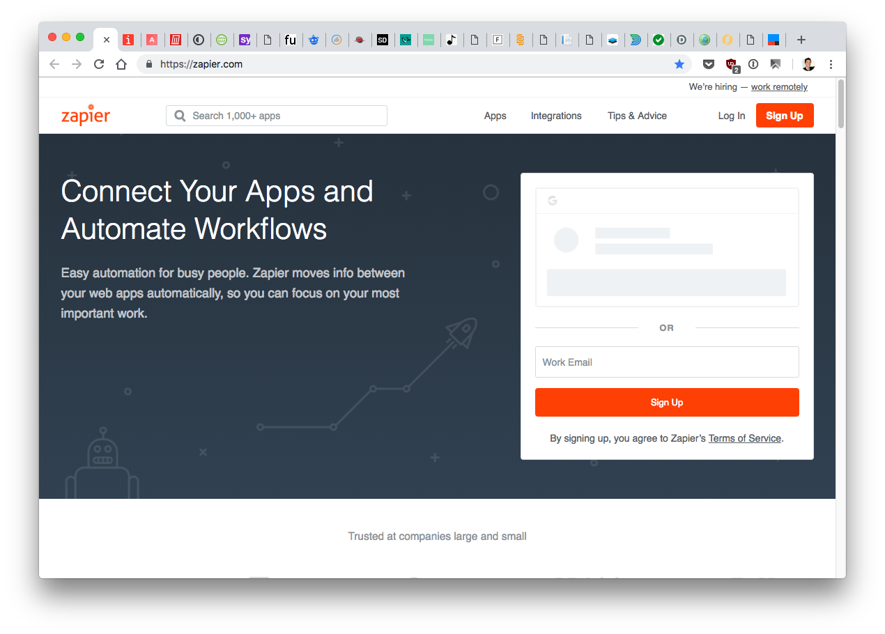
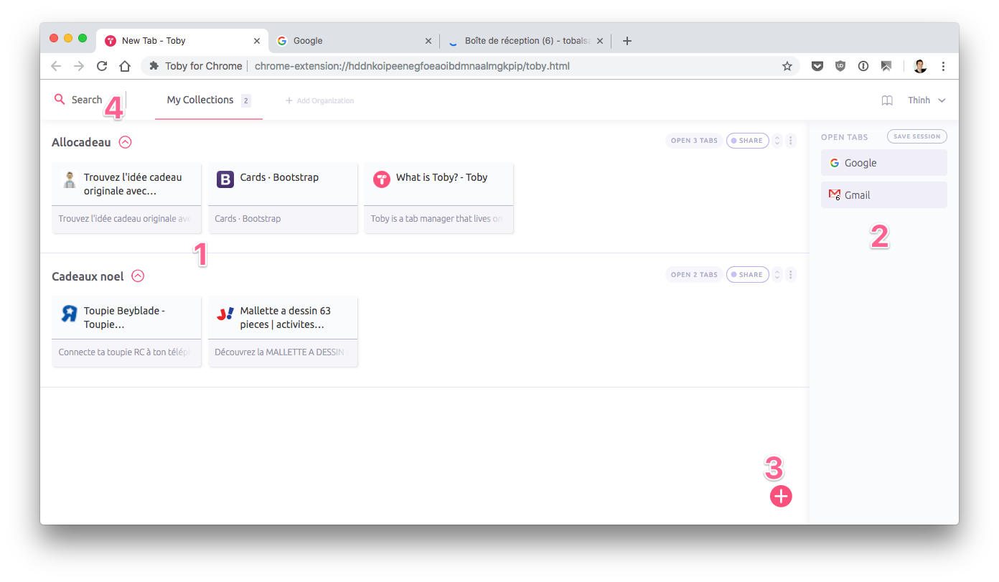

Tu connais l'onglite aigüe ? C'est une maladie très répandue, mais personne ne se rend jamais compte qu'ils en sont atteint. Si ta barre d'onglets ressemble à peu près à ça :<!--more-->

Alors tu es atteint. Tu as un problème. Tu es anxieux de perdre l'info. Tu te dis toujours que tu vas avoir besoin de retrouver un onglet. Sauf qu'il y a plusieurs problèmes avec ce fonctionnement :

- Sois honnête avec toi-même : sur les 34 onglets que tu as ouverts, de combien en as-tu vraiment besoin ? Combien nécessitent _réellement_ de rester ouverts ?
- Tu perds un temps fou à retrouver un onglet quand tu en as vraiment besoin.
- Ça utilise les ressources de ton ordinateur pour rien.

C'est comme les gens qui ont [peur de jeter et qui accumulent](https://tobal.fr/une-chose-en-moins-par-jour-es-tu-capable-de-relever-le-defi/). Tu es peut-être un accumulateur d'onglet. En vrai, on a jamais besoin que de 4 ou 5 onglets grand maximum.

Aujourd'hui j'ai une solution géniale pour toi, qui a peur de fermer ses onglets : l'extension [Chrome Toby](https://www.gettoby.com/).

C'est gratuit et super simple à utiliser.

Une fois que tu as installé l'extension, Toby devient ta page de nouvel onglet, et te permet de sauvegarder tous tes onglets dans un format super clair et rapide à utiliser.

En 1, dans l'espace principal, ce sont les onglets que tu as sauvegardés, qui peuvent être arrangés en collections.

En 2, ce sont les onglets actuellement ouverts. Pour les ajouter à une collection il suffit de les glisser de droite à gauche dans la collection souhaitée.

En 3, c'est pour pouvoir ajouter une collection.

En 4, truc qui fait gagner grave du temps, c'est un champ de recherche pour trouver rapidement un onglet si tu en as beaucoup.

L'extension est toute simple mais très efficace. Et depuis que je l'utilise, je n'ai plus aucun onglet qui traine, sans pour autant devoir perdre du temps à retrouver un onglet que j'ai du laissé ouvert au cas où, ou à devoir mettre en favori. La présentation des onglets via Toby et la barre de recherche te feront gagner un temps monstre.

C'est bien trouvé, c'est bien Toby. Ok, je sors.

[Toby sur le Chrome Web Store](https://chrome.google.com/webstore/detail/toby-for-chrome/hddnkoipeenegfoeaoibdmnaalmgkpip).
