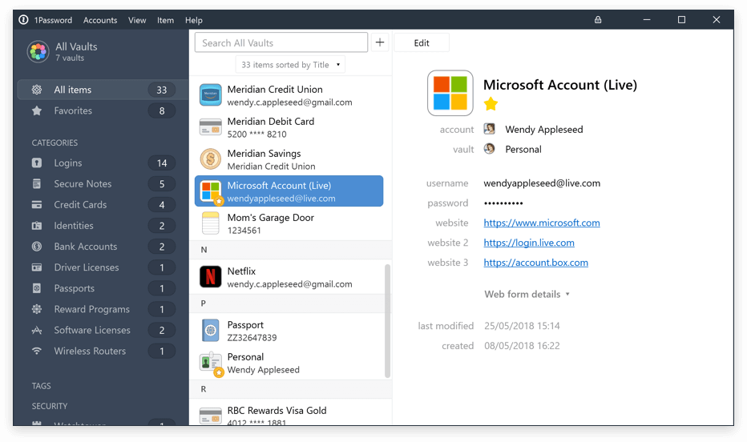
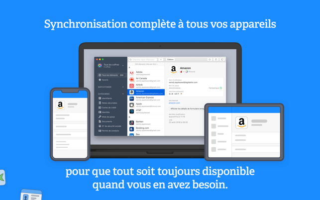
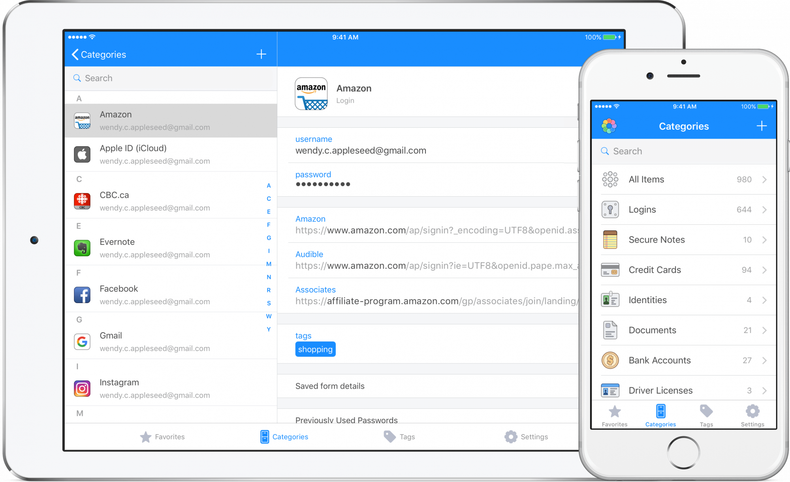
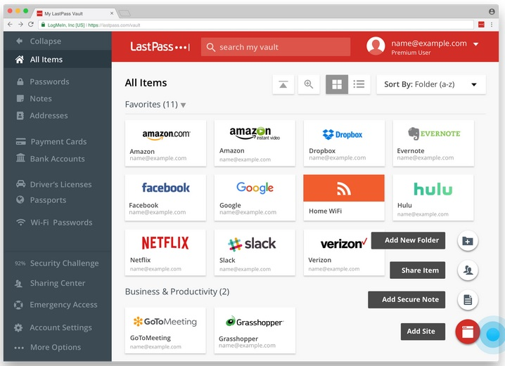
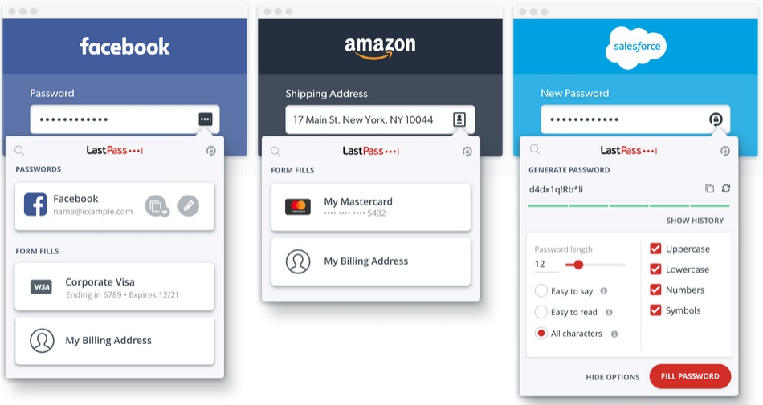
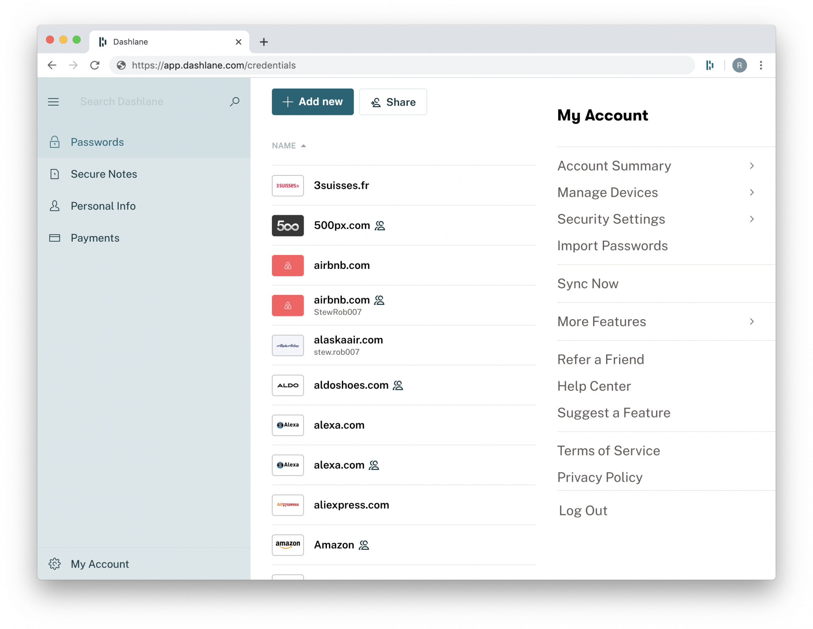
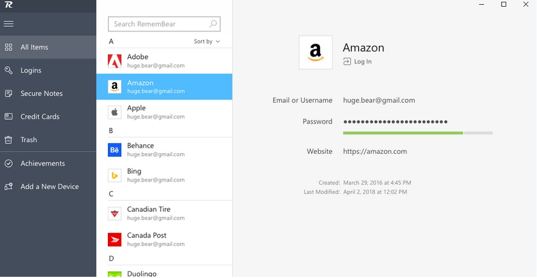
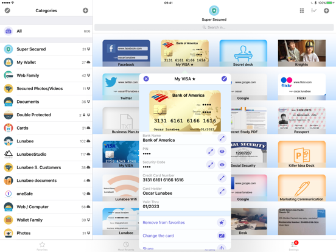
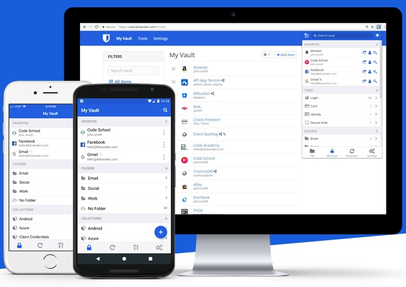

Tu oublies fréquemment tes mots de passe ? Tu en as marre de devoir créer un mot de passe à chaque fois que tu crées un nouveau compte ? 1Password est l’application qu'il te faut. Tu peux installer ce gestionnaire de mots de passe sur Windows, Mac, Android ou iOS. Grâce à lui, tu n’auras plus qu’à retenir un seul mot de passe.

Pas encore convaincu ? Découvre l’application avec moi !

## **Un gestionnaire de mots de passe ? Mais pourquoi ?**

<!--more-->

Tu enregistres tous tes mots de passe sur un fichier numérique ou un papier ? Ce sont de bonnes méthodes, mais [tu pourrais t’y perdre](https://tobal.fr/comment-vraiment-supprimer-le-mot-de-passe-de-connexion-a-louverture-de-windows-10/) au fil du temps. Eh oui, avec tout ce qu’on fait au quotidien, on ne sait jamais où on range tous nos mots de passe.

Pour y remédier, je te conseille de télécharger un gestionnaire de mots de passe dédié. **Ce programme est capable de générer et de retenir tous tes mots de passe**. Il faudra simplement que tu en retiennes un seul : celui qui te permettra d’ouvrir l’application.

De plus, c’est un outil qui va s’avérer particulièrement utile aux personnes un peu réfractaires aux démarches en ligne. Ma copine détestait les formalités en ligne car elle ne se souvenait jamais des mots de passe de tous ses comptes en ligne. Depuis que je l’ai fait passer à 1Password, elle n’hésite plus à tout faire en ligne. C’est beaucoup plus facile pour elle de se connecter à tous les sites en deux clics, sans avoir à faire appel à sa mémoire.

## **Attention aux gestionnaires intégrés aux navigateurs**

Tu veux accéder à des réseaux sociaux, des bibliothèques en ligne ou des sites e-commerce ? Le plus facile serait d’utiliser la fonction intégrée à ton navigateur pour enregistrer tes mots de passe. 

Malheureusement, le niveau de sécurité de ces fonctions intégrées laisse à désirer. Les données que tu stockes sur un navigateur peuvent être trouvées par quelqu’un d’autre utilisant un programme externe (un malware, un trojan ou un virus). Cela devient vraiment problématique lorsque les mots de passe en question donnent accès à tes données financières ou sensibles. 

Pour éviter cette pagaille, j’utilise 1Password. Avec ce gestionnaire de mots de passe, que tu installes en local sur ton ordinateur, tu as également la possibilité de stocker tes mots de passe :

- soit directement sur ton ordinateur, de manière totalement encryptée, 
- soit sur les serveurs de Agilebits (l’éditeur de 1Password), tout aussi encrypté.

Du coup, tes données confidentielles ne sont jamais stockées de manière déchiffrée en ligne. Tu devras activer l’application uniquement quand tu voudras te connecter à un compte en ligne.

Tu ne sais pas quel gestionnaire de mots de passe choisir ? Je te conseille **1Password**. Les fonctionnalités sont complètes, et il est très facile d'utilisation.

## **1Password : le roi incontesté des gestionnaires de mots de passe**

Tout d'abord, 1Password a été créé pour les entreprises et les professionnels qui doivent stocker des informations hautement confidentielles. Si tu en fais partie, tu auras le choix entre 3,99 ou 7,99 dollars par utilisateur et par mois. En fait, tout dépendra de la taille de ton entreprise. Tu peux même profiter d’un devis sur mesure.

Les particuliers auront le choix entre 2,99 ou 4,99 dollars par mois. Le premier prix sera pour un usage personnel. Le second pour la famille. Si tu veux d’abord tester le potentiel du programme, il y a une période d’essai gratuite d’un mois.

Sur mobile, va sur le [Google Play Store](https://play.google.com/store/apps/details?id=com.agilebits.onepassword&hl=fr) ou l’[Apple Store](https://apps.apple.com/fr/app/1password-password-manager/id568903335) pour télécharger 1Password. Sur PC, tout se passe sur le [site web officiel](http://www.1password.com) de l’application et sur le [Chrome Web Store](https://chrome.google.com/webstore/detail/1password-extension-deskt/aomjjhallfgjeglblehebfpbcfeobpgk) pour activer l’extension. Je te conseille de prendre les versions stables au lieu des bêtas qui ont souvent des bugs.

L’inscription est similaire à celle des réseaux sociaux, comme Facebook. Tout se passe sur [www.1password.com](http://www.1password.com).

Une fois ton compte créé, souviens-toi bien de ta clé secrète. Tu en auras besoin pour te connecter sur d’autres appareils. Pense aussi à sauvegarder ton kit d’urgence, contenant ta clé. Il te servira si jamais ton compte est bloqué. D'ailleurs, je te recommande de l’imprimer et le garder dans un endroit sûr.

Pour enregistrer tes mots de passe actuels, ouvre les sites web où tu as déjà un compte, et connecte-toi. 1Password te proposera d’enregistrer chaque mot de passe dans sa base de données.

Puis, si tu t’inscris sur un site pour la première fois, 1Password peut générer un mot de passe à ta place. De base, ce sera une suite incohérente de lettres et de chiffres (exemple : ki#ucazjncjo541).  Le mot de passe est super compliqué, mais ne t’inquiète pas ! Tu n’auras pas besoin de retenir tout cela, puisque c’est le but de ton gestionnaire de mots de passe. Il enregistrera le mot de passe pour toi. Lors de tes prochaines connexions, utilise simplement 1Password avec ta clé maître (ou ton empreinte digitale), et 1Password remplira automatiquement le mot de de passe du site pour toi.

L’interface de 1Password se montre assez intuitive et classe directement les fonctionnalités en rubriques. Il y en a cinq que tu utiliseras certainement plus que les autres :

- **Favoris** : pour les comptes les plus utilisés.
- **Identifiants** : pour regrouper tous les identifiants chiffrés.
- **Comptes** : pour tes bases de données, à part les sites web ;
- **Programmes** : pour tes programmes.
- **Notes sécurisées** : pour tes documents légaux (carte d’identité, RIB, etc.).
- **Identités** : pour tes informations (nom, adresse, date de naissance, etc.).

## **Les alternatives à 1Password : trouve ton gestionnaire de mots de passe**

Bien évidemment, 1Password n’est pas le seul gestionnaire de mots de passe disponible. Tu as des alternatives qui valent le détour. Parmi tout le catalogue, LastPass, Dashlane et Bitwarden sont des alternatives populaires.

### **LastPass**

[LastPass](https://www.lastpass.com/fr) adhère à la même philosophie que 1Password sur pas mal de points, et offre une expérience gratuite qui s’approche dangereusement du pack premium. À première vue, tu devrais donc opter pour celle-ci, le mois d’essai te permettra de voir toutes les possibilités. Je me vois mal y renoncer en sachant que je n’aurai qu’à payer une somme modique pour en profiter de nouveau.

D’ailleurs, tu auras une fonction d’audit plus poussée sur 1Password. À voir si l’utilisateur lambda en aura vraiment besoin.

Enfin, malgré leur apparence similaire, le soin aux détails apportés à LastPass n’est pas le même.

Dans l'ensemble, l'interface de LastPass semble moins ergonomique, surtout sous les appareils Apple. Outre le plugin Safari incohérent, l'application iOS manque de plusieurs fonctionnalités présentes chez 1Password.

### **Dashlane**

[Dashlane](https://www.dashlane.com/fr) est peut-être le concurrent de 1Password le plus complet, avec ses deux offres.

- La version gratuite te donne un accès complet aux fonctionnalités de l'application, mais limite le nombre de mots de passe stockés à 50.
- La version premium est à 4,99 dollars/mois et supprime cette limite, en plus de te protéger du [Dark web](https://fr.wikipedia.org/wiki/Dark_web). Tu seras ainsi informé en cas de fuite de tes données. S'ajoute à cela un [service VPN](https://www.frandroid.com/selection-meilleurs-vpn) qui t’aide à rester anonyme sur les réseaux WiFi publics.
- Enfin, la version Premium Plus est à 9,99 dollars/mois. Elle te propose une surveillance en temps réel ainsi qu'une assurance contre le vol d'identité jusqu'à 1 million de dollars.

Dashlane a de quoi séduire, mais je préfère malgré tout la conception de 1Password. De plus, la version premium est nettement plus coûteuse. Toutefois, l’offre premium Plus peut être une bonne affaire si tu es préoccupé par le vol d'identité ou tu n’as pas encore de service VPN. Autrement, 1Password reste la meilleure option pour les utilisateurs génériques.

### **RememBear**

[RememBear](https://www.remembear.com/) a été conçu par les développeurs de [TunnelBear](https://www.tunnelbear.com/), un service VPN solide qui te permet de surfer sur le web en privé depuis ton appareil Apple. D'ailleurs, tout comme TunnelBear, RememBear est extrêmement bien soigné. Sur certains points, il surpasse même 1Password. C’est notamment le cas de l'écran de verrouillage, qui affiche le logo RememBear et les yeux de l'ours suivent ton mot de passe pendant que tu le tapes. Ce dernier hoche ensuite la tête, tout en souriant légèrement s’il est correct.

Pas d’inquiétude donc quant à la sécurité de RememBear, mais il n'offre pas la même quantité de fonctionnalités que 1Password. Comme il faut un compte payant pour synchroniser tes données et que le prix est identique à celui de 1Password, il vaut mieux choisir ce dernier. Néanmoins, si le stockage de mots de passe sur un seul appareil te suffit, la version gratuite sera amplement satisfaisante.

### **OneSafe**

<figure>

<figcaption>

OneSafe Password - Crédit Photo : iphoneaddict.fr

</figcaption>

</figure>

S’il faut passer par la case payante, [oneSafe](https://onesafesoftware.com/software/fr/safe-passwords) le propose en une seule fois (pas d’abonnement donc). L'application Mac est disponible dans le [Mac App Store](https://apps.apple.com/fr/app/onesafe/id595543758?mt=12) au prix de 19,99 dollars et la version iOS est disponible au prix de 9,99 dollars. En achetant pour Mac et iPhone, tu peux avoir une année entière de 1Password pour le même prix.

Malheureusement, les mises à jour sur oneSafe sont moins fréquentes. Une version de oneSafe achetée il y a un an n’offrira pas les mêmes possibilités que la version actuelle. En outre, 1Password a une bien meilleure conception. En rajoutant le fait que 1Password offre une sécurité bien meilleure que la synchronisation CloudKit de oneSafe, le choix est vite fait.

À cause d’une mise à jour obsolète, le site web de oneSafe utilisera toujours le protocole dépassé « http:// » au lieu du standard actuel « https:// », qui est beaucoup plus sûr. Il s'agit d'une mesure de sécurité simple (et gratuite) que tout propriétaire de site web devrait adopter, en particulier les entreprises.

### **Bitwarden**

[Bitwarden](https://bitwarden.com/) reste, quant à lui, la meilleure alternative à 1Password. Les fonctionnalités sont quasiment équivalentes, mais son équipe se compose de peu de développeurs. En soi, ce n’est pas un défaut inhérent à l’application, mais tu seras peut-être plus intéressé par un logiciel mieux suivi.

**En revanche, il est open-source**. Ainsi, il est utilisable à 100% dans sa version gratuite. Quant à la version premium, avec des fonctionnalités avancées (stockage 1Go, authentification à 2 facteurs, rapports de sécurité), elle coûte moins d’1$ / mois !

Si tu es à l'aise avec l'open-source, tu trouveras Bitwarden très intéressant.

## Conclusion

Au final, 1Password reste le meilleur compromis. En effet, avec une conception soignée, une protection optimale et une facilité d’utilisation, même la version de base à 3,99 $ par mois peut déjà suffire largement à la majorité des utilisations.

Sources :
[Gérer les mots de passe sur les navigateurs WEB et éviter les piratages](https://www.malekal.com/mots-de-passe-sur-les-navigateurs-web/)
[Présentation et tutoriel vidéo sur l'utilisation de 1Password, en français](https://www.youtube.com/watch?v=0Jb28yLm7yw)
[The best password manager and why you need one](https://thesweetsetup.com/apps/best-password-manager-and-why-you-need-one/)
