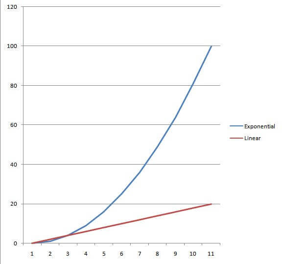

Se fixer des objectifs dans la vie n'est pas aussi simple qu'on le dit. Parvenir à un changement durable peut en effet s'avérer être une tâche beaucoup plus ennuyeuse qu'elle n'y parait.

C'est la nouvelle année et imaginons un instant que tu as décidé de devenir riche. Tu en as peut-être assez de ta dette d'études. Peut-être en as-tu marre de manger des gaufres surgelées tous les soirs pour le dîner. Ou tu as été inspiré par 50 Cent, et tu veux "devenir riche ou mourir en essayant"... Pour faire faillite quelques années plus tard.

<!--more-->

Quel que soit le raisonnement, c'est la nouvelle année. Tu as décidé que le nouveau toi va conduire une Rolls-Royce et boire du Dom-Perignon.

Si tu envisage de devenir riche comme la plupart des gens le font, voici comment tu le conçois :

- Commence par gagner 100 €.
- OK, super, maintenant essayons de gagner 1 000 €.
- Merde, c'était dur, mais maintenant, essayons de gagner 10 000 €.
- Tu finis par y arriver. Sauf que, trois ans plus tard, la seule idée de travailler jusqu'à ce que tu aies 100 000 € te donne envie de tout plaquer pour devenir moine.
- Tu te dis "merde" et tu achètes un télé 60 pouces. Ah, ça fait du bien.
- Les rêves de fêtes en bikini sur ton yacht s'évaporent, ainsi que la plupart de tes économies.

C'est comme ça que la plupart des gens essaient de devenir riche. D'ailleurs, si tu n'as pas remarqué, la plupart des gens ne sont pas riches. En fait, la plupart des gens sont tout le contraire. Et, ce n'est pas une coïncidence.

En réalité, c'est plutôt ainsi que les gens s'enrichissent (sans se retrouver au tribunal des faillites comme ce bon vieux 50 Cent) :

- Commence par gagner 100 €.
- Investi ces 100 € dans des compétences / formations / actifs qui te rapporteront finalement 1 000 €.
- Investi ces 1 000 € dans des compétences / formations / actifs qui te rapporteront à terme 10 000 €.
- Ensuite, investi ces 10 000 € dans des compétences / formations / actifs qui te rapporteront à terme 100 000 €.
- Puis, investi ces 100 000 € jusqu'à ce que tu sois sur ton yacht comme un mafieux russe.

Ce son deux mentalités différentes qui permettent de se constituer une richesse. **Les personnes qui restent pauvres ou de la classe moyenne considèrent l'argent comme quelque chose à dépenser. Les gens qui deviennent riches voient l'argent comme quelque chose à investir**.

Tu peux l'appeler "l'esprit de dépense" par opposition à "l'esprit d'investissement". L'un te rend riche. L'autre te fait cravacher, en te battant toujours pour garder la tête hors de l'eau.

Alors pourquoi je passe en revue tout cela ? Parce qu'il s'agit de [créer des habitudes](https://tobal.fr/prenez-de-bonnes-habitudes-de-vie-pour-reussir/) et d'[atteindre des objectifs](https://tobal.fr/atteindre-ses-objectifs-comment-on-fait-pour-de-vrai/) dans la vie aussi. En fait, c'est exactement le même concept.

## Fixer des objectifs VS développer des habitudes

Prenons la résolution du Nouvel An, la plus clichée et la plus universelle du groupe :

> Je veux perdre 20 kilos et être sexy pour l'été.

Je pense que presque tout le monde a eu cette résolution à un moment ou à un autre. Dans la plupart des cas, tu te remets de ta beuverie du réveillon du 1er janvier. Tu t’inscris à la gym le 2 janvier. Tu te forces à y aller 5-6 fois au cours des mois suivants. Principalement par culpabilité, parce que tu as dépensé de l'argent. Tu as donc le sentiment que tu devrais y aller. Mais tu ne sais pas réellement ce que tu fais.

Et là, tu te te dis : regarde tous ces gens maigres et en sueur ici. Wow, je me sens si fatigué rien qu'à les regarder. Est-ce que ce tapis roulant peut aller plus lentement ? Je suis fatigué. Je veux un hamburger. Ou peut-être une glace. Voire peut-être un hamburger à la crème glacée.

On est le 1er février et tu te retrouves à te fondre dans le tissu de ton canapé. À regarder d'horribles rediffusions des _Feux de l'Amour_. À te demander comment ça se fait que tous tes vêtements semblent rétrécir en même temps.

Oui, c'est dur.

Les problèmes liés à la poursuite conventionnelle d'objectifs dans la vie (c'est-à-dire les [résolutions du nouvel an](https://tobal.fr/nouvel-an-10-conseils-pour-reussir-et-tenir-vos-bonnes-resolutions/)) sont très connus à ce stade.

Les gens ont tendance à trop compter sur l'autodiscipline, au lieu de [prendre des habitudes utiles](https://tobal.fr/prenez-des-bonnes-habitudes-par-curiosite-pas-par-desir/). Les gens ont tendance à avoir les yeux plus gros que le ventre. Ils se fixent des objectifs qui dépassent de loin leur capacité ou leur niveau de connaissances. Puis, ils deviennent frustrés lorsqu'ils ne font que peu ou pas de progrès vers ces objectifs. Les gens sont tentés de prendre des "raccourcis" pour atteindre un objectif. Ce qui souvent les sabote à long terme. Comme se priver de nourriture pour perdre du poids. Ou acheter le dernier appareil à la mode pour se muscler sans efforts.

Tout ça c’est vrai, mais je suis ici pour suggérer autre chose.

"Perdre 20 kilos d'ici l'été" est un exemple typique de mauvais objectif pour commencer. C'est parce qu'il découle de la même mentalité de dépense qui maintient les gens fauchés. Ou dans ce cas, les maintient en surpoids. Ils voient la vie en termes trop simplistes : "Fais beaucoup de X, tu finiras par avoir Y."

Iil est peu probable que le fait de te forcer à travailler et à économiser pendant 20 ans te rende riche. Et le fait de te forcer à aller à la gym des dizaines de fois ne te fera pas perdre beaucoup de poids. Ça t’empêchera même de le faire. De tels objectifs exigent un effort intense, mais ils ne semblent jamais "tenir la route". Finalement, ton énergie et ta discipline s'épuisent et tu redeviens la même personne que tu étais. Sauf que maintenant, tu te sens nul.

C'est parce qu'il est préférable d'investir ton attention et ton énergie limitée dans [la construction d'habitudes](https://tobal.fr/goalmap-une-app-pour-prendre-de-bonnes-habitudes-et-atteindre-vos-objectifs/) plutôt que dans des objectifs spécifiques. Tout comme utiliser l'argent que tu gagnes et le mettre à profit, tu peux te servir des efforts que tu consacres à te changer, et les mettre à profit également.

Les gens ne se concentrent généralement pas sur leurs habitudes car les objectifs, c'est plus sexy dans notre esprit. Ils se sentent plus motivés au moment où on y pense. Nous avons une image claire d'un certain résultat dans notre tête et cela nous excite.

Les habitudes, en revanche, ne sont pas aussi sexy dans notre tête. Elles sont à long terme et répétitives. Ce qui les fait paraître ennuyeuses. Il n'y a pas d'image claire que l'on puisse imaginer pour "aller à la gym tous les matins pendant un an" ou "ne boire de l'alcool que le week-end". Tout comme on n'a pas cette bouffée d'inspiration en s'imaginant manger de la salade tous les jours au déjeuner. D'ailleurs, tu ne t’allonges pas dans ton lit le soir en t’imaginant passer du fil dentaire tous les matins.

- **Les buts** que l'on se fixe sont une affaire d'une seule fois. **C'est la mentalité de dépense**. "Je vais dépenser X fois plus d'énergie pour recevoir Y fois plus de récompenses."
- **Les habitudes sont une mentalité d'investisseur**. Les habitudes exigent que l'on investisse ses efforts pendant un certain temps. Puis, qu'on prenne le fruit de ces efforts et qu'on les réinvestisse dans un effort plus important pour former des habitudes encore meilleures.

C'est pourquoi tant de personnes qui perdent du poids finissent par en reprendre (et même plus). Elles se concentrent sur des objectifs singuliers dans la vie plutôt que de développer des habitudes sous-jacentes. Ainsi, lorsque leur énergie et leur discipline s'épuisent (et c'est toujours le cas, car l'autodiscipline est limitée). À la fin, elles retrouvent leur état d'origine.

Avec les habitudes, en revanche, il n'y a pas de but unique à atteindre. **Le seul but des habitudes est que le but ne soit jamais atteint**. C'est une simple répétition quotidienne ou hebdomadaire que l'on fait. Jusqu'à ce que la mémoire musculaire et [la chimie du cerveau](https://tobal.fr/10-manieres-dont-votre-cerveau-vous-joue-des-tours/) entrent en jeu, et que l'on effectue l'action souhaitée en mode automatique.

- **Avec les objectifs,** chaque jour où tu retournes à la salle de sport te semble plus difficile.
- **Avec les habitudes,** au bout d'un certain temps, il est plus difficile de ne pas aller à la gym que d'y aller.

Par conséquent, il est préférable d'investir son énergie et sa discipline limitées pour se concentrer sur l'acquisition d'habitudes.

C'est bien d'avoir encore des objectifs. J'aimerais bien perdre 20 kilos d'ici l'été. Mais ce n'est pas sur cela que [mon esprit se concentrera](https://tobal.fr/avoir-plus-denergie-etre-plus-concentre-et-plus-efficace-au-quotidien/) cette année. Je vais plutôt me pencher sur les habitudes qui découlent de cet objectif. Celles qui rendraient cet objectif inévitable : manger mieux, marcher plus souvent au lieu de prendre un Uber, élaborer un plan d'entraînement. Et ensuite, je vais me concentrer sur ces habitudes. La perte de poids se produit alors naturellement comme un effet secondaire.

## L'art d'accumuler les habitudes

Mais voici l’essentiel. [Certaines habitudes sont meilleures que d'autres](https://tobal.fr/5-habitudes-eliminer-pour-avoir-plus-confiance-en-soi/). Parce que certaines habitudes, une fois acquises, rendent d'autres habitudes positives beaucoup plus faciles à acquérir également.

Par exemple, il est difficile d'arrêter de fumer. Mais certaines données suggèrent que faire de l'exercice, comme du jogging ou du vélo, peut faciliter l'arrêt du tabac (probablement parce que l'on se casse un poumon tout le temps).

Ce sont des habitudes qui, une fois adoptées, se répercuteront dans d'autres domaines de ta vie. Ce qui rend l'acquisition d'autres habitudes souhaitables plus naturelle et demande moins d'efforts.

Malheureusement, les chercheurs n'ont pas été très doués pour dire exactement quelles sont les habitudes qui donnent les meilleurs résultats. On voit donc beaucoup d'articles du style "Fais ton lit tous les jours" ou "Aie juste plus de volonté" parce qu'ils ont, par exemple, entendu un type le dire une fois et ça sonnait intelligent.

J'aime à penser que [les habitudes clés](https://tobal.fr/prenez-de-bonnes-habitudes-de-vie-pour-reussir/) sont des "habitudes d'accumulation". Car, comme pour l'accumulation des retours sur investissement, sur une période assez longue, elles peuvent augmenter la richesse de ta vie de manière exponentielle. Les objectifs, par eux-mêmes, génèrent une croissance et un changement linéaires. Les habitudes sont capables de générer une croissance et un changement exponentiels.

Et au cas où tu serais mauvais en maths, voici un exemple rapide de la différence entre gains linéaires et gains exponentiels sur le long terme :

Pour poursuivre l'analogie financière, on pourrait dire que chaque habitude a des taux d'intérêt plus ou moins élevés. Ainsi, **cela fait donc de certaines habitudes de bien meilleurs investissements initiaux de ton énergie et de ta discipline que d'autres**.

Par exemple, devenir vraiment bon dans un jeu informatique comme [Starcraft](https://fr.wikipedia.org/wiki/StarCraft) a un taux de rendement vraiment faible sur la qualité de vie, par rapport au temps et à l'énergie dépensés. Si on met de côté le fait de développer des compétences de base en matière de résolution de problèmes, et d'apprendre à insulter d'autres adolescents anonymes sur internet, les habitudes acquises ne se traduiront pas par une amélioration dans d'autres domaines de ta vie. En fait, [consacrer du temps](https://tobal.fr/3-facons-de-perdre-son-temps-quotidiennement/) et de l'énergie à devenir bon à Starcraft risque davantage de nuire à d'autres domaines de ta vie. En effet, tu seras assis toute la journée et tu deviendras gros et paresseux. Et, sans compter que cela transformera ta vie amoureuse en un désert nucléaire.

En revanche, une habitude comme celle de soulever des poids a un taux de rendement extrêmement élevé. En effet, devenir plus fort te rendra plus en forme, te donnera plus d'énergie, [augmentera ta concentration](https://tobal.fr/ameliore-ta-concentration-et-ta-productivite-avec-brain-fm/) et tes performances mentales, réduira les effets du vieillissement, augmentera ton métabolisme et aidera ton corps à mieux assimiler la nourriture, etc... Ironiquement, lever des poids pourrait même faire de toi un meilleur joueur de Starcraft, alors que le contraire n'est absolument pas vrai.

C'est parce que la musculation une habitude très compliquée. Ses bienfaits se répercutent dans d'autres domaines de ta vie. Ce qui rend de nombreuses autres habitudes et compétences positives plus faciles à acquérir. C'est pourquoi, si tu souhaites changer radicalement ta vie, une forme d'exercice comme la musculation est probablement l'un des meilleurs moyens de commencer.

## Déterminer les résolutions chaque nouveau mois

Une autre raison pour laquelle les résolutions typiques du Nouvel An sont nulles est l'horizon temporel. Si je dis quelque chose comme "je veux écrire un autre livre cette année", il devient d'autant plus facile pour moi de [repousser le début de l'objectif](https://tobal.fr/ce-nest-jamais-le-bon-moment/) à juin, juillet ou à n'importe quel autre moment. Moment auquel il devient presque entièrement irréalisable.

Les recherches montrent que les habitudes ne nécessitent environ que 30 jours d'efforts constants pour s'installer dans notre cerveau. Elles commencent alors à devenir automatiques.

Au diable les résolutions du nouvel an. Je dis qu'il faut adopter les résolutions du nouveau mois. Ou comme on les appelle plus communément, les défis de 30 jours. **Choisis une habitude que tu veux adopter et fais-le tous les jours pendant 30 jours**. Ce n'est que 30 jours. Tout le monde peut faire quelque chose pendant 30 jours. Une fois que tu l'as fait, cela devrait commencer à te sembler automatique. Alors, tu peux commencer à ajouter plus de profondeur ou de connaissances pour prendre l'habitude. Ou bien, tu peux passer à une autre habitude (plus d'informations à ce sujet ci-dessous).

## Les six habitudes quotidiennes fondamentales

J'espère que maintenant, tu commences à voir la matrice. Et tu commences à comprendre pourquoi tu n'as pas réussi à atteindre tant d'objectifs que tu t’étais fixés dans le passé.

Se fixer un objectif comme "je veux perdre 20 kilos pour mon mariage" ou "je veux obtenir une promotion cette année", puis se forcer à faire un tas de conneries jusqu'à ce que cela arrive revient à dire "je veux un million d’euros", puis décider de travailler 120 heures par semaine jusqu'à ce que tu y arrives. [Cela va certainement te rendre malheureux](https://tobal.fr/reussir-dans-la-vie-ne-rend-pas-heureux-cest-linverse/) et t’épuiser. Et même si tu y arrives, comme une personne qui gagne à la loterie et dépense immédiatement tout, il est probable que tu finisses par tout perdre peu après.

La bonne façon de gagner un million d'euros, comme nous en avons discuté, est de commencer petit. Puis réinvestir intelligemment ce que tu as gagné. Alors, arrête d'essayer de faire une échelle linéaire et fais plutôt une échelle exponentielle.

On a également constaté que certaines habitudes s'échelonnent de manière plus exponentielle que d'autres. C'est-à-dire que certaines habitudes offrent des taux de rendement plus élevés. En effet, certaines d'entre elles procurent des avantages qui facilitent l'adoption d'autres habitudes.

Il est donc logique d'**utiliser ton énergie pour développer d’abord les habitudes ayant le taux de rendement le plus élevé**. Puis, de passer à d'autres habitudes souhaitées par la suite.

### **Quelles sont donc les habitudes de vie qui te donnent le meilleur rendement sur le plan psychologique ?**

Après de nombreuses recherches et réflexions, j'ai trouvé les six habitudes fondamentales ci-dessous. Ces habitudes sont, je pense, l'utilisation la plus efficace de ton temps limité, de ton énergie et de ta discipline au début. Certaines te sembleront probablement évidentes (On en a déjà évoqué une). D'autres ne le seront pas. Certaines peuvent même te surprendre.

### 1\. Faire de l'exercice

**Avantages :** Si tu ne connais pas encore les bienfaits de l’exercice régulier, tu dois vivre dans une caverne. En plus de te rendre super sexy et de prévenir l'obésité, l'exercice réduit considérablement le risque d'un tas de choses qui peuvent te tuer : maladies cardiaques, accidents vasculaires cérébraux et quelques types de cancer. Ça améliore également ton humeur. Ça te donne plus d'énergie. Cela améliore [la qualité de ton sommeil](https://tobal.fr/comment-trouver-rapidement-le-sommeil/), ta vie sexuelle. Certaines preuves indiquent que ça améliore même la concentration et l'apprentissage.

**Stratégie d'adoption :** Ce qui est fou avec l’exercice physique, c'est que presque tout le monde surestime la quantité d'effort nécessaire pour obtenir des résultats. Ils supposent que tu dois t’inscrire dans une salle de gym chic, dépenser une tonne d'argent pour un entraîneur personnel en pantalon chic, et faire un tas d'exercices chics avec des balles en caoutchouc et des tapis à l'aspect bizarre.

Mais selon les études, faire des exercices est une affaire de 80/20. C'est-à-dire que 80 % des bénéfices résultent de 20 % de l'effort. Il a été démontré qu'une activité aussi simple que la marche rapide 30 minutes par jour améliore considérablement la santé et entraîne une perte de poids. Si tu commences à faire de l'exercice à partir de zéro, [commence simplement](https://tobal.fr/une-astuce-simple-pour-garder-la-motivation-au-sport-et-en-general/).

Un de mes bons amis est un adepte du culturisme. Comme tu peux l'imaginer, il s'arrache les muscles. Une chose qu'il m'a dite l'année dernière et qui m'a frappé, c'est que l'une des meilleures choses qu'il ait faites, c'est de décider de faire de l'exercice tous les jours, quoi qu'il arrive. De toute évidence, il préfère aller à la salle de sport et faire un gros entraînement structuré. Mais les jours où il ne se sentait pas bien, ou quand il voyageait pour son travail, il tenait quand même à faire un peu d'exercice de base. Même s'il ne s'agissait que de pompes au sol ou d'un petit jogging dans les escaliers une douzaine de fois. L'objectif est de toujours faire quelque chose. Il faut se soucier de la perfection plus tard.

Commence donc simplement. Mets-toi au défi de faire chaque jour des exercices très simples. Fais-le pendant 30 jours. Puis, une fois l'habitude prise, pense à établir un programme d'entraînement super sexy. Même s'il ne s'agit que de marcher ou de faire des exercices de musculation dans ta chambre. [Fais-en un peu chaque jour.](https://tobal.fr/une-chose-en-moins-par-jour-es-tu-capable-de-relever-le-defi/)

### 2\. Cuisiner

**Avantages :** Cela peut te sembler bizarre à mettre en place comme habitude fondamentale. Mais à ce stade, j'ai vu les effets positifs de cette habitude dans la vie de beaucoup de mes amis. Suffisamment pour ne pas la prendre à la légère.

Les avantages ne sont pas aussi évidents que l'exercice physique. Car la plupart des avantages ne proviennent pas de l'acte de cuisiner lui-même, mais plutôt de la capacité à contrôler exactement ce que l'on mange et en quelle quantité.

Le fait est que la plupart des gens ne mangent pas bien. Ou du moins, ils développent de terribles habitudes alimentaires parce qu'ils ne sont pas capables de contrôler ce qu'ils mangent. Ni quand ils le font. Ils ont si peu de temps ou de connaissances qu'ils se contentent de ce qui est rapide et facile. Généralement, c'est de la malbouffe.

Bien manger, tout comme faire de l'exercice, est un atout pour la santé et le mode de vie : meilleure énergie, meilleure santé cardiovasculaire, diminution du risque d'obésité, de diabète, de divers cancers, de maladies cardiaques et d'autres maladies mortelles, plus d'énergie, plus de concentration, une meilleure humeur (adieu les excès de sucre et les accidents), un meilleur sommeil et une meilleure vie sexuelle.

Tu peux tirer les mêmes avantages de la vie en général en mangeant bien comme en faisant de l'exercice. Mais en plus de cela, être un cuisinie peut t’offrir des opportunités sociales intéressantes, une plus grande appréciation de la nourriture et/ou du vin, et te faire économiser beaucoup d'argent en ne mangeant pas au restaurant tout le temps.

**Stratégie d'adoption :** C'est mon talon d'Achille et ce sera mon grand projet de prise d'habitudes dans les mois à venir. Pour être franc, ma relation avec la nourriture, depuis aussi longtemps que je me souvienne, a été merdique et toxique. J'ai toujours porté de la considération à ma nourriture. Mais cet considération était basée sur des plaisirs superficiels et des impulsions. Non sur un véritable désir de construire quelque chose de sain.

Pendant la plus grande partie de ma vie, j'ai pu compenser cela par un métabolisme élevé et un exercice constant. Cela a suffi à me garder mince et énergique malgré toutes mes mauvaises habitudes alimentaires.

Mais comme on dit, cette année, mon âge m'a rattrapé. Outre le fait de vieillir, plusieurs événements majeurs de la vie m'ont frappé successivement. Et ont été suivis d'une série de problèmes de santé mineurs et inattendus. En d'autres termes, l'année dernière s'est avérée être une année assez stressante et tumultueuse. Quand j'ai été honnête avec moi-même, mes mauvaises habitudes alimentaires ont fait leur apparition. Je me suis vite retrouvé en mauvaise forme pour la première fois depuis des années. Et aussi je me suis senti le plus lourd de toute ma vie.

Pour quelqu'un qui a vécu seul pendant 13 ans, c'est assez étonnant que je ne sache même pas me cuire un œuf. J'ai essentiellement vécu de snacks, de plats à emporter et de restaurants pendant la dernière décennie.

Le problème avec les snacks et les plats à emporter est évident : tu échanges essentiellement la nutrition contre la commodité. La nourriture est rapide, facile et savoureuse, et donc si tu dois renoncer à une partie de ta santé pour cela, qu'il en soit ainsi. Cette stratégie fonctionne bien lorsque tu as une vingtaine d'années et que tu restes debout toute la nuit à [coder des sites web](https://tobal.fr/commencer-une-carriere-de-developpeur-web/). Mais comme habitude de toute une vie, c'est une mort lente et progressive qui se joue sur des années et des décennies.

Et les restaurants ? Pour commencer, disons que même les restaurants qui servent des aliments sains ne sont pas très sains. En effet, l'intérêt premier d'un restaurant est de te faire vivre une expérience agréable et de te donner le sentiment que tu en as pour ton argent, et non de s’assurer que tu ne meurs pas d'une crise cardiaque. Ainsi, même si tu ne le vois pas là, des tas de sels, de sucres et d'autres saletés sont presque toujours au menu.

(Oh, et il y a 2 desserts pour le prix d’1 ! On ne peut pas passer à côté de ça).

Peu à peu, j'en suis venu à l'inévitable conclusion, l'année dernière, que le trou béant dans mon mode de vie en ce moment est la nourriture et mon incapacité totale à contrôler où et comment je l'obtiens. J'ai alors réalisé qu'à moins de vouloir manger dans les mêmes 1-2 restaurants biologiques chaque jour pendant l'année suivante (et de dépenser la moitié de ce que je gagne en un an pour le faire), ma seule autre option est d'apprendre à cuisiner.

J'ai décidé de commencer par apprendre quelques bases - comment préparer quelques salades, comment faire griller du poulet (non, sérieusement), comment faire quelques œufs pour le petit déjeuner - puis je me fixerai comme objectif de me faire cuire au moins un repas par jour pendant 30 jours d'affilée. Une fois que j'aurai atteint cet objectif, je m'occuperai de recettes plus compliquées et de la préparation d'autres types d'aliments.

Un autre objectif sera de trouver des recettes saines que j'aime manger, mais aussi que j'aime faire. Ma petite expérience de la cuisine dans le passé a été misérable. Probablement parce que j'essayais de cuisiner des trucs que je n'avais pas à essayer de cuisiner et je n'avais aucune idée de ce que je faisais. Cette fois-ci, je vais commencer par des recettes simples et je vais progressivement m'améliorer de manière à ce que ce soit à la fois agréable et satisfaisant.

### 3\. **Méditer**

**Avantages :** Les [bienfaits de la méditation](https://tobal.fr/comment-se-mettre-a-la-meditation/) sont célèbres et nombreux. Mais en bref, la réponse est la suivante : une meilleure concentration, une meilleure conscience de soi, une réduction du stress et de l'anxiété, un meilleur sommeil, une plus grande stabilité émotionnelle, une plus grande empathie pour les autres, et peut même être utilisée comme une forme de thérapie pour divers troubles mentaux ou émotionnels.

**Stratégie d'adoption :** Ce n'est pas un secret, commence par une petite pratique quotidienne. Même une minute par jour peut avoir des effets bénéfiques. D'ailleurs, j'ai récemment découvert une application appelée [Headspace](https://www.headspace.com/fr) qui guide doucement les gens dans une pratique de méditation si tu veux essayer d'apprendre par toi-même. [Calm](https://www.calm.com/) est une autre bonne application.

Mais à vrai dire, malgré ce que l'on pourrait penser, il est incroyablement difficile de s'asseoir sur un oreiller et de ne penser à rien pendant plus de quelques secondes. Tu t’ennuies et tu t’agites, et si tu es seul, il est incroyablement difficile de rester là plus de quelques minutes. C'est pourquoi je recommande souvent aux gens de trouver un groupe ou une classe locale. Il y en a souvent des gratuits dans les grandes villes. C'est aussi un bon moyen de rencontrer des gens. Ensuite, une fois que tu as pris le coup de main, essaye-le toi-même. Commence avec une minute par jour et augmente lentement. Fais-le pendant 30 jours jusqu'à ce que tu aies un entraînement régulier.

### 4\. Lire

**Avantages :** Si tu es encore en train de lire et que tu ne veux pas te planter une cuillère dans les yeux, cela signifie que tu as probablement déjà pris du plaisir à lire. Ce qui veut dire que je n'ai probablement pas besoin de te dire que la lecture est magique. C'est la seule chose au monde qui te permet de venir vivre dans ton cerveau pendant un petit moment, de voir ce qu'il voit, de ressentir ce qu'il ressent, puis de repartir.

Certains historiens pensent que l'écrit et la capacité des gens à lire l'écrit (c'est-à-dire l'alphabétisation) est essentiellement à la base de la civilisation. Sans la capacité de sentir et de voir les pensées des autres (ou de sentir et de voir les pensées et les sentiments des gens des générations passées), nous n'aurions aucun sens d'identité culturelle, et beaucoup moins d'empathie.

Et de nombreuses études suggèrent que [les personnes qui lisent régulièrement](https://tobal.fr/comment-lire-un-livre-par-semaine-sans-forcer/) sont beaucoup plus empathiques. Elles se soucient davantage des autres. Elles ont de meilleurs rapports et répondent mieux aux autres. Les personnes qui lisent régulièrement sont aussi simplement plus intelligentes, mieux informées et connaissent mieux le monde.

C'est pourquoi, lorsque l'on a demandé un jour à Warren Buffett quelle était la meilleure chose dans laquelle les jeunes pouvaient investir pour leur avenir, il a répondu par "la connaissance". Il a dit que l'argent va et vient, les gens vont et viennent, mais ce que tu sais ne te quitte jamais. Il a ajouté que même à 80 ans, il gagnait de l'argent grâce aux connaissances et aux informations qu'il avait acquises à 20 ans.

**Stratégie d'adoption :** Le plus gros problème que les gens rencontrent lorsqu'ils prennent l'[habitude de lire](https://tobal.fr/comment-lire-un-livre-par-semaine-sans-forcer/) ait qu'ils essaient de lire ce qu'ils pensent devoir lire plutôt que ce qu'ils aiment vraiment lire. Si tu aimes les romans policiers pour adolescents, même si tu es une mère célibataire de 45 ans, lis les romans policiers pour adolescents. Si tu aimes les livres sur les zombies, lis des livres sur les zombies.

Lorsque tu prends l'habitude de lire, commence par ce qui te semble facile et excitant, puis élargis lentement ton champ d'action.

Voici un autre conseil de lecture : _si tu n'aimes pas un livre, arrête de le lire._

Je rencontre tellement de gens qui détestent le livre qu'ils lisent, et pourtant ils se traînent à contrecœur pour y revenir encore et encore parce qu'ils se sentent mal s'ils ne le terminent pas. Ils se sentent coupables ou ont peur que cela signifie qu'ils sont stupides. Parfois, ils disent que parce qu'ils ont lu jusqu'ici, ils pourraient aussi bien finir le tout. Tu ne continuerais pas à regarder une émission de télévision que tu n'aimes pas. Tu ne mangerais pas une assiette entière de nourriture que tu n'aimes pas. Alors pourquoi diable essayes-tu de lire un livre que tu n'aimes pas ?

Ma règle de base est que lorsque je commence à lire un livre, je me force à lire soit les premiers 10%, soit le premier chapitre (selon ce qui vient en premier) et si je ne l'aime pas à la fin, alors je le pose et je passe au [livre suivant](https://tobal.fr/3-livres-a-lire-pour-bien-demarrer-2019/).

### 5\. Écrire

**Avantages :** Qu'il s'agisse d'envoyer des courriers électroniques, de tenir un journal, d'écrire une fiction ou de publier un discours politique sur Facebook, bien écrire devient rapidement l'une des compétences les plus importantes de la vie courante au XXIe siècle. Aujourd'hui, tu passes une grande partie de ta vie devant un écran et par le biais des médias sociaux, des courriels et des applications de messagerie. Si tu ne peux pas bien communiquer par écrit, tu te mets dans une situation monstrueuse.

Si la lecture te permet d'habiter l'esprit des autres pendant une brève période, apprendre à bien écrire, c'est comme nettoyer ta maison avant que les invités n'arrivent. Cela t’oblige à apprendre à structurer tes pensées de manière plus cohérente, à enchaîner des arguments rationnels et à raconter des histoires de manière convaincante et perspicace. Mais ce n'est pas tout, cela fait de toi un meilleur penseur et bien plus perspicace. Comme l'a dit [Flannery O'Connor](https://fr.wikipedia.org/wiki/Flannery_O%27Connor), "Je ne sais pas ce que je pense avant de l'avoir écrit".

C'est aussi thérapeutique. En fait, parmi tous les conseils de développement personnel à la mord-moi-le-noeud, il a été démontré que le fait de tenir un journal et d'écrire régulièrement ses pensées et ses sentiments a des effets calmants et thérapeutiques.

**Stratégie d'adoption :** Le moyen le plus simple est de commencer un journal. Il existe [des applications sympas pour tenir un journal](https://tobal.fr/notion-outil-de-productivite-ultime/) sur ton ordinateur. Tu peux aussi le faire à l'ancienne, à la main.

L'important est de ne pas se limiter. Utilise l'écriture comme un outil de découverte de soi ; écris tes sentiments, tes idées, tes fantasmes. Et si tu as envie d'aller sur une tangente à des problèmes de calcul qui t'ont rebuté, fais-le aussi.

Si tu as du culot, tu peux même créer un blog sur un site comme WordPress ou Medium. Ainsi, tu pourras rendre tes idées publiques.

Il s'agit ici de prendre l'habitude de t’exprimer sans entrave et de t’entraîner à formuler tes pensées. Et ceci, fait de manière très cohérente afin que les autres puissent les comprendre. Commence par 30 jours. Comme d'habitude, ne te juges pas. Au début, fais-en sorte que le simple fait de se montrer soit la seule condition du succès.

### 6\. Socialiser

**Avantages :** Je sais ce que tu penses : "Sérieusement, Mark ? La socialisation ?"

Je sais, je sais. Cela semble douloureusement évident - comme un de ces remplisseurs d'espace que l'on voit dans le top 10 des mauvais articles du [Huffington Post](https://www.huffingtonpost.fr/). Mais avoir des amis, c'est très sérieux, mon gars. Non vraiment, arrêtes de rire. Je suis sérieux là. Ecoute-moi bien.

Je pense que beaucoup d'entre nous, si nous ralentissons assez longtemps pour nous regarder, ne donnent pas à nos relations le temps ou l'attention nécessaires pour les garder saines et heureuses.

Tu vois, il s'avère que la solitude est une sorte de chose. Elle se développe à un rythme alarmant aux États-Unis, en particulier chez les personnes âgées. Et de nouvelles recherches découvrent qu'être seul peut être tout aussi mauvais pour la santé physique que l'obésité ou le tabagisme lourd.

Cela te rend également malheureux et beaucoup plus susceptible de [faire une dépression](https://tobal.fr/es-tu-depressif-saisonnier/). Alors oui, dans notre monde "hyper-connecté", de plus en plus de gens ont du mal à prendre le temps d'être simplement avec quelqu'un d'autre pendant un certain temps. Et cela nous épuise.

C'est ce qui m'a frappé l'année dernière. Après avoir vécu nomade pendant de nombreuses années, je suis retourné aux États-Unis pour y vivre pour la première fois depuis 2010. Et à mon grand regret, j'ai réalisé que presque tous mes anciens amis avaient soit perdu le contact les uns avec les autres, soit déménagé dans des coins complètement différents du pays.

En plus de cela, j'étais en retard pour finir un livre (ce qui, dira-t-on, a réduit ma capacité à quitter la maison). Ainsi, ma vie sociale a pris un coup très réel et inconfortable cette année. Tout comme mes problèmes de santé. C'était un problème auquel je n'étais pas habitué et qui m'a donc frappé de manière inattendue.

**Stratégie d'adoption :** Heureusement, j'ai trouvé cela beaucoup plus facile à gérer. À l'automne, j'ai pris une décision simple. J'ai décidé de commencer à faire quelque chose de si simple et si évident que je me suis sentie un peu bête de ne pas l'avoir déjà fait. Désormais, je me ferais un devoir de parler à un ami différent chaque jour. Que ce soit sur Facebook ou Skype, en personne ou au téléphone, je me ferais un devoir de discuter avec quelqu'un de différent chaque jour.

Je ne parle pas seulement des bavardages sur Facebook. Je veux dire de véritables "Hé mec, qu'est-ce qui t'arrive ces derniers temps ? Comment ça va ?" suivi de quelques "Oh, c'est cool, raconte-moi ça", et enfin terminé par un "On devrait se voir bientôt, qu'est-ce que tu fais la semaine prochaine ?" pour faire bonne mesure. Cela prendrait peut-être 15 à 20 minutes tout au plus. Et c'était surprenant de voir à quel point c’était facile de renouer avec de nombreuses personnes.

La plupart du temps, j'étais en contact avec des amis dont j'avais perdu contact. D'autres fois, il s'agissait de tendre la main à quelqu'un que je connaissais à peine et de prendre le "risque" de le rencontrer. D'autres fois, c'était sortir et rencontrer quelqu'un de nouveau, peut-être à une fête ou une conférence, ou être présenté par un ami. Et étonnamment, cela suffisait. C'est vraiment tout ce qu'il fallait. Une personne par jour. Comme un ordinateur qui redémarre, ma vie sociale a repris son cours. Et j'en suis devenu beaucoup plus heureux.

## Réflexions finales

Il semble y avoir un parti pris dans le circuit humain qui sous-estime ce qu'il faut pour atteindre de très grands objectifs dans la vie. Et qui surestime également l'effort nécessaire pour assumer une série de petits objectifs. Selon mon expérience, c'est **le rythme régulier de la poursuite et de la réalisation de petites victoires qui mène finalement aux plus grandes**. En fait, j'ai souvent constaté qu'en se concentrant sur les petites victoires quotidiennes simples, on ne se rend même pas compte qu'un de ses grands objectifs a été atteint avant qu'il ne soit déjà dépassé.

D'ailleurs, les six habitudes fondamentales ci-dessus constituent une bonne base pour une vie saine dans tous les domaines : physique, émotionnel, psychologique et social. Elles se chevauchent et se renforcent mutuellement. Et étonnamment, elles sont en fait toutes très simples à réaliser. De plus, elles nécessitent beaucoup moins d'efforts initiaux que ce que la plupart des gens réalisent.

Si tu as apprécié ce billet et que tu souhaites en savoir plus sur les rouages de l'adoption d'habitudes, tu peux consulter cet article sur [la manière de te motiver et surtout de le rester.](https://tobal.fr/comment-se-motiver-et-surtout-le-rester/)

Maintenant, si tu veux bien m'excuser, je dois préparer une salade.

_Note : Cet article est une traduction de l'article [Your Goals Are Overrated](https://markmanson.net/goals) de Mark Manson_.
