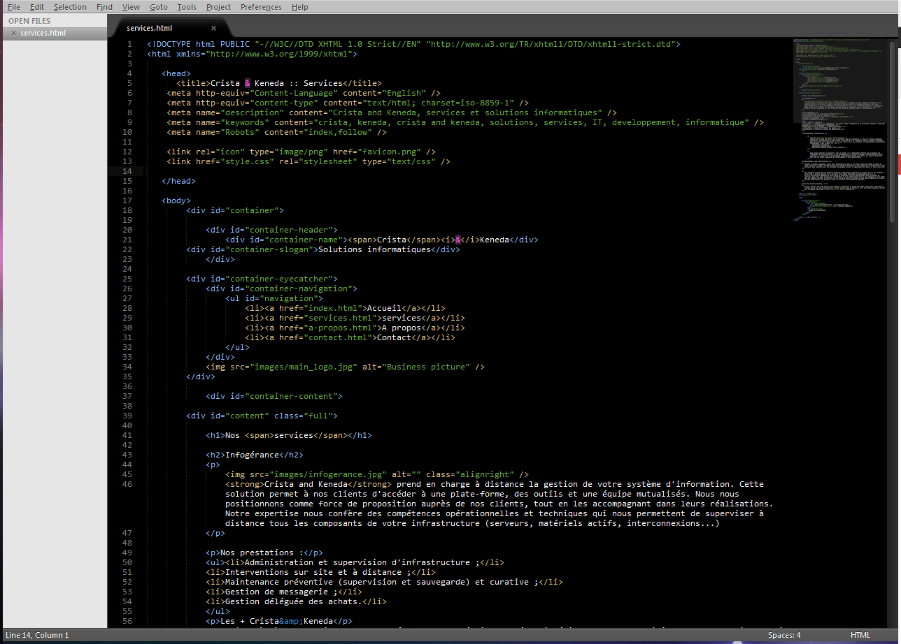

J'aurai pu aussi appeler ce billet "**Sublime Text VS Notepad++**" ou encore, mais surtout, "**Pourquoi je suis passé à Sublime Text**".<!--more-->

J'ai changé d'éditeur de texte pour mes développements. Après plusieurs années à être resté fidèle à Notepad++, je suis parti voir ailleurs. Si, comme moi il y a encore 3 jours, vous êtes  un fervent défenseur / fanatique de Notepad++, lisez la suite de cette article.

Au sujet de Notepad++, je pense que si vous êtes en train de lire cet article, c'est que vous connaissez un minimum. J'en étais vraiment satisfait, c'est un très bon éditeur de texte ainsi qu'un excellent outil pour développer. Son réel atout, ce qui fait son gros point fort est son système de plugins.

Avec les plugins Explorer, Fileswitcher,  FingerText, Window Manager, Xbrackets et Zen Coding (vous pouvez installer tous ces plugins très simplement grâce au _plugins manager_ intégré à Notepad++), je pensais avoir trouvé le combo parfait: auto-complétion de mots, _[snippets](http://fr.wikipedia.org/wiki/Snippet "Définition des snippets dans wikipedia")_, outils pratiques et rendant le développement plus agréables.

J'étais donc content de mon outil de travail et, à vrai dire, en fait je ne cherchais même pas à l'améliorer ou le remplacer. En réalité, j'ai découvert Sublime Text de façon totalement fortuite.

C'est en écrivant un article sur une mise à jour de Notepad++ ajoutant la fonctionnalité "Document Map" (qui consiste à avoir un aperçu d'ensemble du fichier en cours d'édition), que j'ai été amené à citer Sublime Text car je savais que ce logiciel (pour l'avoir vu très brièvement utilisé par des anciens collègues) proposait cette fonctionnalité depuis longtemps. Du coup en cherchant un lien à ajouter pour mon article, je suis tombé sur la page Wikipedia parlant de Sublime Text, et en lisant le contenu j'ai été attiré par certaines fonctionnalités que Notepad++ ne proposait pas (et oui, ça existe !). Ni une, ni deux, je l'ai téléchargé et installé pour le tester, et là, ce fut la claque.

## Le meilleur éditeur de texte

Le titre peut paraître un peu élogieux, mais franchement, je vais vous dire pourquoi j'ai eu un véritable coup de foudre pour cet éditeur de texte.

### Une interface moderne, belle et agréable à utiliser

Il faut bien l'avouer, si Notepad++ est ultra-efficace, esthétiquement, il laisse à désirer. Il fait penser à un _logiciel des années 2000_, et pas un logiciel web 2.0.

Bon, ok, certains me diront que ce n'est qu'un éditeur pour faire du code, et qu'on s'en fout. Oui mais voilà, on a beau dire ce qu'on veut, Sublime Text est... vraiment joli. L'interface fait très moderne, on n'a pas l'impression de bosser sur Windows XP, le design est sobre, esthétique et épuré, les animations et le comportement de l'interface sont très fluides.

En fait, si vous êtes sur PC et que d'aventure vous ayez testé un Mac, c'est typiquement cette sensation de **fluidité** si propre à Mac qui ressort. Bref, pour un outil sur lequel vous êtes amené à bosser pendant plusieurs heures d'affilées, c'est un point non négligeable. En optant pour un thème "dark" (écritures claires sur fond sombre. Essayer, c'est l'adopter), c'est un vrai bonheur pour les yeux.

### Rapide et réactif

Comparé aux [IDE](http://fr.wikipedia.org/wiki/Environnement_de_d%C3%A9veloppement_int%C3%A9gr%C3%A9 "Définition d'IDE") standards, c'est le jour et la nuit. D'ailleurs c'est ce que pas mal de gens reprochent aux IDE tels **Eclipse, Aptana, Geany ou NetBeans**. Ils sont très efficaces mais "lourds", lents à démarrer et parfois pas super réactifs.

Si Notepad++ lui s'en sort bien mieux et est déjà rapide (à la base ce n'est pas IDE, la possibilité de créer des "projets" reste basique, on n'atteint pas le niveau des IDE classiques.

Sublime Text repousse les limites en offrant une rapidité et une réactivité supérieures à Notepad++. Je ne sais pas vraiment comment ça fonctionne sous le capot, mais c'est bluffant. Il suffit juste de cliquer une fois sur un fichier pour qu'il s'affiche instantanément dans l'espace de travail, de manière virtuelle (en fait vous visualisez un aperçu, mais le document n'est pas réellement chargé). En commençant à le modifier ou en double-cliquant sur le fichier vous l'ouvrez vraiment.

Le temps de démarrage est très rapide également, et la navigation dans les dossiers / fichiers, ainsi qu'entre les différents onglets, est vraiment fluide et sans latence. Que du bon, je vous dis.

### Des fonctionnalités avancées bien pratiques

Sublime Text propose des fonctionnalités vraiment très utiles par défaut: en appuyant sur `CTRL+P`, on ouvre un menu "popup" discret qui nous invite à rentrer le début ou une partie du nom d'un fichier, et qui ouvre ce fichier, à la manière du plugin FileSwitcher sur Notepad++.

C'est méga-pratique quand vous avez toujours 36 onglets ouverts en même temps. Mais là où Sublime Text fait plus fort, c'est qu'il permet d'ouvrir n'importe quel fichiers présent dans le projet, et pas seulement ceux déjà ouverts en onglets.

Avec `CTRL+MAJ+P`, vous ouvrez la "Command Palette", qui vous permet de retrouver n'importe quel commande du logiciel en tapant une partie de son nom.

### Toutes les fonctionnalités d'un IDE... sans la lourdeur

Si on devait résumer Sublime Text en une phrase, je dirais:

> Un IDE complet avec la rapidité de Notepad.

En effet, Sublime Text offre la plupart des fonctionnalités d'un IDE classique, car l'ouverture de fichier se fait soit directement (via le menu "Ouvrir..."), soit par le biais du _Projet_.

Il vous suffit de glisser un dossier dans la fenêtre de Sublime Text pour que votre dossier soit incorporé au projet en cours. Une fois des dossiers / fichiers intégrés au projet, Sublime Text les indexe quasi instantanément, et vous profitez alors de l'auto-complétion, la recherche rapide de fichier, de  l'accès rapide aux **symboles**, c'est à dire en fait toutes les fonctions, variables et classes d'un fichier, via `CTRL+R`.

Cela ne fonctionne pas que pour le PHP ou les autres langages de programmation, c'est très pratique aussi pour les webdesigners / intégrateurs, car vous pouvez rapidement retrouver tous les identifiants et classes dans un fichier HTML.

Bref, on retrouve tous les avantages d'un IDE, mais dans une interface ultra-fluide, qui donne cette agréable sensation de légèreté.

A titre d'exemple, j'ai effecuté un test de recherche d'une phrase de 2 ou 3 mots dans tout un dossier (donc recherche de texte dans plusieurs fichiers). Pour un dossier "moyen" (environ une centaine de fichiers), sous Notepad++, les résultats sont arrivés au bout de quelques minutes. Avec Sublime Text, c'est en quelques secondes !

### Des atouts que n'a pas (encore) Notepad++

Si vous développez activement sous [Symfony](http://symfony.com) comme je le fais, alors vous avez du remarqué que Notepad++ ne supporte pas la coloration syntaxique des fichiers [Twig](http://twig.sensiolabs.org/ "En savoir plus sur Twig").

Sublime Text le fait, et de plus, il existe un plugin de snippets spécialement pour Symfony2. Ce sont ces deux facteurs qui m'ont attiré vers Sublime Text au premier abord.

### Et toutes les fonctionnalités pratiques de Notepad++

Auto indentation, mise en surbrillance des parenthèses ou accolades, macros, édition multi-lignes (plus poussées encore sur Sublime Text), et surtout, à l'instar de Notepad++, Sublime Text incorpore un **gestionnaire de packages** similaire au Plugin Manager de Notepad++, ce qui rend l'installation de plugins vraiment facile et très rapide.

Et les plugins sont nombreux (plus de 300) ! Voici la liste des plugins que j'utilise et que je conseille:

- Alignment
- AutocompleteAll
- Bracket Highliter
- ColorPicker
- Git
- Goto Documentation
- jQuery Snippets
- NetTuts+ Fetch
- Package Control
- PHP Twig
- Prefixr
- SFTP
- SidebarEnhancement
- SublimeCodeIntel
- SublimeLinter
- Symfony2 Snippets
- Tag
- Emmet

Avec tout ça, vous serez comblé et aurez probablement le meilleur outil pour développer. Sublime Text vous rendra la tâche beaucoup plus agréable (et rapide).

### Un seul bémol

Petit bémol quand même, parce que tout n'est pas parfait non plus, le gros point noir est l'absence de plugin type **NppFTP**,  c'est à dire qui vous permette l'édition directe sur un serveur FTP en visualisant l'arborescence des fichiers directement dans la barre latérale.

Le plugin Sublime SFTP permet d'éditer des fichiers en direct sur un FTP, mais ne permet pas d'avoir une vue de type arbre de l'explorateur. Vous devez ouvrir une popup et rechercher le fichier voulu dedans.

Le seul moyen pour avoir l'arborescence des dossiers est de synchroniser le dossier FTP avec un dossier local. À ce moment le plugin vous affichera l'arborescence des dossier, puis vous effectuerez vos modifications sur les fichiers en local. Celles-ci seront synchronisées sur le FTP.

C'est vraiment le seul gros défaut que j'ai pu observer, mais pour les quelques fois ou je souhaite travailler directement sur FTP j'ai gardé Notepad++ sous la main, en attendant qu'un plugin similaire à NppFTP sorte pour Sublime Text.

Alors, qu'attendez vous pour [essayer](http://www.sublimetext.com "Aller sur le site de Sublime Text") ?
