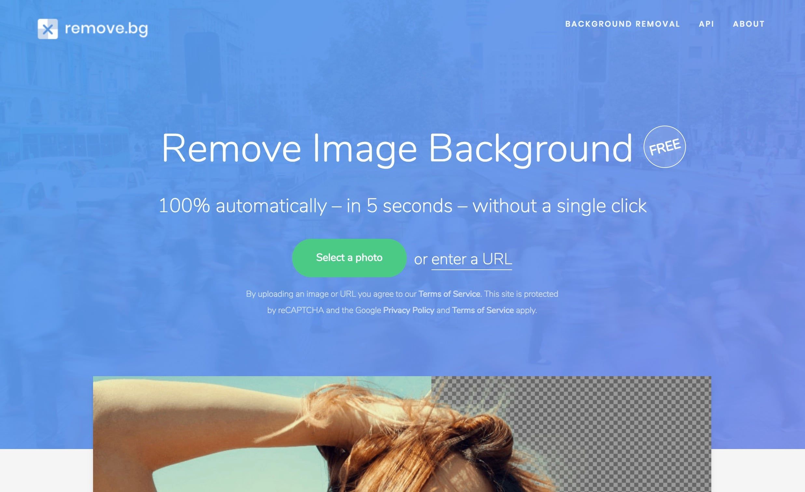
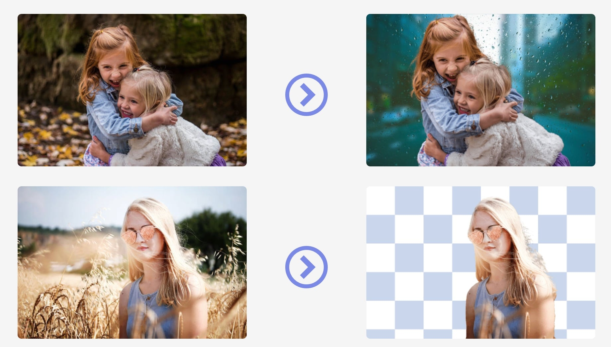
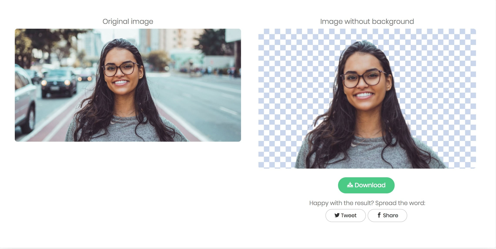

**Isoler un sujet et supprimer l'arrière-plan d'une image** en _5 secondes_ et deux clics, qui dit mieux ?<!--more-->

Jusqu'ici, cette tâche était une corvée. Il fallait lancer Photoshop, zoomer, détourer manuellement, effacer, recommencer... Et je ne parle même pas des images complexes où il faut détourer une personne avec des cheveux par exemple.

Mais ça, c'est du passé, **grâce à l'intelligence artificielle** (ou au _machine learning_ si tu préfères). J'ai découvert récemment un service de OUF, sous la forme d'une web app qui s'appelle [Remove.bg](https://www.remove.bg/).

Le principe du site, c'est le titre de cet article : **te faciliter grandement la tâche, si tu as besoin de supprimer l'arrière-plan d'une image**, pour isoler un sujet d'une photo, pour un montage, créer des effets ou créer une image au format PNG.

Pour s'en servir, c'est super simple. Tu te rends sur le site, tu upload une photo, tu attends cinq secondes et pouf, ta photo est détourée.

J'ai testé avec plusieurs photos, et **le résultat est excellent**. Et ça prend vraiment moins de cinq secondes. C'est hallucinant.

Voici quelques tests que j'ai moi-même effectués.

Avant :

Après :

Et ça marche super bien, même avec une image "compliquée". Habituellement les sujets avec des longs cheveux, c'est une galère grave. Imagine devoir détourer à la main cette photo, avec tout le détail des cheveux :

Pourtant Remove.bg fait ça en 3 secondes, super bien :

Autre exemple. Avant :

Après :

Temps total passé pour toutes ces photos : moins d'une minute. Si j'avais dû le faire "à l'ancienne", ça m'aurait pris trois heures. C'est un truc de dingue. Et ce qui l'est encore plus, c'est que c'est totalement gratuit.

Bref, terminé les sessions pénibles de détourage.

[Remove.bg](https://www.remove.bg/)
