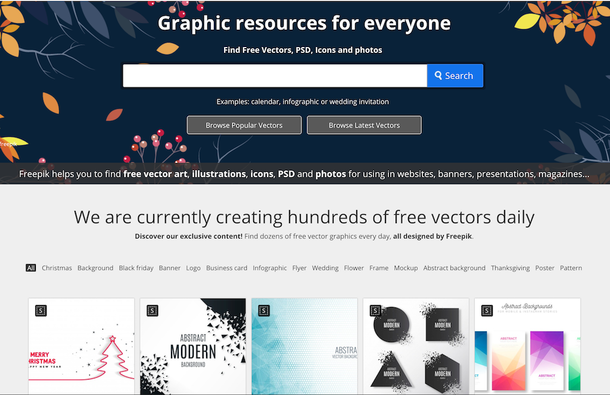

L'internet, c'est cool. T'as besoin de quelque chose et t'as toujours un site qui répond à ce besoin d'une manière ou d'une autre.<!--more-->

Quand t'as besoin de trouver des images vectorielles, ou simplement des illustrations (façon dessin / art graphique 2D) pour agrémenter ta présentation powerpoint, ton CV, ton article de blog, ton site, tes cartes de visites ou tes flyers, etc... soit t'es doué avec Illustrator / Photoshop et t'as du temps devant toi, soit tu piques des images sur Google (mais c'est bof quand même).

Mais ça c'était avant. Dorénavant, sache qu'il y a [Freepik](https://www.freepik.com/). C'est un site super pratique où tu tapes un terme de recherche lié à un thème, et il te propose plein d'illustration sympas, souvent au format vectorielle (donc redimensionnable à volonté et ça c'est cool).

Leur slogan c'est :

> On vous aide à trouver de l'art vectoriel, des illustrations, des icônes, des PSD et des photos à utiliser sur vos sites web, bannières, présentations, magazines...

Les illustrations sont variées et de bonne qualité. Ce ne sont pas des vieilles images ringardes ou inutilisables. **Et la plupart des fichiers sont gratuits** donc c'est royal !

Maintenant tu vas pouvoir ajouter des illustrations qui déchirent à ton projet sans dépenser un sou.
