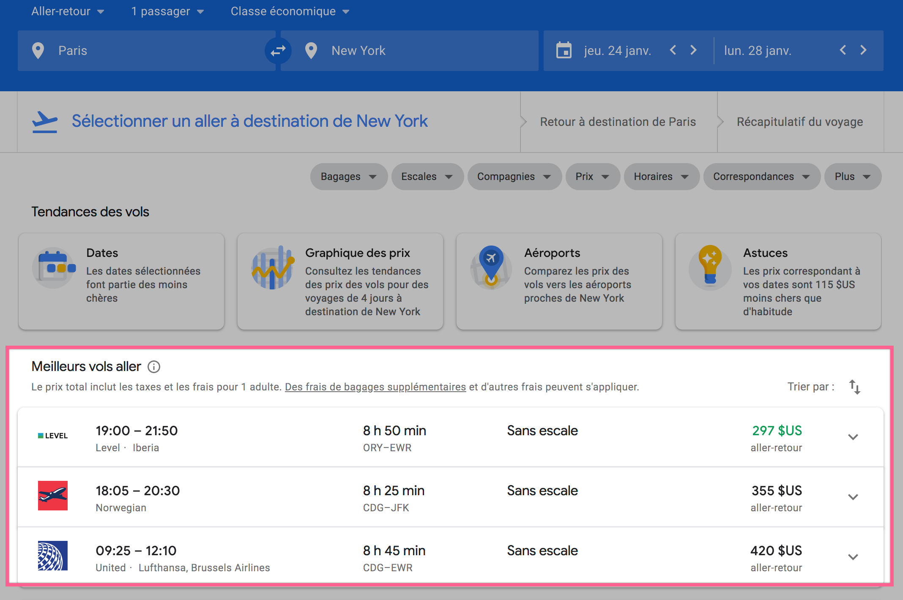
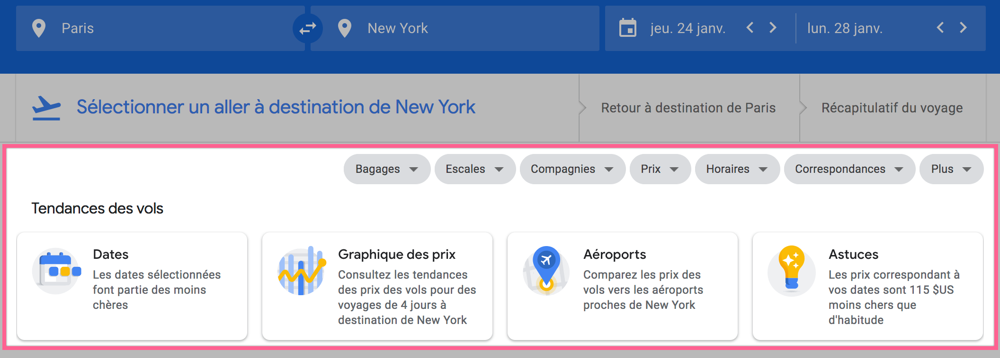
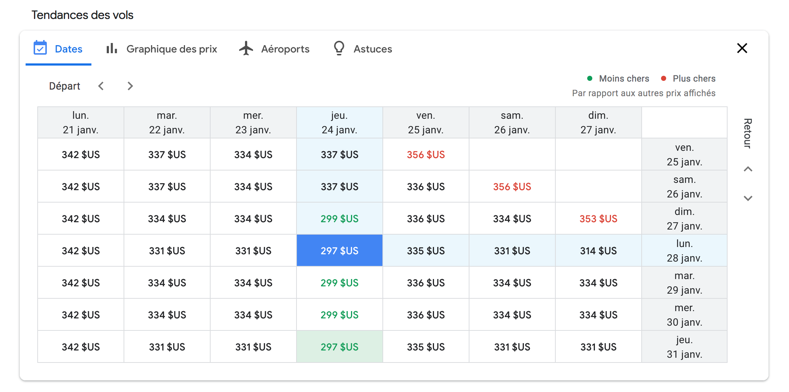
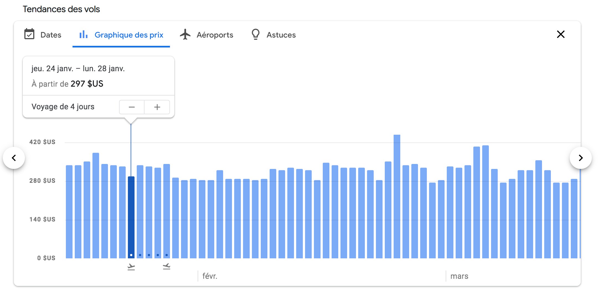
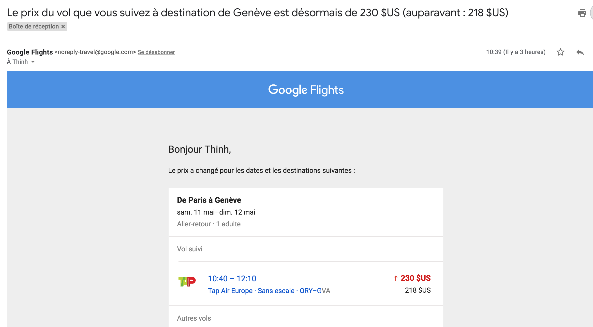

Tu comptes voyager prochainement ? Je suis parti à Phoenix, en Arizona, il y a un peu plus d'un mois. Sachant que je m'y suis pris seulement un mois l'avance pour acheter mon billet d'avion, les prix de vols étaient carrément flippants. Mais j'ai fini par trouver un billet à un super prix.

Voici une petite astuce simple que j'ai utilisé pour trouver le meilleur prix pour mon vol en Arizona.<!--more-->

Il y a plein de techniques plus ou moins connues :

- Chercher tes billets en utilisant le mode navigation privée de ton navigateur. Ça permet d'éviter les cookies de traçage des sites, qui font monter les prix à chaque nouvelle visite que tu fais.
- Ou encore chercher un billet d'avion le mardi matin. Selon certaines sources, le jeudi est aussi un bon jour.
- Et, évidemment, s'y prendre le plus longtemps possible à l'avance.

Ce qui est sûr, c'est qu'il faut éviter de passer directement par les sites de compagnie aériennes. Il faut utiliser les meilleurs comparateurs de prix. C'est-à-dire des sites comme [Skyscanner](https://www.skyscanner.fr/) ou [Momondo](https://www.momondo.fr/).

Mais, si tout ça te paraît compliqué, il y a une méthode encore plus simple : utiliser [Google Flights](https://flights.google.com/).

## (Presque) Tout est accessible via Google Flights

Si tu ne connaissais pas, **Google Flights** est un site _ultra-complet_, qui recense tout simplement **la quasi-totalité des vols aériens et des prix de billet**, toutes destinations et toutes dates comprises. Le site liste les prix des billets d'avion de pratiquement toutes les compagnies aériennes.

Et comme souvent avec les produits Google, c'est super simple à utiliser. Tu choisis si tu veux un Aller simple ou un Aller-retour, le nombre de passagers, la classe de voyage, le départ et la destination, les dates, et il te sort en quelques secondes tous les vols aux meilleurs prix, classés du moins cher au plus cher.

Tiens, regarde, je viens de faire une recherche juste pour l'exemple, et il me trouve un vol aller-retour pour New York sans escale à moins de 300 dollars.

Cela dit, la partie la plus intéressante, c'est celle-ci :

Les boutons gris au milieu à droite, ce sont les filtres qui permettent de peaufiner facilement et rapidement ta recherche dans les moindres détails, en fonction de tes préférences de voyage : avec ou sans escales, nombre de bagages, prix, horaires... Et surtout, **les 4 cartes du bas sont celles qui permettent de trouver le meilleur prix en fonction des dates et de l'aéroport de départ**, si tu es flexible sur ces paramètres.

## On peut trouver le meilleur prix de billet d'avion avec un peu de flexibilité

L'outil le plus utile et fondamental à cette astuce, c'est le calendrier des prix. Grâce à ce calendrier, tu peux savoir en un clin d'œil à quelles dates le prix du billet d'avion sera le moins cher. C'est parfait si tes dates de départ et de retour sont flexibles. Lorsque tu cliques sur la première carte "Dates", tu obtiens ce tableau :

En te déplaçant dans le tableau tu pourras comparer tous les prix de vols en fonction des dates d'aller et retour. D'un coup d'œil, tu peux voir à quelles dates d'aller et de retour le prix est le moins cher : ce sont les prix affichés en vert. Et si tu préfères la vue graphique en bâtons, il suffit de cliquer sur la deuxième carte, "Graphique" des prix :

## Suivre le prix pour attendre le meilleur moment si tu peux t'y prendre à l'avance

Une autre fonction très sympa, si tu t'y prends à l'avance, c'est que tu peux demander à suivre le cours du prix d'un vol en particulier. Le prix des vols fluctue constamment, un peu comme la bourse. En un clic, tu peux indiquer à Google que tu souhaites surveiller un prix de vol.

Et dès que le prix change, tu recevras un email t'informant du changement du prix, comme celui-ci :

\[caption id="" align="aligncenter" width="2412"\] Bon OK, le prix a augmenté. Mais tu reçois aussi un email quand le prix baisse.\[/caption\]

Il n'y a pas à dire, ils sont forts chez Google. Et cette application web est vraiment géniale. Complète, rapide et pratique. Il n'y a vraiment plus besoin d'aller visiter des dizaines de sites pour comparer les différents prix de billet d'avion. Juste Google Flights, et tu as toutes les infos dont tu as besoin, et surtout les meilleurs prix facilement accessibles.

Tu penses que ce n'est pas suffisant? Tu aimerais voyager pour encore moins cher, voici d'[autres astuces](https://tobal.fr/comment-voyager-pas-cher-nimporte-ou/).

[Google Flights](https://www.google.com/).
