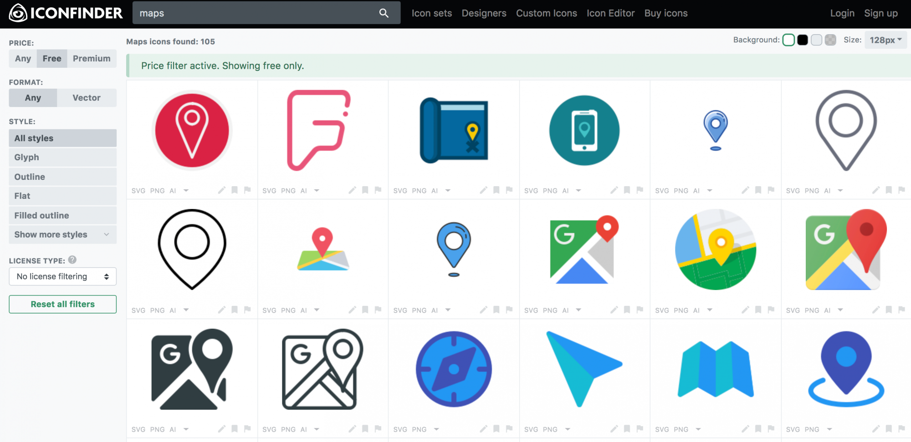
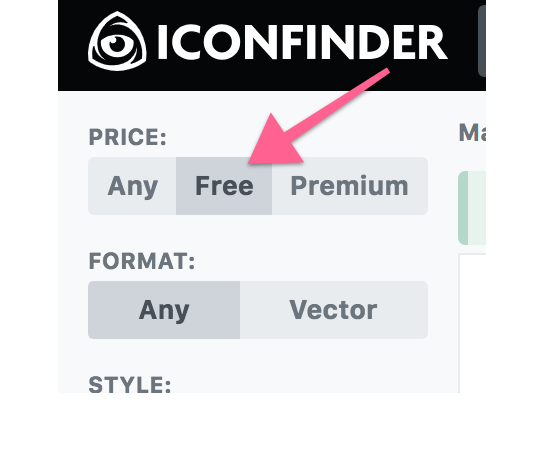
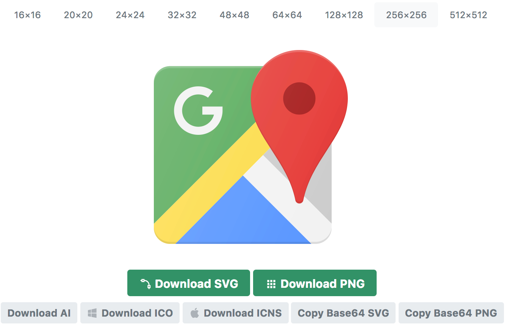

Quand j'ai besoin de trouver rapidement un icône sympa, je ne fais pas de recherche Google images. Pour trouver des icônes gratuits, et surtout de qualité, j'ai bien mieux que ça : le site [IconFinder](https://www.iconfinder.com/).<!--more-->

Ce site est génial. Il te permet de trouver en deux clics n'importe quel icône, que tu aies besoin : icônes pour un site web, pour tes applications, tes raccourcis, ou pour agrémenter une présentation ou un document.

Il y a un choix phénoménal, et tu trouveras tous les icônes dont tu pourrais avoir besoin : icônes de fonctionnalité, d'objets, d'animaux, mais aussi logos officiels (comme Facebook, Twitter, Instagram, etc...).

 

## Même pas besoin de s'inscrire

Tu peux aller sur le site et télécharger les icônes directement.

Tu trouveras des icônes "premium", donc payant, mais il y en a de très nombreux gratuit. Ça fait plusieurs années que je me sers du site et j'ai toujours trouvé les icônes que je voulais parmi les gratuits.Pour chercher parmi les gratuits tu peux cocher la case "gratuit" au moment de la recherche comme ça tu ne verras que les icônes gratuit.

Qu'ils soient payant ou gratuits, les icônes sont d'**excellente qualité**.

Cerise sur le gâteau, le site propose de télécharger les icônes dans plusieurs formats :

- PNG
- SVG
- Base64 SVG (!)
- Adobe Illustrator
- ICO (fichier icône Windows)
- ICNS (fichier icône OS X / MacOS)

Et en plusieurs tailles, allant du 16x16 au 512x512.

 

Trouver le bon icône n'est plus un problème, et surtout maintenant ça prend 2 minutes.

[IconFinder](https://iconfinder.com)
