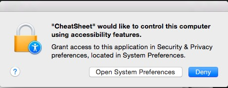

Vous avez déjà probablement vu un ninja du clavier dans votre entourage, et vous vous êtes dit "punaise, j'aimerais tellement maitriser le clavier comme ça moi aussi". Et bien aujourd'hui, les possesseurs de Mac ont de la chance: il existe une petite application appelée [CheatSheet](http://www.mediaatelier.com/CheatSheet/) (anti-sèche pour les nuls en anglais) et qui va vous afficher la liste des raccourcis clavier disponibles pour chaque application.<!--more-->

Le côté sympa de cette application, c'est qu'au lieu de bêtement vous ressortir une liste ennuyeuse de tous les raccourcis pour toutes les applications, elle va lister uniquement les raccourcis de l'application en cours, via un petit popup qui apparait lorsqu'on appuie sur la touche `Commande` (Cmd).

Pour l'installer, rendez-vous sur le [site de l'application](http://www.mediaatelier.com/CheatSheet/) et cliquez sur le gros bouton vert pour lancer le téléchargement. Une fois le téléchargement terminé, installez l'application puis lancez là. Afin que l'application fonctionne, il vous faut effectuer une petite manipulation au préalable: autoriser la fonctionnalité d'accessibilité pour cette application dans les préférences système. La première fois que vous lancerez l'application, vous verrez cette fenêtre apparaitre.

Bon perso mon interface est en anglais, mais vous devriez avoir la même chose en Français. En gros ça vous dit qu'il faut aller autoriser l'application dans les paramètres d'OS X. Cliquez sur le bouton d'ouverture des préférences système, cliquez sur le cadenas en bas à gauche pour débloquer les paramètres et enfin cochez la case à gauche de CheatSheet.

Et voilà, à présent, depuis n'importe quelle application, il vous suffit d'appuyer sur la touche **Cmd** pendant environ 3 secondes et vous verrez apparaitre la liste des raccourcis disponibles. En cliquant sur l'icône des paramètres en bas à droite, vous pourrez modifier le temps nécessaire à l'apparition de la liste des raccourcis (si vous voulez qu'elle s'affiche plus rapidement par exemple):

 

Notez que la liste des raccourcis reste affichée tant que vous maintenez la touche Cmd appuyée. Elle disparait lorsque vous relâchez  la touche.

Voilà, dorénavant, vous pourrez accéder en un éclair aux raccourcis de n'importe quel application. De quoi devenir un ninja du clavier en un rien de temps.
