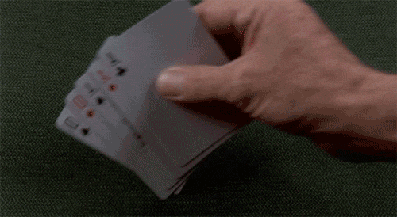

Les choses intéressantes se passent dehors

Comme tout le monde, il y a des moments dans la vie où je me sens bloqué. Comme dans une impasse. J'ai l'impression qu'il ne se passe rien de spécial. L'impression d'être dans une routine où les choses n'évoluent pas.

**Pour sortir d'un blocage lié à la routine, je m'efforce de vivre de nouvelles expériences**. Et pour vivre de nouvelles expériences, il faut commencer par sortir de chez soi. <!--more-->

## Tout commence par sortir de chez soi

Ce n'est pas devant ta télé ou ton ordi que tu vas trouver de nouvelles idées, ou [stimuler ta créativité](https://tobal.fr/tu-veux-devenir-creatif-accepte-la-mediocrite/). Ce n'est pas chez toi que tu vas vivre de nouvelles histoires.

**Les nouvelle choses, les choses intéressantes, ne se passent pas chez toi mais dehors**. C'est dehors que tu vas rencontrer de nouvelles personnes, vivre de nouvelles choses, de nouvelles situations et créer des expériences.

Pour amener de nouvelles (et bonnes) choses dans sa vie, il faut interagir avec un nouvel environnement. Tu dois interagir avec le reste du monde. Et pour ça, il faut sortir de chez toi.

## Comment avoir plus de chance

Si rien de nouveau n'arrive dans ta vie, tu ne mets pas toutes les chances de ton côté. **Tu veux avoir de la chance ? Crées plus d'interactions**. Fais plus de choses. Vis plus d'expériences.

La chance, ce n'est pas une question de "don". Ce n'est pas de la magie, ou un talent dont certains sont dotés naturellement et d'autres privés. **Non, la chance est une question de probabilités**. Si tu as une chance sur mille de tomber sur la personne qui va changer ta vie, alors commence dès aujourd'hui à rencontrer des nouvelles personnes.

Tu veux connaitre le succès ? Toujours une question de probabilités. Une chance sur un million de réussir ? Très bien, commence aujourd'hui, tout de suite. Tu ne sais pas à quel moment ça va tomber, mais c'est mathématique : [**plus tu échoues et plus tu as de chances de réussir**](https://tobal.fr/succes-ou-echec-ce-qui-compte-cest-de-commencer/).

La chance ce n'est pas quelque chose qui nous tombe dessus par accident. C'est quelque chose qui nous tombe dessus parce qu'on s'est exposé, à force de répétition. Ensuite c'est la loi des probabilités. Quand tu lances un dé, tu as une chance sur six de faire un 6. Tu peux très bien le faire dès le 1er jet. Mais si tu lances le dé 6 fois, tu as 6 fois plus de chances de faire un 6. La vie c'est pareil. Plus tu tentes ta chance et plus tu en as.

## Deviens naturellement plus intéressant

Une des questions les plus posées dans le monde du développement personnel, c'est :

> Comment devenir quelqu'un d'intéressant.

Tu veux devenir une personne plus intéressante ? Vis des choses intéressantes. Casse ta routine. Les nouvelles expériences forgent le caractère, deviennent des histoires à raconter et par conséquent te rendent plus intéressant.

**Les même actions produisent les même résultats**. Si tu as une routine, que tu vas aux même endroits tous les jours, tu ne joue pas avec le hasard, tu n'interagis pas avec l'univers.

Apporte du nouveau dans ta vie, rencontre de nouvelles personnes, essaye des nouvelles choses.

Toute cette nouveauté va t'apporter des expériences de vie qui d'une part vont te rendre plus intéressant, et d'une autre t'amener de nouvelles choses pour améliorer ta vie.
