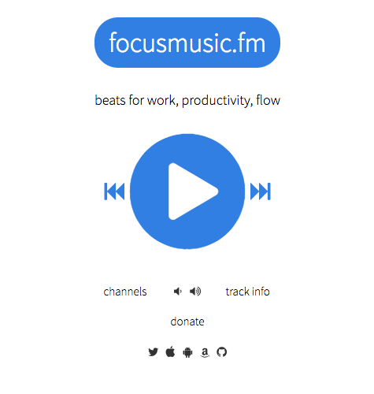
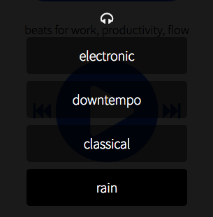

L'environment sonore est clé quand il s'agit d'être productif. Car pour pouvoir être productif, il faut pouvoir se concentrer. Et je sais pas pour toi, mais moi, quand il y a des bruits parasites autour de moi, j'ai du mal à me concentrer.<!--more-->

Pour pallier à ça, rien de mieux que la musique. Tu te mets à bosser, tu mets tes écouteurs et pouf, tu peux bien te concentrer. Mais attention, pas n'importe quel musique. Enfin ça dépend de chacun, mais il est fort probable qu'écouter du death metal ne va pas t'aider à trouver l'inspiration ou résoudre des problèmes.

C'est là qu'intervient [FocusMusic](https://focusmusic.fm/), une application web toute simple et gratuite, qui est une sorte de radio diffusant de la musique en continu. Pas n'importe quel type de musique; il s'agit de musiques sélectionnées spécialement pour t'aider à te concentrer pour travailler et favoriser la créativité.

il y a exactement 4 stations :

- la chaine Downtempo (musique ambiante relaxante),
- la chaine Electronique,
- la chaine Classique,
- et la chaine pluie.

Tu choisis une chaine et c'est parti, tu as de la musique en continu pour pouvoir te concentrer tranquille.

Perso j'adore les chaines downtempo, classique et rain, un peu moins l'électronique. La chaine pluie, c'est simplement un fond sonore de pluie et d'orage, mais je trouve ça super apaisant.

Voilà, si tu dois travailler dans un openspace bruyant, dans un café, bref n'importe quel endroit avec beaucoup de bruit, tu vas adorer FocusMusic.

Tu cherche une solution plus avancée? Tu peux essayer [AmbiantMixer](https://tobal.fr/creer-dans-ambiances-sonores-pour-etre-plus-concentre-et-plus-productif/) et créer tes propres ambiances sonores.

[Focusmusic.fm](https://focusmusic.fm/)
