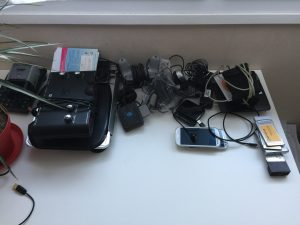
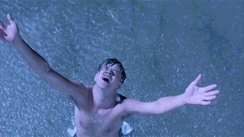

A une époque, j'avais des dizaines et des dizaines d'affaires que je ne mettais plus, d'objets que je n'utilisais plus, de trucs qui ne servaient plus ou que je ne savais même pas à quoi ils pouvaient bien servir. Tout ça trainait dans la maison.<!--more-->

\[caption id="attachment\_3445" align="aligncenter" width="666"\] Ça c'est juste la partie "électronique".\[/caption\]

Et je te parie 100€ que pour toi c'est la même (à moins que tu sois [minimaliste](http://je suis minimaliste)).

**Voilà mon défi pour toi: débarrasse toi d'une de tes possessions chaque jour**.

Pas n'importe lesquelles. Simplement celles dont tu ne te sers jamais ou dont tu ne t'es pas servi depuis super longtemps. Genre depuis plus de 3 mois.

D'habitude, quand on se met à faire le ménage, qu'est ce qu'on fait ? On se dit qu'il faut se débarrasser de "tout son bordel" d'un coup, et ça faire peur. Ça représente trop d'efforts, on a pas le temps. C'est pour ça qu'au final on le fait jamais.

Non, là, rien de tout ça. Pas de gros ménage. Juste UN truc par jour. 2 minutes. Pense-tu en être capable ?

C'est un défi que je me lui lancé (et que j'ai réussi). Chaque jour pendant 3 mois, je jetais un seul truc. Un coup c'était un stylo, une autre fois un vieux cadenas inutilisé. Parfois un câble micro usb (plus aucun appareil n'utilise ça en 2018), une PSP que je n'ai pas allumé depuis 2012, un vieux appareil photo numérique et des cartes SD, des vieux disques dur, des vieux téléphones, etc...

Tu n'es pas pas obligé de tout _jeter_. Pour beaucoup d'objets, j'ai posté une annonce sur des groupes facebook ou sur leboncoin, la plupart du temps en donnant mais parfois en vendant. Du coup tu fais des heureux et même un peu d'argent au passage. Elle est pas belle la vie ?

> "Attends, on sait jamais, je risque d'en avoir besoin un jour".

AAAAAAaaaaah, "on sait jamais", la pire phrase de l'univers. Oui, on sait jamais. Il peut aussi y avoir une apocalypse zombie, on sait jamais. Tu peux gagner au loto, on sait jamais. Dans tous les deux cas, ton vieux DVD du Roi Lion il va pas te servir à grand chose. T'as même plus de lecteur DVD de toute façon. Si tu t'es pas servi d'un truc depuis plus de 3 mois, tu ne t'en resserviras jamais.

Et que s'est-il passé après avoir jeté des dizaines et des dizaines de choses qui trainaient dans ma maison ? Du bien ! Un grand soulagement.

Mais en plus d'une libération d'espace physique, c'est aussi une libération mentale. Moins t'as de choses, plus tu as d'espace. Et quand t'as plus d'espace, tu respires mieux, t'es moins stressé. Et tu profites plus des choses que tu as gardé. Et tu te sentiras plus [heureux](https://tobal.fr/moins-tu-auras-plus-tu-sera-heureux/).

Sans déconner, essaye.
